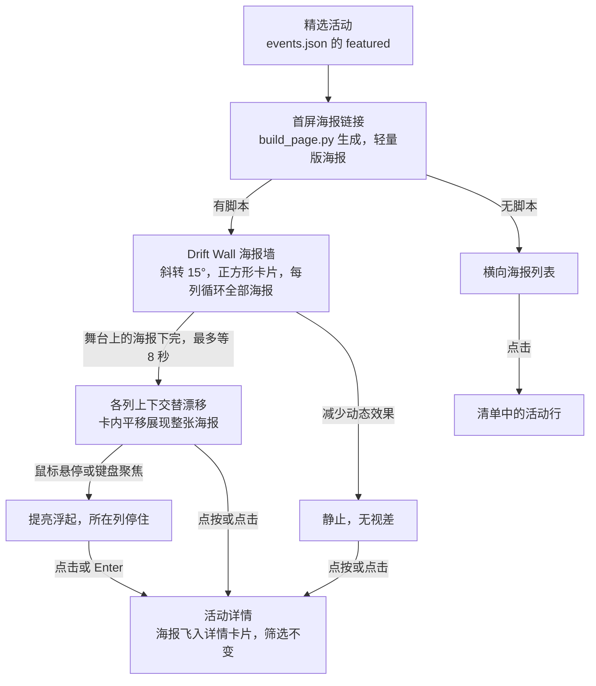
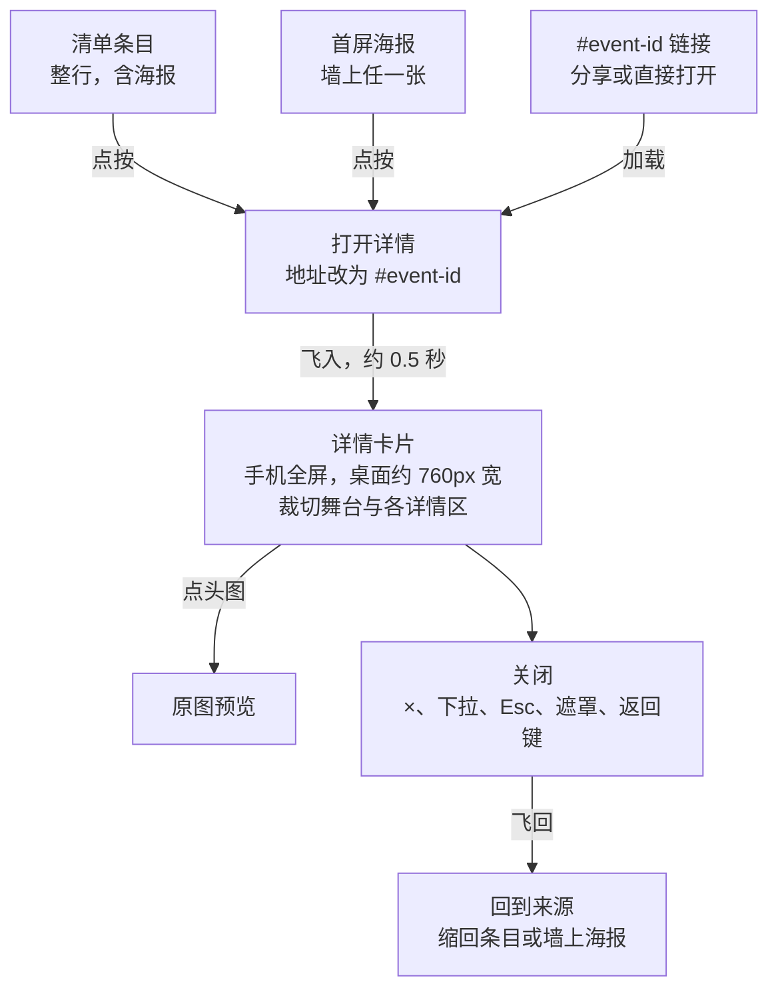
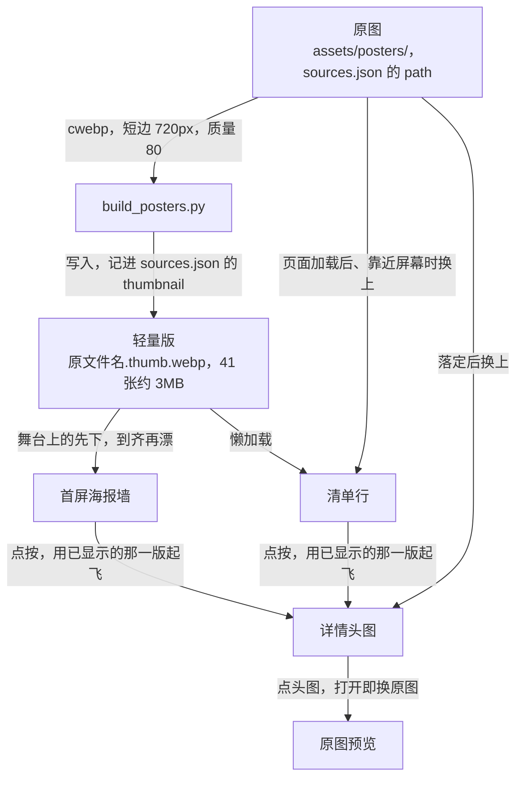

# 活动浏览

## 需求澄清

### 请求：详情海报过场与原图预览交互

> 2026-10-05：“详情内海报的hero效果有时候会失效或者不流畅。 然后海报点击完之后，我觉得预览图片的交互不够严谨丰富。”

### 已查明事实

| # | 事实 | 来源 |
| --- | --- | --- |
| F24 | 旧文档 docs/workflow/hero-mobile.md（连同同名伴随页面 docs/workflow/hero-mobile.html 与附件目录 docs/workflow/hero-mobile/）：已迁移进本文档，附件移到 docs/event-browsing/，原文件已移到废纸篓（按 moss 2026-10-05 的答复“重写hero-mobile让它符合workflow，并重新命名档案，然后复用这个档案”） | 2026-10-05 迁移 |
| F35 | “失效”：详情顶部海报的下半部分被摘要文字层（开场时间、名称、场地、艺人、风格，`.event-summary`，叠在海报上）盖住，点在文字层上不会打开原图。10×10 网格命中测试中能打开原图的面积：桌面 59%–69%、手机 49%–59%（event-2、58、20） | Chrome `--headless=new` 脚本 `pw/fl4.mjs`（`elementFromPoint`） |
| F36 | “不流畅”：详情飞入开头有原地停顿——390 宽、CPU 降速 4 倍时开头一帧约 100ms，卡片在来源处停约 140ms 才开始展开，随后按 power4.out 一下走完大半；不降速也停约 50ms；关闭开头有约 83ms 的长帧。推断原因：打开那一帧要克隆舞台、移入详情、`showModal`、排版并绘制背景模糊 | 脚本 `pw/fl1.mjs`、`pw/fl2.mjs`（逐帧取卡片位置与帧间隔） |
| F37 | 现在的飞入用 left/top/right/bottom、圆角与舞台最小高度做动画，每帧重新排版卡片和其中的内容，跑在主线程；同时页面后面的地形 WebGL 与镜面光也在主线程上逐帧运行 | `assets/event-detail.js` 的 `frame`、`flyIn`；`assets/topography.js`、`assets/glass.js` |
| F38 | 从首屏打开时，起始画面是详情头图的裁切（铺满、纵向 25% 位置、放大 1.25 倍），而墙上那张海报显示的是不裁切、按位置平移的海报，起点对不上；清单里离得远的行的海报是懒加载的（`loading="lazy"`），从首屏打开这类活动时详情头图在飞入途中才加载出来 | `assets/event-detail.js` 的 `fill`、`sourceOf`；`scripts/build_page.py` 的 `event_row` |
| F39 | 原图预览打开时按返回键，关掉的是下面的详情卡片（地址退回无 `#event-id`），预览仍留在清单上方；关闭详情后过场还没结束（约 0.42s 内）再点另一条目，这次点按不起作用 | 脚本 `pw/fl5.mjs`；`assets/event-detail.js` 的 `open`（`current` 未清空时直接返回） |
| F40 | 原图预览现有交互：打开时从缩略图原位放大 0.3s、关闭 0.22s；双指缩放 1–8 倍（以双指中点为锚）与双指平移；放大后单指拖动（硬边界、无惯性、无回弹）；双击在 1 倍与 2.5 倍之间切换（瞬间跳变）；单击图片 0.3s 后关闭（等待双击判定）、点背景立即关闭；滚轮与键盘加减号缩放（瞬间）；方向键平移 60px；0／Home 复位；Enter、空格、Esc 关闭；窗口变化复位。未放大时单指拖动没有反应；最大 8 倍不看原图分辨率（桌面适配高约 850px 时，2560px 高的海报放到 8 倍远超原图像素）；不接入返回键 | `assets/poster-preview.js`、`scripts/check_preview.js` |
| F41 | 参考：开源看图组件 PhotoSwipe 的默认做法——竖向拖动关闭（`closeOnVerticalDrag`）、双指捏小关闭（`pinchToClose`）、初始“适配”、双击到 2.5 倍适配且不超过原图（`secondaryZoomLevel`）、手势最大倍数单独设置（`maxZoomLevel`）、触屏单击默认只切换控件不关闭、双击放大、点背景关闭、关闭后焦点回到原处 | https://photoswipe.com/options/ 、https://photoswipe.com/adjusting-zoom-level/ 、https://photoswipe.com/click-and-tap-actions/ （2026-10-05 读取） |
| F42 | 飞入过程本身每帧约 17ms（CPU 不降速与降速 4 倍都是，桌面与手机），卡顿集中在打开那一帧：390 宽、CPU 降速 4 倍时点按处理约 80ms，卡片在来源处停约 160ms 才动；飞入期间不让详情区参与排版（先不显示）停顿降到约 116ms，隐藏地形背景降到约 133ms。也就是说，把逐帧的盒子动画换成变换动画解决不了这次的卡顿，要减的是打开那一帧的工作 | 脚本 `pw/fl6.mjs`、`pw/fl7.mjs` |
| F43 | 从详情头图打开原图预览：过场每帧约 17ms、开头停 40–60ms；不顺的来源是画面跳变——头图带向下渐隐、上面压着文字，过场一开始换成不带渐隐的整图，渐隐与文字瞬间消失；关闭时反过来瞬间出现 | 脚本 `pw/fl8.mjs`、`pw/fl3.mjs` 截图 |
| F44 | 站内控件规范：可点的胶囊与圆形按钮高 40px（`--control`），文字 13px，图标按文字大小定；胶囊共用玻璃底与镜面反光环（`assets/glass.js`）；详情卡片的 × 在右上角（40px 圆形）；“只属于悬停的效果”按 `(hover: hover)` 与鼠标指针判断（`moss-web-ui`） | AGENTS.md 第五节、`assets/site.css`、项目技能 `pages-site-visual-choices` |
| F45 | 打开详情那一帧里，`showModal()` 单独约 30–55ms（CPU 降速 4 倍）：模态对话框会把文档其余部分设为 inert，要整页重算样式；克隆舞台、移入详情、`pushState` 与加类都在 1ms 以内 | 脚本 `pw/fl9.mjs`（逐步计时） |
| F46 | 弱网下的“失效”：慢速 4G（562.5ms、1.6Mbps）与快速 4G（165ms、9Mbps）、390 宽手机下，打开页面 3–30 秒后点首屏海报，点到的那张都还没下载完；卡片按约定停 0.15s 后照常飞出，飞行全程海报仍在下载，卡片是空的，海报落定后才自上而下逐渐出现；从详情头图打开原图预览时同样是空图在飞。屏幕上的墙海报已下载的比例：慢速 4G 3s 1–2/16、10s 3–4/15、20s 3–4/13；快速 4G 3s 2/16、10s 6/15、20s 13/15 | 脚本 `pw/wn1.mjs`、`pw/wn3.mjs`（Chrome `--headless=new`，CDP 网络限速，新上下文无缓存） |
| F47 | 根因：首屏海报墙一打开就下载全部 41 张原尺寸海报（`loading="eager"`），共 30.1MB，其中 12 张 PNG 每张 1.8–3.2MB；清单行、详情头图与原图预览用的也是同一批原图。试编码（未改项目文件）：720px 宽 WebP（质量 80）共 3.1MB，原尺寸 WebP（质量 85）共 9.3MB。把 720px 版按原地址提供时，屏幕上的墙海报：慢速 4G 3s 3/14、10s 11/16、20s 14/14，快速 4G 3s 全部（17/17）；原尺寸 WebP：慢速 4G 3s 1/14、10s 5/14、20s 5/13，快速 4G 10s 全部 | `pw/wn3.mjs`；`cwebp`（本机 Homebrew）；`scripts/hero.mjs`、`scripts/build_page.py` |
| F48 | 正常网速下也有一处确定的跳变：从详情头图打开与收回原图预览时，过场的起点与终点按“海报顶端对齐”摆放，而头图实际按 `object-position: center 25%`（并放大 1.25 倍）裁切，比头图高的海报会整体错位：桌面 1440 宽 53 张里 49 张错开 62–246px，手机 390 宽 53 张里 18 张错开 10–104px（越高的海报错得越多） | 脚本 `pw/fl16.mjs`；`assets/poster-preview.js` 的 `animateFromSource` |
| F49 | 慢速 4G 下滚到清单后，90 秒内屏幕上没有一条清单行的海报下载完：清单行的原图是懒加载的，排在首屏墙 30.1MB 原图之后 | 脚本 `pw/wn4.mjs` |
| F50 | 点开时来源海报已下载完的，详情头图（同一地址）在打开那一帧就已完整，过场正常：浏览器直接复用页面里已载入的图片。也就是说，只要来源上已经显示出海报，飞行就有海报 | 脚本 `pw/wn4.mjs`（慢速 4G，首屏海报 `verknipt.webp`） |
| F51 | 编码工具与格式：本机有 `cwebp` 1.6.0（Homebrew `webp`），系统自带的 `sips` 能写 JPEG 与 AVIF、不能写 WebP（且在沙箱里不出文件）；41 张海报的 720px 宽版本合计：WebP（cwebp 质量 80）3.1MB、AVIF（sips 质量 60）2.5MB、JPEG（sips 质量 75）7.1MB。浏览器支持（MDN）：WebP 当前所有主流浏览器（Safari 14 起、macOS 11 起），AVIF 为 Chrome 85、Edge 121、Firefox 93、Safari 16.1 起；站内已直接使用 `.webp` 海报（如 `verknipt.webp`、`verdant-vein-2026.webp`），没有备用格式 | `cwebp -version`；`/tmp/claude-501/postertest/`；https://developer.mozilla.org/en-US/docs/Web/Media/Guides/Formats/Image_types （2026-10-05 读取）；`index.html` |
| F52 | 现有缩略图：`assets/posters/` 里 49 张 `.thumb.jpg`（300–600px 宽），记在 `assets/posters/sources.json` 的 `thumbnail`，页面不使用，只有 `scripts/check_page.py` 核对它们存在。各处需要的清晰度：首屏墙卡片最宽约 380 CSS px（桌面）、280 CSS px（手机），按屏幕像素密度约需 760–840px 宽；清单展开行与详情头图按行宽或卡片宽放大 1.25 倍铺满（桌面约 1425 CSS px、手机约 450 CSS px），原图（1024–1500px 宽）在这里已经是放大显示；原图预览按原图像素缩放（Q28） | `assets/posters/sources.json`、`scripts/check_page.py`、`assets/site.css`、`scripts/hero.mjs` |
| F53 | 改成轻量版与下载队列后（首屏墙：舞台上的文件先下，其余按多久漂进舞台排队，同时最多 4 个，只排经过舞台的列；文本按线上一样 gzip 压缩），屏幕上舞台内海报已到位的比例：快速 4G 手机 2 秒 8/8、桌面 2 秒 13/15、4 秒全部；慢速 4G 手机 6 秒 3/9、10 秒 4/7、12 秒 8/9、14 秒全部，桌面 6 秒 7/17、10 秒 9/16、14 秒 13/16、18 秒全部。改动前（原图）慢速 4G 20 秒时 3–4/13 | 脚本 `pw/wn12gz.mjs`、`pw/wn7gz.mjs`（Chrome `--headless=new`，CDP 限速，2026-10-05） |
| F54 | 慢速 4G 的瓶颈是带宽与漂移的比：约每秒 2 张轻量版，打开时屏幕上手机约 8 张、桌面约 16 张；第一批在手机上约 6.6 秒下完，而墙一直在漂（每列约 23–61px/s），10 秒内屏幕上的卡片约换掉一半，后来漂进来的要接着下。轻量版再减到短边 600px、质量 70 时，41 张合计 1.86MB（现为 3.09MB，小 40%） | `pw/wn7gz.mjs` 的请求时间线；`scripts/hero.mjs` 的速度参数；`cwebp` 试编码 |
| F55 | 已核对：换原图时 Chrome 与 WebKit 都一直显示轻量版，直到原图下完才整张切换（不闪空、不逐行出现）；点开已显示海报的首屏卡片，飞行每一帧头图都完整（快速 4G）；两版都没到时头图与预览先隐藏、到了 0.3s 淡入；53 张海报的预览起点偏差都在 2px 以内（手机、桌面） | 脚本 `pw/wn5.mjs`、`pw/wn5wk.mjs`、`pw/wn6.mjs`、`pw/wn13.mjs`、`pw/wn14.mjs`、`pw/fl16.mjs` |
| F56 | 旧文档 docs/event-browsing.md：本任务不迁移（按 moss 2026-10-06 的答复“不迁移”）。工作流规格改为内联 Mermaid 后，本文档里 3 个 archify 图块（首屏海报墙交互流程、活动详情的打开与关闭、海报的轻量版与原图）算旧写法，页面上不再显示；图块与 docs/event-browsing/ 下的图文件原样保留，本任务继续记在本文档 | 2026-10-06 迁移题；已于 2026-10-06 迁移，见 F58 |
| F57 | 预览工具栏按钮与 × 的跟随光（`assets/glass.js` 的镜面环）在代码里已接上：无头 Chrome 中鼠标靠近时 −／＋／复位的亮度升到 0.5–1、光带转向鼠标。moss 在内置浏览器里没看到，是因为那里的 `glass.js` 从缓存读的旧版（`transferSize` 0，旧版还没把预览按钮列入）：本地预览服务 `python3 -m http.server` 不发缓存头，浏览器按 `Last-Modified` 启发式缓存，多日未改的脚本改了之后仍用旧的；换成发 `Cache-Control: no-cache` 的服务、换端口（127.0.0.1:8766）后，内置浏览器里按钮的光随鼠标转向变亮（0.50–0.93） | 脚本 `pw/pv4.mjs`；内置浏览器 `performance.getEntriesByType`、`--spec` 读数（2026-10-06） |
| F58 | 旧文档 docs/event-browsing.md：已迁移进本文档（按 moss 2026-10-06 的答复“迁移 (推荐)”）——3 张 archify 图（首屏海报墙交互流程、活动详情的打开与关闭、海报的轻量版与原图）按现状改写成内联 Mermaid，docs/event-browsing/ 下的 3 个 HTML 与 3 个 JSON 图文件已移到废纸篓；没有另外的旧文件要删 | 2026-10-06 迁移 |

### 问答

| # | 问题 | 答复 | 影响 |
| --- | --- | --- | --- |
| Q27 | 原图预览要加哪些交互（可多选，F40、F41）：A 下拉关闭——未放大时单指拖动图片，图片跟手移动并缩小、背景变淡，松手超过约四分之一屏高或快速下滑就关闭并缩回详情头图，否则弹回；B 惯性与回弹——放大后拖动松手按速度继续滑行再减速，拖过边缘、双指缩到 1 倍以下或超过最大倍数时能越出一点，松手弹回；C 缩放过渡——双击、键盘加减号与滚轮的缩放用约 0.25s 平滑过渡，不再瞬间跳变；D 双指捏小关闭——缩到 1 倍以下继续捏、松手即关闭。推荐 A、B、C：这三项补上“跟手、可预期”的基本手感，是 iOS“照片”与 PhotoSwipe 的标准做法；D 与 A 功能重复、容易误关，可不加 | “A 下拉关闭 (推荐), B 惯性与回弹 (推荐), C 缩放过渡 (推荐), D 双指捏小关闭”（2026-10-05 提问工具） | 四项都加；B 的“缩到 1 倍以下回弹”与 D 的“捏小关闭”合起来：缩到 1 倍以下时跟手越出，松手时缩得够小（约适配的 0.75 倍以下）或捏得够快就关闭，否则弹回 |
| Q28 | 双击与最大放大倍数（F40、F41）：A 按原图分辨率——双击放大到 2.5 倍适配但不超过原图像素，双指与滚轮最多放到原图像素的 2 倍；B 保持现在——双击 2.5 倍、最大 8 倍。推荐 A：大屏上放大不会超出原图变糊，手机上与现在差别不大 | “A 按原图分辨率 (推荐)”（2026-10-05 提问工具） | 双击放大到 2.5 倍适配且不超过原图像素；双指与滚轮最多到原图像素的 2 倍 |
| Q29 | 单击图片怎样（F40、F41）：A 单击图片不再关闭——关闭靠点背景、下拉（Q27 选 A 时）、Esc 与返回键，单击也就不用等 0.3s 判断双击；B 保持现在——单击图片 0.3s 后关闭；C 单击放大——鼠标点哪放大哪、再点缩回，点背景关闭。推荐 A：避免想放大时误关，响应也更快；条件是 Q27 选了下拉关闭，否则推荐 B | “A 单击不关闭 (推荐)”（2026-10-05 提问工具） | 单击图片不再关闭，也不再等 0.3s；关闭靠点背景、下拉、捏小、Esc 与返回键（AGENTS.md 第四节“单击图片／遮罩退出”随之改为只有点遮罩退出） |
| Q30 | 怎么分层（括号里是各层改的文件）：A 两层——L1 修过场：详情头图的文字层不再挡点击、详情飞入改为只用变换、裁切与透明度（不再逐帧排版）并先载好头图、从首屏飞入的起点与墙上海报一致、关闭过程中可以再点别的条目、预览打开时返回键先关预览、从头图展开预览时头图的渐隐与文字过渡掉（`assets/event-detail.js`、`assets/poster-preview.js`、`assets/site.css`、`scripts/check_detail.js`、`scripts/check_preview.js`、AGENTS.md、README）；L2 预览交互：下拉关闭、惯性与回弹、缩放过渡、捏小关闭、按原图分辨率的倍数、单击不关闭（`assets/poster-preview.js`、`assets/site.css`、`scripts/check_preview.js`、AGENTS.md、README）。B 一层：全部一起做、一次验收。C 三层：L1 只修点击、返回键与关闭中再点三个问题；L2 详情飞入改造（流畅度与首屏起点）；L3 预览交互。推荐 A：先把“失效、不流畅”修好验收，再专心调预览手感 | “A 两层 (推荐)”（2026-10-05 提问工具） | L1 修过场，L2 预览交互；L1 的飞入做法按 F42 的实测调整，见方案；已被 Q34a 改变（分层重问，见 Q35） |
| Q30a | 修改要求 | “还有，非触屏下，预览要有交互按钮”（2026-10-05 提问工具，确认方案时） | 改变 AGENTS.md 第四节“预览不显示标题栏与放大／关闭按钮”：在可悬停、指针精确的设备（鼠标、触控板）上给预览加按钮，触屏照旧不显示；按钮的组成、位置与显隐见 Q31–Q33；方案改写后重新确认 |
| Q31 | 非触屏下预览放哪些按钮（可多选，F40、F44）：A 放大与缩小（＋ −，每次 1.25 倍，有过渡）；B 复位到适配（放大后才可用）；C 关闭（×）；D 在新标签页打开原图文件。推荐 A、B、C：放大缩小与复位补上鼠标用户找不到的手势，× 与详情卡片的关闭一致；D 偏离“不新开标签页”的约定（AGENTS.md 第四节），不推荐 | “A 放大与缩小 (推荐), B 复位到适配 (推荐), C 关闭 × (推荐)”（2026-10-05 提问工具） | 按钮为 − ＋（每次 1.25 倍、有过渡，到上下限时不可用）、复位到适配（放大后才可用）与 ×；不放“新标签页打开” |
| Q32 | 按钮放在哪（F44）：A 右上角一组——与详情卡片的 × 同一位置，按顺序为 − ＋ 复位 ×；B 底部居中一条胶囊工具栏、× 单独在右上角；C 右侧竖排一列。推荐 A：只看一个角落，与详情一致，也不挡海报正中的内容 | “B 底部居中工具栏”（2026-10-05 提问工具） | − ＋ 复位放在底部居中的一条胶囊工具栏里（玻璃底、控件规范），× 单独在右上角（与详情卡片的 × 同款同位） |
| Q33 | 按钮何时显示（F44）：A 一直显示；B 鼠标移动时显示，静止约 2 秒后淡出，指针停在按钮上时不淡出。推荐 A：显示状态可预期、不会找不到；B 更沉浸但要先晃一下鼠标 | “B 静止后淡出”（2026-10-05 提问工具） | 鼠标移动时显示，静止约 2 秒后淡出；指针停在按钮上或键盘焦点在按钮上时不淡出；减少动态效果时直接显示与隐藏 |
| Q34 | 弱网下海报还没下载完就被点开，卡片与预览都是空图在飞（F46、F47），怎么处理：A 只在过场里兜底——海报没到时卡片照样飞出、海报到了再淡入（不再自上而下逐行出现），点开的那张优先下载，首屏墙先下载屏幕上的海报；只改本层的文件，弱网下仍会出现没有海报的飞行；B 兜底之外再把海报减轻——生成轻量版本，墙与清单用约 720px 宽的 WebP（41 张约 3.1MB），详情头图与原图预览先用屏幕上已有的轻量版起飞、清晰版到了再换上；要新增生成脚本与生成的图片文件，超出本层范围，选 B 时回到方案改写后再确认。推荐 B：空图的根因是首屏一次下载 30.1MB，只兜底治标；减轻后快速 4G 下 3 秒内屏幕上的海报全部到位，也省流量。F48 的错位无论选哪项都在本层修 | “B 兜底并减轻海报 (推荐)”（2026-10-05 提问工具） | 弱网兜底之外再减轻海报：生成 720px 宽 WebP 轻量版，首屏墙与清单收起行改用轻量版，详情与原图预览先用屏幕上已有的版本起飞、落定后换原图；减轻海报超出 L1 的内容，按需求变化回到方案改写（Q34a） |
| Q34a | 需求变化 | Q34 选 B（“B 兜底并减轻海报 (推荐)”）：减轻海报要新增生成脚本与生成的图片文件，改动落在 L1 以外 | 回到澄清改写方案，L1 回到待做；分层重问（Q35）；F48 的错位仍在过场修正里修 |
| Q35 | 怎么分层（Q34a 后重问，括号里是各层改的文件）：A 三层——L1 过场修正：保留已做的改动，修 F48 的预览起点错位，加弱网兜底：海报没到时卡片照样飞出、到了整张淡入，点开的那张优先下载，首屏墙先下载屏幕上的海报（`assets/event-detail.js`、`assets/poster-preview.js`、`assets/site.css`、`scripts/hero.mjs` 与重建的 `assets/hero.js`、`scripts/check_detail.js`、`scripts/check_preview.js`、AGENTS.md、README）；L2 海报减轻：新增生成脚本，用 `cwebp` 为每张海报生成 720px 宽 WebP 轻量版，取代页面没在用的 `.thumb.jpg` 并更新 `sources.json`；首屏墙与清单收起行改用轻量版，每天展开的第一条换原图；详情与原图预览先用屏幕上已有的版本起飞、落定后换原图（新脚本 `scripts/build_posters.py`、`scripts/build_page.py`、`assets/posters/`、`assets/accordion.js`、`assets/event-detail.js`、`assets/poster-preview.js`、`scripts/check_page.py`、AGENTS.md、README）；L3 原图预览交互：原 L2，不变。B 两层——L1 过场修正与海报减轻合为一层（上面 L1、L2 的文件），L2 原图预览交互。推荐 A：L1 大部分已做完，补上 F48 与兜底就能先在正常网速下单独验收；L2 改生成流程与图片文件，弱网效果单独实测验收；预览交互不受影响 | “B 两层”（2026-10-05 提问工具） | L1 为过场修正与海报减轻（一次验收），L2 为原图预览交互（内容不变） |
| Q36 | 慢速 4G 下 10 秒时首屏屏幕上的海报只到约一半（F53、F54），而 L1 验收写的是“慢速 4G 约 10 秒内到位”，怎么处理：A 首批到齐前墙先不漂——打开时屏幕上那批下完再开始漂移（最多等 8 秒），快速 4G 下约 1–2 秒、几乎察觉不到，慢速 4G 下开头几秒是静止的墙，预计 10 秒时屏幕上的海报基本到齐（估计）；B 再减轻轻量版——短边 600px、质量 70，合计约 1.9MB（小 40%），3 倍屏手机上更软，慢速 4G 约快四成；C 保持现在的做法，L1 验收改为实测值（慢速 4G 10 秒约一半，手机约 14 秒、桌面约 18 秒全部到位）。推荐 A：弱网时漂着空白卡片正是首屏看起来坏掉的原因，海报到齐再漂能让首屏始终完整，快网下几乎没有差别；B 用清晰度换得有限，C 保留空白漂移 | “A 到齐前先不漂 (推荐)”（2026-10-05 提问工具） | 首屏墙打开时先静止，屏幕上那批海报下完（最多等 8 秒）再开始漂移；之后漂进来的按队列接着下；改 `scripts/hero.mjs`（重建 `assets/hero.js`），实现方案与 AGENTS.md 的首屏描述同步 |

### 以往：首屏轮播窄屏优化（2026-10-04）

大湾区国庆电音指南（`/Users/moss/code/pages`）：首屏海报轮播在窄屏上看不清单张海报，参照 React Bits 与 Awwwards 优化。

#### 请求

> 2026-10-04：“我希望优化一下轮播图，现在窄屏幕上看不清一张图。根据reactbits和awwwards来优化。”

#### 已查明事实

| # | 事实 | 来源（2026-10-04 观察） |
| --- | --- | --- |
| F1 | 现状：首屏为 React Bits Flex Carousel 的移植（`scripts/hero.mjs` 构建为 `assets/hero.js`，ogl 绘制），“liquid”透镜预设（lensWidth 0.74、lensHeight 1.18、tilt 62°、bend 0.34、reach 0.38、dispersion 0.45），“portrait”裁切（卡片 3:4、放大 1.08），卡片高为轮播区的 0.7；轮播区桌面 720px、700px 以下 480px | `scripts/hero.mjs`、`assets/hero.css`、AGENTS.md 第五节 |
| F2 | 根因：透镜大小按屏幕宽度计算（半宽 0.37×屏宽），而卡片大小按轮播区高度计算。1440 宽时透镜的不变形区半径约 263px，大于中间卡片半宽 189px，中间海报保持平整；375 宽时不变形区半径约 68px，远小于中间卡片半宽 126px，中间海报的边角也被弯折并带色散，所以看不清。React Bits 原版同样按屏宽计算透镜，没有窄屏处理 | 代码计算与 Chrome `--headless=new`（GPU）截图 `r10/hero-now-375.png`、`hero-now-1440.png`；原版 `FlexCarousel.jsx` 第 868 行 |
| F3 | 另一个因素：41 张首屏海报中 30 张竖版、7 张方形、4 张横版，统一按 3:4 裁切；手机上中间卡片只有 252×336px | 页面数据 |
| F4 | 原型（临时脚本，未改项目文件；`r10/hero-sheet-375.png`）：A 透镜按海报尺寸缩放——取“1440 宽时中间卡片占屏宽 0.2625”的比例反推透镜跨度（跨度 = max(屏宽, 卡片宽 / 0.2625)），桌面 1440 不变，手机中间海报完全平整，两侧海报也基本不弯；B 同 A 并把手机轮播区加高到 580px，卡片 304×405；C React Bits Morph Slider 式：一次一张、几乎占满屏宽（静态示意，切换为“melt”溶解转场）；D React Bits Depth Carousel（默认参数）：前一张清晰，其余向右后方叠放，手机上按原版缩放后卡片约 187px 宽 | `proto/hero.mjs`、`pw/altmock.mjs`；React Bits 源码 `DepthCarousel.jsx`、`MorphSlider.jsx` |
| F5 | React Bits 现有 47 个组件，其中可作海报轮播或画廊的 17 个：Flex Carousel（liquid、arch、ribbon、vortex 四种透镜预设）、Circular Gallery、Circular Carousel（cylinder、orbit、wheel、panorama 四种预设）、Depth Carousel、Morph Slider、Dome Gallery、Infinite Menu、Flying Posters、Infinite Spiral、Drift Wall、Card Swap、Stack、Bounce Cards、Carousel（文字卡片）、Scroll Stack（随页面滚动叠卡）、Masonry（瀑布流）、Accordion Gallery（已用于活动清单） | GitHub API `DavidHDev/react-bits` `src/content/Components` 目录列表（2026-10-04） |
| F6 | 第二轮原型（临时页，未改项目文件）：用 React Bits 原版源码与默认参数，以站内 41 张精选海报渲染 19 种形式，只把卡片设为站内 3:4（轮播区高的 0.7），Card Swap 居中，Dome Gallery 关闭默认灰度；375 宽轮播区 578px、1440 宽 720px，各截入场后与约 6 秒两帧（`r11/sheet-375-a.png`、`sheet-375-b.png`、`sheet-1440-a.png`）。手机上：Flex Carousel 四种预设的中间海报都被弯折；Morph Slider 单张海报约占屏宽 90%、平整；Stack 与 Card Swap 顶卡约占 81%、平整，后方露出叠卡；Circular Gallery 中间海报约占 55%、两侧沿弧线弯；Depth Carousel 前卡约占 48%；Dome Gallery、Infinite Spiral、Bounce Cards 的单张海报都很小；Infinite Menu 把海报裁成圆形；Flying Posters 运动中海报扭曲；Drift Wall 为倾斜、压暗的海报墙 | `rbproto/src/e-*.jsx`、`pw/rbcat.mjs`；Chrome `--headless=new`（GPU） |
| F7 | Circular Carousel 的圆柱半径随卡片数增大（`CircularCarousel.jsx` 按卡数算弦长与弧长）：默认 10 张时 cylinder、panorama 弧度明显；换成站内全部 41 张后 cylinder、orbit、wheel 在手机上缩成一圈小图，panorama 几乎变成平直横排。首屏须覆盖全部精选海报、数量不能写死（AGENTS.md 第五节） | 源码第 221–228 行；`r11/sheet-cc41-375.png`、`sheet-cc41-1440.png` |
| F8 | 手势与无障碍（原版源码）：Morph Slider 支持拖动擦动转场进度、键盘、减少动态效果；Depth Carousel 支持拖动、横向滚轮、键盘、减少动态效果；Stack 只有拖动；Card Swap 只按时间自动切换、无拖动与键盘；Circular Gallery 支持触摸、滚轮、键盘，不处理减少动态效果；Dome Gallery 支持拖动与键盘。各组件都需按站内现有轮播的约定补齐（无 WebGL2 回退、离开视口暂停、点击居中海报跳到活动等） | `rbproto/src/*.jsx` 源码检索 |
| F9 | Awwwards 同类参考（Inspiration 元素为视频，页面文字只给标签，未逐个播放核对）：WebGL 形变或色散转场的单张滑块——Thibaut Foussard 2023（swipe）、Studio DOT 拖动形变 slider（标注 mobile）、Distortion and color channel split 转场、Beyond Studios 彩色遮罩转场；横排 WebGL 轮播——Fleava Production；3D 圆柱或拖动轮播——12 Brews of Xmas、FAO Schwarz Return to Wonder；叠卡——Driftime 交互轮播、Swag 叠卡 | https://www.awwwards.com/inspiration/webgl-slider-thibaut-foussard-2023 、https://www.awwwards.com/inspiration/slider-drag-and-drop-with-distortion-studio-dot-2 、https://www.awwwards.com/inspiration/transition-with-distortion-and-color-channel-split-effects 、https://www.awwwards.com/inspiration/carousel-beyond-studios 、https://www.awwwards.com/inspiration/webgl-portfolio-carousel-fleava-production 、https://www.awwwards.com/inspiration/infinite-carousel-with-3d-effect-12-brews-of-xmas 、https://www.awwwards.com/inspiration/3d-carousel-navigation-fao-schwarz-return-to-wonder 、https://www.awwwards.com/inspiration/interactive-carousel-driftime-r-media-2 、https://www.awwwards.com/inspiration/card-stacking-swag-2 |
| F10 | Drift Wall 原版行为（源码）：5 列，卡片 200×132、间距 18、圆角 14；整面墙 rotateX 16°、rotateY −14°、放大 1.18；各列以 42px/s 上下交替漂移，速度差 ±45%；鼠标视差最多 4.8°；所有卡片 55% 不透明度并叠 42% 暗色层；鼠标悬停或聚焦（触屏点按即聚焦）的那张浮起 64px、恢复全亮，所在列停住；边缘遮罩渐隐；减少动态效果时静止。卡片有链接时在新标签页打开，否则为按钮；每列重复自身海报以填满 1.6 倍高度，同一海报出现多次，键盘 Tab 顺序随之重复。没有“当前海报”、定时切换和点击跳到活动 | `rbproto/src/DriftWall.jsx`、`DriftWall.css` |
| F11 | Drift Wall 用站内 41 张海报（每列约 8 张）：手机 375 宽、轮播区 480px（撤回 L1 后的高度）只露出约一列半，卡片约 200px（占屏宽约 53%）且倾斜，点按后约 215px；1440 宽时 5 列墙约 1286px 宽，更宽的屏幕上铺不满。三种变体静止与点按／悬停截图：原版横向卡片（竖版海报被裁成中间横条）、竖版 3:4（200×267）保留压暗、竖版 3:4 不压暗（dim 1，暗色叠层仍在） | `r11/drift-375.png`、`r11/drift-1440.png`；`pw/driftcat.mjs` |
| F12 | 与现有首屏契约的冲突（AGENTS.md 第五节）：下方精选信息（日期·城市与“阵容与购票”）跟随居中海报、4 秒自动切换、点击居中海报跳到活动、方向键与 Home／End、无 WebGL2 回退列表、首次出现的发开动画，都以“当前海报”为前提；Drift Wall 没有当前海报，须决定怎样看清单张、怎样去活动、精选信息是否保留 | AGENTS.md 第五节；`scripts/hero.mjs` |

#### 问答

| # | 问题 | 答复 | 影响 |
| --- | --- | --- | --- |
| Q1 | 窄屏轮播怎么改（`r10/hero-sheet-375.png`）；选项与推荐：★B：保留已选定的 Flex Carousel（桌面不变），修正透镜根因，再把手机轮播区加高，海报宽占屏约 81%，左右仍露出相邻海报；A：只修透镜，海报尺寸不变（占 67%）；C：手机改用 Morph Slider，一次一张最清楚，但看不到相邻海报、与桌面形式不同；D：手机改用 Depth Carousel，有层次但默认参数下海报偏小 | “B 修透镜并加高 (推荐)”（moss 2026-10-04 提问工具） | — |
| Q2 | 手机轮播区高度怎么取（`r10/hero-height.png`，均已应用 B 的透镜修正）：固定 580px——375 宽海报 304px（占屏宽 81%），320 宽海报仍 304px（占 95%，几乎看不到相邻海报，轮播区占满 320×640 屏的大半）；按屏宽 `min(580px, 154vw)`——各手机宽度海报都约占 81%（375 宽同为 304px，320 宽轮播区 493px、海报 259px）；选项与推荐：★按屏宽：各尺寸手机比例一致，小屏也能露出相邻海报、不占满整屏；固定 580：实现最简单，小屏海报最大 | “按屏宽计算 (推荐)”（moss 2026-10-04 提问工具） | — |
| Q2a | 需求变化 | “这个轮播图太朴素了，还有哪些种类”（moss 2026-10-04 提问工具，L1 验收时） | L1 未验收，要求了解其它轮播种类；被推翻的前提：方案 B 只修透镜并加高，手机屏内基本看不到透镜弯折、两侧只露约 24px 窄边，moss 判为太朴素；需重新澄清可选的轮播种类（React Bits 与 Awwwards 参考）及其适用宽度，见 Q3–Q6 |
| Q3 | L1 验收时 moss 认为手机轮播“太朴素”，窄屏轮播换成哪种形式（`r11/sheet-375-a.png`、`sheet-375-b.png`、`sheet-1440-a.png`、`sheet-cc41-375.png`）；选项与推荐：★A Morph Slider：单张大海报约占屏宽 90%，手指拖动即擦动 WebGL 形变转场（melt、ripple、shear、swirl 四种，带色散），4 秒自动切换；海报数量不影响效果；不露相邻海报；Awwwards 同类最多。B Stack：叠卡，顶卡约占 81%，拖动把顶卡甩到底部，触屏手感最直接；层次只靠后方卡边。C Circular Gallery：WebGL 弧形画廊，中间海报平、两侧沿弧线弯，可拖动；手机海报约占 55%，比现在小。D Dome Gallery：球面海报墙，拖动转球、点开放大单张；最不朴素，但静止时海报很小、须点开阅读。其余形式见截图：Circular Carousel 在 41 张时弧度几乎消失或海报过小，Flex Carousel 其它预设同样弯折中间海报，Card Swap 适合 3–5 张。推荐 A 的依据：手机上海报最大最清楚，拖动时有明显的形变动效，补上“朴素”的缺口，且与现在的液态透镜同属 WebGL 形变风格；不确定性：静止时只有一张平整海报、看不到相邻海报（Q1曾以“露出相邻海报”为 B 的优点） | 先答“A，且占满宽度”（moss 2026-10-04 提问工具），随后改为“我感觉还是用drift”（moss 2026-10-04 消息）；以修改后的为准：drift，按截图标签理解为第 16 号 React Bits Drift Wall。“占满宽度”随 A 提出，Drift Wall 本身铺满轮播区宽度，作为约束保留 | — |
| Q4 | 新形式用于哪些宽度；选项与推荐：★只换 700px 以下：平板与桌面保留已确认的 Flex Carousel，并保留 L1 的透镜按海报缩放（1440 宽画面不变，768 宽中间海报不弯）；只换 700px 以下并撤回 L1：平板恢复原透镜，768 宽中间海报重新弯折；所有宽度统一换成新形式并撤回 L1：全站一种形式，桌面也放弃 Flex Carousel。推荐依据：桌面 Flex Carousel 此前已确认且未受影响，L1 对平板的修正符合Q1“中间海报不弯”的目标；不确定性：平板在 L1 后同样变平，可能也被认为朴素 | “所有宽度统一”（moss 2026-10-04 提问工具）：全站换成新形式，撤回 L1，桌面也放弃 Flex Carousel | — |
| Q5 | Drift Wall 的卡片形状与压暗（`r11/drift-375.png`、`r11/drift-1440.png`）；选项与推荐：★竖版 3:4（200×267）并保留原版压暗：海报完整，静止时整面墙偏暗，点按或悬停的那张提亮浮起最突出；原版横向 200×132：竖版海报被裁成中间一条横带；竖版 3:4 且不压暗：静止时更亮，选中那张不那么突出。推荐依据：海报完整，只把卡片比例改成竖版（宽度不变），其余保持原版氛围；不确定性：手机上单张海报仍只占屏宽约一半 | “竖版 3:4，不压暗”（moss 2026-10-04 提问工具）：卡片 200×267，dim 取 1，原版 42% 暗色叠层保留 | — |
| Q6 | Drift Wall 上怎样看清单张、怎样去活动，首屏精选信息是否保留；选项与推荐：★原版点亮并保留精选信息：鼠标悬停或手指点按一张海报，它提亮浮起、所在列停住，下方日期·城市与“阵容与购票”切换为这场活动，再点这张海报或“阵容与购票”跳到清单中的活动，加载时默认选中现在首屏开场的那张；点按直接跳转、去掉精选信息：悬停只提亮，点按任何海报直接跳到活动，首屏下方不再有精选活动信息（日期统计保留）；点按打开完整原图预览：点按海报打开站内现有的全屏原图预览，精选信息随之切换，经“阵容与购票”去活动。推荐依据：保留已确认的“合并精选活动信息”与“点击海报跳到活动”，不加新界面，点按即点亮与原版触屏行为一致；不确定性：桌面上精选信息会随鼠标移动切换，触屏去活动要点两次 | “点按直接跳转”（moss 2026-10-04 提问工具）：悬停只提亮（原版），点按任何海报直接跳到清单中的活动；首屏下方不再有精选活动信息，日期统计保留 | — |
| Q6a | 需求变化 | “太过于透明了，看不清图片了”（moss 2026-10-04 提问工具，L2 验收时） | 被推翻的约束：意图中“边缘按原版渐隐”——原版上方与边缘的遮罩渐隐让海报墙半透明，站内等高线透过海报显示，海报看不清；需重新澄清降低透明度的方式（渐隐范围、墙后底色、卡片暗色叠层），见 Q7 |
| Q7 | L2 验收时 moss 认为“太过于透明了，看不清图片了”，海报墙怎样降低透明度（`r13/op-375.png`、`r13/op-1440.png`，实际页面注入样式、减少动态效果下同一帧对比；原版遮罩为“上方 60% 线性渐隐 × 四周椭圆渐隐（78%×82%，40% 以内不透明）”，卡片另叠 42% 暗色层）；选项与推荐：A 去掉上方线性渐隐、保留四周椭圆渐隐：中部海报不再透明，四周仍渐隐并露出等高线，卡片仍偏暗；★B 在 A 的基础上去掉卡片 42% 暗色叠层：海报原色、最清楚，四周仍柔和渐隐；C 保留原版渐隐、墙后加与页面同色的深色底（上下边缘渐变融入页面）：等高线不再透过海报，但渐隐处海报变暗，整体最暗；D 去掉全部渐隐与暗色叠层：海报完全不透明，墙在首屏区域边界硬切。推荐 B 的依据：直接解决“透明、看不清”，同时保留原版四周渐隐的氛围；不确定性：四周仍会露出等高线 | “B 去上方渐隐与暗层 (推荐)”（moss 2026-10-04 提问工具）：只保留四周椭圆渐隐，去掉上方线性渐隐与卡片 42% 暗色叠层 | — |
| Q7a | 需求变化 | L3 验收提问被 moss 关闭未作答；随后 moss 2026-10-04 消息（附内置浏览器截图，箭头指向首屏海报墙与“活动清单”之间的横线）：“这个分割线不要了，然后上下还是要一些渐隐，过渡不要生硬” | 被推翻的约束：Q7 B 的“只保留四周椭圆渐隐、首屏区域上下边界直接截断”；AGENTS.md 第五节“地形背景上的 4 处分割线”中的“首屏与清单之间的顶线”；需重新澄清上下渐隐的范围与强度，见 Q8 |
| Q8 | moss 要求“上下还是要一些渐隐，过渡不要生硬”，并去掉首屏与“活动清单”之间的分割线；上下渐隐带取多宽（`r15/fade-375.png`、`r15/fade-1440.png`：实际页面注入样式，四周椭圆渐隐不变，叠加一条上下对称的线性渐隐，三档均已去掉分割线；该分割线是 `assets/site.css` 的 `.schedule::before` Star Border，`scripts/check_layout.js` 第 32 行断言它存在）；选项与推荐：上下各 12%：边界不再硬切，渐隐最短，中部不透明区最大；★上下各 20%：过渡明显柔和，中部 60% 高度不透明；上下各 30%：最柔和，但上下两排海报大半变淡、透出等高线。推荐 20% 的依据：在不重回“太透明”的前提下消除硬切；不确定性：手机 480px 高时上下各约 96px 渐隐 | “上下各 12%”（moss 2026-10-04 提问工具）；分割线按 moss 消息去掉 | — |
| Q8a | 需求变化 | L4 验收时 moss 先要求“打开预览我看看”，随后 moss 2026-10-04 消息在预览中选中首屏日期统计块 `.hero-edition`（“2026”“09.30 — 10.07”“57 场活动 · 05 座城市 · 08 天”）：“这个地方感觉有些冗余” | 被推翻的约束：Q6 所选项中的“日期统计保留”；需重新澄清首屏日期统计块怎样精简，见 Q9 |
| Q9 | moss 认为首屏日期统计块“有些冗余”，怎样精简（`r17/stats-375.png`、`r17/stats-1440.png`；块内“2026”“09.30 — 10.07”“57 场活动 · 05 座城市 · 08 天”在页面其他位置都有：页脚为“2026 / 09.30 — 10.07 · 粤港澳大湾区”，筛选栏显示“57 场”，清单按日期分组逐日列出，城市在筛选面板；首屏上只有日期范围是其他地方没有的）；选项与推荐：A 整块去掉：页眉下直接是海报墙，日期范围只在页脚与清单日期中出现；★B 只留日期范围“09.30 — 10.07”：去掉年份、场数、城市数与天数；C 日期范围加城市数：去掉年份、场数与天数。推荐 B 的依据：去掉全部重复项，同时保留首屏上唯一不重复、对首次访问者有用的活动期间；不确定性：若 moss 认为“国庆”已足以说明期间，A 更简洁 | “A 整块去掉”（moss 2026-10-04 提问工具）：页眉下直接是海报墙，日期范围只在页脚与清单日期中出现 | — |
| Q9a | 需求变化 | “感觉海报墙得在往下延伸一些，现在和活动清单的距离太大”（moss 2026-10-04 提问工具，L5 验收时） | 被推翻的约束：方案中“舞台下方沿用原精选信息区的底部间距（24px，手机 22px）”与舞台高度 720／480px；需重新澄清海报墙向下延伸多少、是否伸到“活动清单”标题后面，见 Q10 |
| Q10 | moss 认为“海报墙得在往下延伸一些，现在和活动清单的距离太大”，向下延伸多少（`r19/gap-375.png`、`r19/gap-1440.png`：实际页面注入样式；现在舞台下外边距 24px 加清单上内边距 44px，共 68px 空隙，手机 22 + 32 = 54px，海报墙底部还有 12% 渐隐；三档都把舞台加高 X、下外边距减 X，“活动清单”位置不变）；选项与推荐：E1 延伸到标题上方留 16px（桌面加高 52px、手机 38px）；★E2 延伸到标题所在区块的上沿（桌面加高 68px、手机 54px），渐隐尾部正好落到标题上方；E3 再伸到标题后面 40px（桌面加高 108px、手机 94px），标题压在渐隐的海报上。推荐 E2 的依据：空隙消失而海报不压到标题文字；不确定性：E3 的层叠感更强，但标题背后有海报，可读性略降 | “E2 延伸到标题上沿 (推荐)”（moss 2026-10-04 提问工具）：桌面舞台加高 68px、手机 54px，下外边距相应减少，“活动清单”位置不变 | — |
| Q10a | 需求变化 | “可以，但是海报是固定宽度的，导致宽屏上的海报过多了，优化一下”（moss 2026-10-04 提问工具，L6 验收时） | 认可向下延伸，要求宽屏上海报不要过多；被推翻的约束：卡片固定 200×267、列数随屏宽增加（Q5 问题文字所述“屏幕更宽时会增加列数把墙铺满”）；需重新澄清宽屏上怎样让海报变大变少，见 Q11 |
| Q11 | moss 认为“海报是固定宽度的，导致宽屏上的海报过多了”，宽屏上怎样让海报变大变少（`r21/zoom-sheet.png`：同一脚本原型、实际页面、减少动态效果下对比 1440、1920、2560 宽；现在卡片固定 200px，列数随屏宽增加，1920 宽 10 列、2560 宽 13 列；三档都是“超过某个宽度后整面墙等比放大、列数不再增加”，卡片、间距、圆角与浮起一起放大，手机与平板不变）；选项与推荐：★Z1440：1440 宽及以下不变，更宽时等比放大，各宽屏都是 1440 宽时的 8 列构图（1920 宽放大 1.33 倍，2560 宽 1.78 倍）；Z1200：1200 宽起放大，1440 宽变为 7 列、海报大 1.2 倍；Z1024：1024 宽起放大，1440 宽变为 6 列、海报大 1.41 倍。推荐 Z1440 的依据：只改 moss 指出的宽屏，1440 宽保持此前看过的样子，任何宽屏的疏密都与 1440 一致；不确定性：若 1440 宽也嫌海报多，应选 Z1200 或 Z1024；补充布局（moss 追问后，`r21/layout-sheet.png`，1920 与 2560 宽）：限宽居中——海报墙最宽 1440px 居中，两侧按原版椭圆渐隐露出背景，海报大小与数量同 1440 宽；固定列数拉大间距——始终 1440 宽时的 8 列，海报保持 200px，列间距随屏宽拉开，画面更疏朗 | 先答“有其他的布局方案吗”（moss 2026-10-04 提问工具），补充两种布局后重问，答“8列太多了，然后然后我不希望每张图都一样大”（moss 2026-10-04 提问工具）：四个选项都未选；新约束——桌面列数要少于 8，海报大小不要全部一样 | — |
| Q12 | 桌面列数少于 8、海报大小不一，用哪种做法（`r22/mix-1440.png`、`r22/mix-375.png`，同一脚本原型、实际页面、减少动态效果下对比；三种都把桌面卡片基准宽从 200px 加到 270px，1440 宽 6 列，更宽的屏幕等比放大、保持 6 列构图，手机基准宽仍 200px）；选项与推荐：列宽不一：各列宽度按 1.3、0.85、1.15、0.75、1.4、0.95、1.1、0.8 倍循环，卡片仍为 3:4；按海报原比例：列宽相同，每张卡片按海报自身宽高比（限制在 0.7–1.6 之间）定高度，横版短、竖版长，裁切最少；★两者结合：列宽不一且按原比例定高，大小变化最丰富、海报最完整。推荐两者结合的依据：同时满足“不一样大”与看清海报；不确定性：构图最不规则，若 moss 想要更整齐的节奏应选列宽不一 | “两者结合 (推荐)”（moss 2026-10-04 提问工具）：列宽不一且按海报原比例定高；桌面基准宽 270px（1440 宽 6 列），1440 宽以上等比放大，手机基准宽 200px | — |

#### 形态判定

- 涉及视觉与交互方案选择（④ 不满足），改动影响首屏渲染脚本与构建产物；伴随页面适用。结论：分阶段处理。

#### 依据：首屏轮播现状

- `scripts/hero.mjs`（源）→ `bun run build:hero` → `assets/hero.js`；检查 `node scripts/check_hero.mjs`。
- AGENTS.md 第五节规定首屏为 Flex Carousel、手机轮播区 480px、卡片 3:4 等，改动后同步。
- 首屏标记：`templates/index.html` 的 `#spotlight` 依次为日期统计行、`.hero-stage`（WebGL 画布，`.hero-reel` 海报链接列表作无 WebGL2 回退）、`#hero-help` 键盘说明、`.hero-editorial` 精选信息（`scripts/build_page.py` 生成 `hero_details`，含 `.hero-event-link.spotlight-card`）与 `.hero-status` 播报。
- 地形背景（`assets/topography.js`）按 `.hero-stage` 的上下边界给轮播区留出不模糊的范围，改动须保留该元素。
- 锚点：`assets/filters.js` 在 `hashchange` 时若目标被筛选隐藏则静默清空，另在加载时给 `.spotlight-card` 逐个绑定点击；`assets/accordion.js` 在 `hashchange` 时展开目标行。
- `scripts/check_layout.js` 第 172–185 行断言首屏：舞台贴两侧、WebGL 画布或海报列表、无箭头与页码、纵向滚动可达、精选日期与“阵容与购票”同行；`scripts/check_hero.mjs` 测旧轮播的卷轴几何、精选信息同步与回退。
- ogl 仍由地形背景（`scripts/topography.mjs`）使用；Drift Wall 是 CSS 3D，首屏不再需要 ogl。

### 以往：手机首屏海报墙覆盖全部精选活动（2026-10-05）

#### 请求

> 2026-10-04：“如果手机只能显示一列活动墙，那么这一列会覆盖所有的活动吗”“那怎么办呢”

#### 已查明事实

| # | 事实 | 来源 |
| --- | --- | --- |
| F13 | 海报按顺序轮流分进各列（第 i 张进第 i mod 列数 列），每列只上下循环自己的海报；手机（375–430 宽）5 列，每列 8–9 张；墙只有各列上下漂移，不会横移（只有键盘聚焦边缘海报时横移把它带到中间） | `scripts/hero.mjs` 的 `wallLayout` 与绘制循环 |
| F14 | 实测：375 与 430 宽手机模拟，40 秒内逐秒取每张卡片落在舞台中部（去掉上下各 12% 渐隐带）的比例：第 2、3 列 16 张至少一半可见；第 4 列 8 张只露出左侧一条；第 1、5 列共 17 张始终在屏外。41 张里 17 张在手机首屏看不到，8 张只露边 | Chrome `--headless=new`（GPU）脚本 `pw/phonecols.mjs`，截图 `phone-375.png` |
| F15 | 现在手机各列转完一轮（每张海报回到同一位置）要 32–84 秒：第 2 列 32 秒、第 3 列 51 秒 | `wallLayout` 的列高与速度（42px/s × 0.55–1.45） |
| F16 | 若手机上把全部海报只分进屏内完整可见的第 2、3 列（每列 20–21 张），转完一轮约 79 秒与 136 秒；分进第 2–4 列（每列 13–14 张）约 53–92 秒，但第 4 列只露边、看不清 | 同 F15 的计算 |
| F17 | 减少动态效果时墙静止，只能看到首帧在屏内的海报；活动清单始终列出全部活动，首屏墙不是唯一入口 | `scripts/hero.mjs`；AGENTS.md 第五节 |
| F18 | 原型：整面墙在屏幕平面内斜转（CSS `rotate` 叠在原版透视倾斜外），375 宽 140 秒内中心经过屏幕中部（左右各去 10%、上下各去 18%）的海报：0° 8 张，−15°、−25°、−35°、+25° 都是 16 张（共 41 张）；斜转后屏内同时露出约 3 列，四角仍被海报铺满，1440 宽同样铺满。单靠斜转仍有约 25 张经不过中部 | 脚本 `pw/tiltcov.mjs`；对比图 [手机](event-browsing/tilt-sheet-375.png)、[桌面](event-browsing/tilt-sheet-1440.png) |
| F19 | 斜转后经过中部的是 2 列：若再把全部海报只分进这 2 列（其余列放复制品），每张都会经过中部，转完一轮约 79–136 秒（同 F16） | F16、F18 |
| F20 | 站内已有的海报视差（活动清单）：图片以顶边为基准放大 1.25 倍，随位置从 −20% 移到 0；减少动态效果时关闭（AGENTS.md 第五节） | `assets/site.css` 第 162 行、`assets/scroll-motion.js` |
| F21 | 首屏卡片现由 `wallLayout` 按 `tileRatio`（0.7–1.6）定高，`scripts/check_hero.mjs` 断言该规则；正方形卡片要改这两处，AGENTS.md 第五节与项目技能 `site-visual-choices` 的首屏描述随之同步 | `scripts/hero.mjs`、`scripts/check_hero.mjs`、AGENTS.md |
| F22 | 斜转 15° 后按原墙面高（1.6 倍舞台高），2560 宽时舞台沿列方向的跨度（宽·sin15° + 高·cos15°，约 801px）超过墙面投影高（约 773px），上下角会露空；墙面高改为该跨度的 1.6 倍后五种宽度四角都铺满 | `scripts/check_hero.mjs` 断言；L1 验证 |
| F23 | 每列循环全部 41 张正方形卡片时，一轮长度为 41 ×（列宽 + 18）：手机 5 列约 129–314 秒，1440 宽 6 列约 170–416 秒；屏内各列起点错开约 7–8 张，但各列速度不同，同一张海报可能同时出现在两列 | `wallLayout` 的列宽与速度计算 |

#### 问答

| # | 问题 | 答复 | 影响 |
| --- | --- | --- | --- |
| Q13 | 手机上怎样让全部精选海报都能出现在首屏（F13–F17）：A 手机只把海报分进屏内看得清的中间两列，边缘列放这两列的复制品作装饰，外观与漂移不变，每张都会经过屏幕中部，但转完一轮要约 1.5–2 分钟；B 手机上整面墙缓慢左右来回平移，轮流露出全部 5 列，每列仍 8–9 张，但这偏离原版，边缘列的海报只在平移到那一侧时出现；C 手机缩小卡片让 5 列全部进屏，海报变小、回到“看不清”；D 保持现状，首屏只作氛围，完整活动看清单。推荐 A：不改外观与动效、不加交互，每张海报都会经过看得清的位置；不确定：转一轮时间较长，减少动态效果时仍只看到首帧 | “如果让照片墙有点倾斜角度会不会好一些”（2026-10-04 提问工具）：未选 A–D，提出新做法 | 需补证：原版已有 rotateX 16°、rotateY −14° 的透视倾斜；按答复理解为整面墙在屏幕平面内再斜转一个角度（列斜着穿过竖长的手机屏，屏内能截到更多列），先用原型实测不同角度下的覆盖与观感，再追问；实测见 F18–F19，追问为 Q14–Q16 |
| Q14 | 整面墙斜转多少度（对比图见 F18）：−15°（向左下斜，最轻，海报文字最好读）；−25°（斜得明显，动感更强）；−35°（最斜，文字要歪头看）；+25°（向右下斜）。推荐 −15°：覆盖与更大角度相同（F18），文字倾斜最少 | “+15吧，然后海报区域都改为正方形，海报移动的时候视差展示”（2026-10-04 提问工具） | 整面墙向右下斜转 15°；新要求：卡片改为正方形（取代Q12“按海报原比例定高”，各列宽度仍按倍数循环，保持Q11“不要每张一样大”），海报在正方形卡片内随漂移做视差移动；视差幅度沿用活动清单的做法（图片放大 1.25 倍、位移为卡片高的 20%），写进方案确认 |
| Q15 | 斜转后手机中部仍只经过 16/41 张（F18），要不要同时把海报只分进经过中部的 2 列让全部出现（F19）：同时分列（每张都会出现，转一轮约 1.5–2 分钟）；只斜转（约 25 张在手机首屏看不到中部）。推荐同时分列：这才解决“覆盖所有活动” | “只斜转”（2026-10-05 消息） | 不改分列：海报仍按顺序轮流分进各列；手机上约 25 张到不了屏幕中部，作为已知取舍写进残余风险；已被 Q19 改变 |
| Q16 | 斜转用于哪些宽度：所有宽度统一；只用于 700px 以下手机。推荐所有宽度统一：Q4曾定“所有宽度统一”，桌面斜转后同样铺满（F18）；分列（Q15）只在手机需要，桌面 6 列已全部可见 | “所有宽度统一”（2026-10-05 消息） | 斜转 +15°、正方形卡片与视差用于所有宽度 |
| Q17 | 怎么分层：一层完成（斜转 +15°、正方形卡片、卡内视差一起做，一次验收）；两层（L1 斜转与正方形，验收后 L2 再加视差）。推荐一层：三处都在同一个首屏组件里，改动集中，验收一次即可看到最终效果 | “一层完成 (推荐)”（2026-10-05 提问工具） | 方案只有 L1 |
| Q18 | 交付操作：完成并验收后提交并推送到 `main`（会连同此前已验收、尚未提交的首屏海报墙改动一起提交，线上随之更新）；只留在本地工作区。推荐由你决定，没有推荐：涉及线上发布 | “提交并推送 main”（2026-10-05 提问工具） | 交付：L1 验收后提交并推送 `main`，回读远端并检查线上页面；项目历史一直直接提交到 `main`，按此答复不另建 `moss/` 分支 |
| Q19 | 需求变化 | “我希望照片每列是按照一条长列表渲染的。比如第一列1-7第二列8-14，类似于无限滚动轮播图的那种原理，这样每列都可以展示所有的海报了”（2026-10-05 提问工具，L1 第二次验收时） | 取代 Q15 的“只斜转”：全部海报排成一条长列表，每列都循环整条列表、只是起点错开（第 c 列从第 c×海报数／列数 张开始，41 张 6 列时每段约 7 张），任一列循环一轮都会经过全部海报；每列一轮约 2–7 分钟（F23）；斜转、正方形、全图平移不变；方案改写后重新确认 |

### 以往：活动清单详情改为 App Store 式详情页（2026-10-05）

#### 请求

> 2026-10-05：“我想优化详情，首先去掉加号的折叠，然后详情卡片里，每个日期第一条展开海报，其余无法展开。 任何详情条目点击后，会有一个类似apple appstore的那种hero动画，海报从一个页面飞到详情页面。”

#### 已查明事实

| # | 事实 | 来源 |
| --- | --- | --- |
| F25 | 活动清单现状：按日期分组的手风琴（React Bits Accordion Gallery 竖向）——每天一行展开（默认第一场；舞台桌面 560px、手机 520px，海报原色向下淡出，名称、时间、场地、艺人、风格叠在淡出区），其余收起（海报 70% 色彩；桌面约 162px、手机约 291px，仍列出全部艺人与风格）；点按、轻触或键盘切换展开行，宽屏收起行倾斜 8°；7 天有活动，每天 3–14 场，共 57 场 | `assets/accordion.js`、`assets/site.css` 第 147–237 行；Chrome `--headless=new` 实测（`list-now-1440.png`、`list-now-375.png`） |
| F26 | “加号的折叠”即展开行里的展开线：品牌粉短线、“时间表 · 票务 · 详情 · 须知 · 地点”与圆形 ±（AGENTS.md 第五节第 192 题），在行内原地展开全部详情——阵容表、票务、活动详情、入场须知、地点（`.event-details`，默认收起，0.4s 高度过渡） | `scripts/build_page.py` 的 `event_row`、`assets/accordion.js` 的 `setDetails` |
| F27 | 点清单里的海报现在打开全屏原图预览：`<dialog>`，海报从缩略图原位放大并去掉裁切（Web Animations），可双指或滚轮缩放、拖动，单击退出（AGENTS.md 第四节） | `assets/poster-preview.js` |
| F28 | 锚点：首屏海报墙每张海报链接到 `#event-id`；加载或地址变化时 `accordion.js` 展开该行并打开其详情、滚到该行；目标被筛选隐藏时 `filters.js` 先静默清空筛选 | `assets/accordion.js` 的 `revealHash`、`assets/filters.js` 的 `revealTarget` |
| F29 | 无脚本时每行都展开并显示全部详情（没有 `accordion-ready`） | `assets/site.css` 第 149 行注释、`assets/accordion.js` |
| F30 | 依赖这套行为的检查与约定：`scripts/check_page.py`（`.event-more` 按钮）、`scripts/check_layout.js`（每天一行展开、展开线与详情同步、详情链接 44px）、`scripts/check_preview.js`（海报预览）；AGENTS.md 第四节（点海报开原图预览）与第五节（手风琴切换、展开线、“首屏与锚点进入时自动展开”）要随之改写 | 上列文件 |
| F31 | 站内现有的原位展开过渡都用 Web Animations 写成、不依赖动画库：海报预览从缩略图原位放大到全屏，手风琴过渡舞台高度；GSAP 只在 `node_modules` 里，站内不加载 | `assets/poster-preview.js`、`assets/accordion.js`；`grep gsap assets/*.js` 无结果 |
| F32 | 参考交互：Apple App Store “Today”卡片——点卡片后卡片从原位扩展成全屏故事页，头图随之放大、圆角收起，正文在下方出现；右上角圆形关闭按钮；在页顶下拉时卡片跟手缩小并缩回原位。这是 iOS 应用里的交互，网页上可用 FLIP（Web Animations）或 View Transitions 实现 | moss 请求所指的参考（未逐帧核对） |
| F33 | 与本任务无关：项目技能目录里 `.claude/skills/site-visual-choices` 已被改名为 `.claude/skills/pages-site-visual-choices`（工作区未提交的改动，不是本会话所做） | `git status` |
| F34 | 内置浏览器面板隐藏时，页面照常执行脚本，但截图停在旧画面：详情已关闭（`open` 为 false），截图仍显示打开的卡片 | 本任务 L1 验证，`tabs_context` 显示面板隐藏 |

#### 问答

| # | 问题 | 答复 | 影响 |
| --- | --- | --- | --- |
| Q20 | 详情页是什么形态（F25、F32）：A 全屏卡片层——同一页面内打开，手机占满全屏，桌面为居中的大卡片（约 760px 宽、上下留边）加暗色模糊遮罩，卡内可滚动，关闭后回到清单原位置与原筛选；B 独立页面——每场活动生成一个单独的 HTML 页面，点条目跳过去，用跨页面过渡动画，返回键回清单，构建要多生成 57 个页面，浏览器不支持跨页面过渡时直接跳页。推荐 A：最接近 App Store 的卡片展开，动画在各浏览器一致，不用改构建，筛选与滚动位置不丢 | “A 全屏卡片层 (推荐)”（2026-10-05 提问工具） | 详情是同一页面内的卡片层：手机全屏，桌面居中约 760px 宽的大卡片加暗色模糊遮罩，卡内滚动；关闭后清单位置与筛选不变 |
| Q21 | 详情页顶部的海报（飞入后的样子）：A 与清单展开行同样的裁切舞台——海报铺满卡片顶部、向下淡出，名称与时间叠在淡出区，下面接阵容、票务、详情、须知、地点；B 完整海报——按原比例不裁切铺满卡宽，下面接名称与详情，手机上竖版海报约占一屏、要往下滚才看到详情。推荐 A：就是行里那张卡片“长大”成详情页，最像 App Store；完整原图仍可点头图打开预览（见 Q25） | “A 裁切舞台 (推荐)”（2026-10-05 提问工具） | 详情顶部沿用清单展开行的裁切舞台（海报铺满、向下淡出，名称与时间叠在淡出区），下面接阵容、票务、详情、须知、地点各区 |
| Q22 | 怎么关闭详情（F32）：A 右上角圆形 × 按钮、在详情顶部往下拉（卡片跟手缩小，超过约三分之一或快速下滑就缩回原位，否则弹回）、Esc 键，桌面另可点遮罩；B 只有 × 按钮与 Esc（桌面点遮罩），不做下拉手势；C 不放 × 按钮，靠下拉、Esc 与点遮罩关闭（与原图预览一样无按钮）。推荐 A：与 App Store 相同，手机上下拉最顺手，× 给不熟悉手势的人一个明确出口；下拉的跟手规则沿用筛选弹层（第 169 题） | “A ×＋下拉＋Esc (推荐)”（2026-10-05 提问工具） | 关闭方式：右上角圆形 × 按钮、详情顶部下拉（跟手缩小，超过三分之一或快速下滑缩回原位，否则弹回）、Esc，桌面另可点遮罩 |
| Q23 | 详情有没有独立地址（F28）：A 打开时地址变成 `#event-id`——这个链接分享出去打开就是该活动的详情，浏览器返回键关闭详情回到清单；B 地址不变——返回键会离开页面或回到上一个锚点。推荐 A：可分享，手机上返回手势最自然；现有 `#event-id` 锚点（首屏海报墙、外部链接）随之改为打开详情 | “A 地址变为 #event-id (推荐)”（2026-10-05 提问工具） | 打开详情时地址变为 `#event-id`，可分享、直接打开即进详情；浏览器返回键关闭详情；现有锚点改为打开详情 |
| Q24 | 点首屏海报墙的海报后去哪（F28）：A 直接打开该活动的详情，海报从墙上飞进详情；B 仍跳到清单中该行（该行不再展开，要再点一次才进详情）。推荐 A：一步到位，与清单条目同一套过场 | “A 直接打开详情 (推荐)”（2026-10-05 提问工具） | 首屏海报墙点按海报直接打开该活动详情，海报从墙上飞进详情；不再跳到清单，也不必为它清空筛选 |
| Q25 | 清单里点海报（F27）：A 整行（含海报）都进详情，原图预览移到详情里——点详情顶部的海报打开现在的全屏原图预览；B 点海报仍直接打开原图预览，点行的其他地方进详情；C 不再提供原图预览。推荐 A：条目上只有一种点按结果，不会误触；原图预览的缩放与拖动照旧 | “A 整行进详情 (推荐)”（2026-10-05 提问工具） | 清单条目整行（含海报）都打开详情；全屏原图预览改由详情顶部的海报打开，缩放与拖动照旧 |
| Q26 | 怎么分层（各层改的文件见括号）：A 两层——L1 功能：清单去掉展开线、每天第一条固定展开其余不可展开，条目与首屏海报点按打开详情卡片层（先用淡入淡出），× 与 Esc、遮罩关闭，`#event-id` 地址与返回键，原图预览移到详情头图（`templates/index.html`、`scripts/build_page.py`、`assets/accordion.js`、新增 `assets/event-detail.js`、`assets/site.css`、`assets/poster-preview.js`、`assets/filters.js`、`scripts/hero.mjs`、检查脚本、AGENTS.md、README）；L2 动画：App Store 式飞入飞出（从清单行或墙上海报的位置与角度展开成详情、关闭时缩回原位）与下拉跟手关闭（`assets/event-detail.js`、`assets/site.css`）。B 一层：以上全部一起做、一次验收。C 三层：L1 功能同 A；L2 从清单行飞入飞出；L3 从首屏海报墙飞入飞出与下拉跟手关闭。推荐 A：先验收结构与交互是否对，再专心调动画观感，动画改几轮也不碰功能 | “B 一层”（2026-10-05 提问工具） | 不分层：功能与 App Store 式动画在 L1 一起做、一次验收 |

## 实现方案

### 首屏 Drift Wall 海报墙

- 首屏只有一面铺满宽度的 React Bits Drift Wall 海报墙，所有宽度同一形式（Q4、Q16）。
- 几何：卡片基准宽桌面与平板 270px、手机 200px，各列宽按 1.3、0.85、1.15、0.75、1.4、0.95、1.1、0.8 倍循环；卡片为正方形（Q14，取代Q12按海报比例定高），海报按卡片裁切铺满；列数取 5 与盖过屏宽所需列数中的较大者（1440 宽 6 列），更宽的屏幕整面墙等比放大（Q11–Q12）。
- 姿态：原版透视倾斜（rotateX 16°、rotateY −14°、放大 1.18）之外，整面墙以中心为轴在屏幕平面内向右下斜转 15°（Q14）；墙面高取斜转后舞台沿列方向跨度的 1.6 倍，四角由海报铺满（F22）。
- 运动：全部海报排成一条长列表，每列都循环整条列表、起点错开（第 c 列从第 c×海报数／列数 张起，Q19），各列上下交替漂移（原版速度 42、速度差 0.45）；海报在卡片内不裁切、按原比例铺满卡宽（横版铺满卡高），卡片中心从舞台顶到舞台底的过程中竖版由顶部平移到底部、横版由左到右，经过舞台一次即展现整张海报（L1 修改要求）。减少动态效果时墙静止、无视差；离开视口或页面隐藏时停止。
- 外观：卡片不压暗、原色；遮罩为四周椭圆渐隐叠加上下各 12% 线性渐隐；舞台桌面 788px、手机 534px，延伸到“活动清单”标题上沿；首屏没有日期统计、精选信息与分割线（Q5–Q10）。
- 交互：鼠标悬停（仅可悬停设备）或键盘聚焦的海报提亮浮起、所在列停住；点按或点击任何海报直接打开该活动的详情，海报从墙上飞进详情卡片，筛选不变（Q24）；详情打开期间海报墙暂停漂移；键盘 Tab 只经过每张海报一次并把它带到中部；无脚本时显示横向海报链接列表，链接到清单中的活动。
- 图片：墙上用海报的轻量版（见“海报的轻量版与原图”）；舞台上的先下载，其余按多久漂进舞台排队、同时最多 4 个文件，只排经过舞台的列；打开时舞台上那批下完（最多等 8 秒）墙才开始漂（Q34、Q36）。
- 已知取舍：每列一轮约 2–7 分钟，同一张海报可能同时出现在两列（F23）。

#### 交互流程

海报墙从构建到点按的路径：有脚本时生成 Drift Wall，舞台上的海报到齐后开始漂移，点按海报打开活动详情；无脚本时保留横向海报列表，链接到清单；减少动态效果时墙静止。

### 活动清单与详情

- 清单：按日期分组，日内按开场时间排序；每天第一条可见的活动固定展开（海报舞台桌面 560px、手机 520px），其余收起、点按不再展开；筛选隐藏首条时由当天第一条可见行接替；收起行外观照旧（海报 70% 色彩、列出全部艺人与风格），平放不倾斜（glass-effects）。行内不再有展开线（Q20–Q21 前的“± 展开详情”取消）。
- 入口：清单条目整行（含海报）、首屏海报墙任一海报、`#event-id` 地址（加载、返回与前进）都打开该活动的详情（Q23–Q25）；条目名称按钮可用键盘 Enter／Space 打开。
- 详情卡片层（Q20–Q21）：同一页面内的 `<dialog>`，手机全屏，桌面居中约 760px 宽、24px 圆角的卡片，卡片的磨砂材质、遮罩与边框光见 glass-effects；顶部为与展开行相同的裁切舞台（海报铺满、向下淡出，开场时间、城市、名称、场地与时间、艺人、风格叠在淡出区），下面依次为阵容、票务、活动详情、入场须知、地点，沿用现有详情分区的结构与样式（宽屏有阵容时左栏阵容、右栏其余）；卡内滚动，打开期间页面不滚动；详情内容取自该行已有的节点，不重复生成。
- 过场（App Store 式，F32）：卡片从来源展开成详情——清单行取它舞台的位置、尺寸与圆角，首屏取墙上那张海报的位置、15° 斜角与它在卡片里的平移位置（海报从墙上的样子过渡到详情头图的裁切）；海报随卡片放大，详情各区在卡片落定后按 Card Nav 节奏上移淡入、飞入期间不参与排版；关闭时反向缩回来源当前的位置（来源已不在画面内时原地缩小淡出）。约 0.5s，不过冲的减速缓动（与海报预览同族），用 Web Animations 写成、不加依赖（F31）。头图用来源上已经显示的那一版起飞（首屏墙与清单行显示的是轻量版），已下载的等解码最多约 0.15s；落定后换成原图，原图下完之前一直显示轻量版，不闪空、不逐行出现；两版都还没下载完时卡片照样飞出、不等，海报到了整张淡入；点开的那张优先下载（F46–F50、Q34）；详情打开期间地形背景与海报墙暂停；关闭过程中再点别的条目，先立即结束关闭再打开新的（F35–F39、F42）。
- 关闭（Q22）：右上角圆形 × 按钮（40px，胶囊同款镜面环）、在详情顶部下拉（卡片跟手缩小、遮罩变淡，超过约三分之一或快速下滑时缩回来源，否则弹回，阈值沿用筛选弹层）、Esc、桌面点遮罩、浏览器返回键。
- 地址（Q23）：打开时用 `history.pushState` 把地址改为 `#event-id`（页面不跳动），返回键关闭；×、下拉、Esc、遮罩关闭时退回这一条历史；直接打开带 `#event-id` 的链接时先把清单滚到该行再打开详情，关闭后停在该行。
- 原图预览（Q25、Q27–Q29）：点详情顶部海报的任何位置（文字层不挡点击，F35）打开全屏原图预览；从头图展开时头图的向下渐隐随过场褪去、文字淡出，关闭时反过来（F43）；过场的起点与终点按头图实际的裁切位置（`object-position`）摆放（F48）。预览从头图当前显示的那一版展开，原图到了再换上，大小与位置不变；两版都没到时整张淡入（Q34）。预览打开时往历史里记一笔，返回键先关预览、再按才关详情（F39）。手势：未放大时单指下拉关闭（跟手移动缩小、背景变淡，超过约四分之一屏高或快速下滑就缩回头图，否则弹回）；双指缩放到适配以下时跟手越出，松手时缩到约 0.75 倍以下或捏得够快就关闭、否则弹回；放大后拖动松手带惯性，拖过边缘或缩放越界时按三分之一跟手、松手回弹；双击在适配与 2.5 倍适配之间切换（不超过原图像素），双指与滚轮最多到原图像素的 2 倍；双击、键盘加减号与滚轮的缩放有约 0.25s 过渡；单击图片不关闭、也不再等 0.3s，点背景、下拉、捏小、Esc／Enter 与返回键关闭；键盘方向键、0 复位照旧，关闭后焦点回到头图。鼠标、触控板等可悬停、指针精确的设备上另有按钮（Q30a、Q31–Q33）：底部居中一条胶囊工具栏放 − ＋（每次 1.25 倍、有过渡，到上下限不可用，以 `aria-disabled` 标出、仍可聚焦）与复位到适配（放大后可用），右上角单独一个与详情卡片同款的 × ；鼠标移动或转动滚轮时显示、静止约 2 秒后淡出，指针停在按钮上或键盘焦点在按钮上时不淡出；触屏不显示。
- 无障碍：卡片层以活动名称为标签，打开时焦点进卡片，关闭后回到来源条目的名称按钮（从首屏打开时回到那张海报）；名称按钮带 `aria-haspopup="dialog"`，不再有 `aria-expanded`。
- 减少动态效果：不飞入飞出，详情直接显示与隐藏；下拉仍可关闭，松手后直接关闭、不做缩回动画。
- 无脚本：清单每行展开并在行内显示全部详情，首屏海报链接到清单中的行。

#### 打开与关闭

清单条目、首屏海报与 `#event-id` 链接都进入同一个详情卡片层；五种关闭方式都把卡片缩回来源。

### 海报的轻量版与原图

- 每张海报有两版：原图（`assets/posters/` 里的原文件，`sources.json` 的 `path`）与轻量版（同目录 `<原文件名>.thumb.webp`，短边 720px 的 WebP，质量 80，原图短边不到 720px 时不放大；`sources.json` 的 `thumbnail` 记它，取代原来没被页面使用的 `.thumb.jpg`，F52）。
- 生成：`scripts/build_posters.py` 用 `cwebp`（Homebrew `webp`，F51）为 `sources.json` 里的每张图生成缺少或比原图旧的轻量版并更新 `thumbnail`；新增或更换海报后先运行它，再运行 `scripts/build_page.py`。
- 使用：首屏墙用轻量版，舞台上的先下载、其余按漂进舞台的先后排队（同时最多 4 个文件），首批到齐前墙先不漂（最多 8 秒，Q36）；清单行先显示轻量版，页面加载完成后、靠近屏幕时换成原图，屏外行的海报跳过渲染（`content-visibility`），懒加载不提前触发；有脚本时首屏的无脚本海报列表从一开始就不渲染（`@media (scripting: enabled)`）；详情头图用来源上已经显示的那一版起飞，落定后换原图；原图预览从头图当前显示的那一版展开，打开即换原图。换图时旧图一直显示到原图下载完（浏览器的待换请求行为），不闪空也不逐行出现；两版都没到时整张淡入。无脚本时清单与首屏都显示轻量版，海报链接打开原图。
- 体积：41 张首屏海报的原图共 30.1MB，轻量版约 3.1MB（F47）。

海报的两版从生成到使用：轻量版先显示，原图在靠近屏幕、详情落定或打开预览时换上。

## 执行记录

### 本任务：详情海报过场与原图预览交互

- 确认：“确认”（2026-10-05 提问工具，按 Q34–Q35 改写后的方案）
- 学习：写入项目技能 `pages-site-visual-choices`（鼠标光效只分两种：活动卡片一种——品牌四色、满亮度、在卡片上时一直指着鼠标；其余胶囊与圆形按钮一种——白光、自带底环、在按钮上时停到对角；新增控件归入后一种，按 moss 2026-10-06“两种就行，活动卡片一种，其他另一种”）；各层的纠正与发现已在 L1、L2 写入 `moss-web-ui`、`moss-browser` 与本项目技能；代理记忆里没有与本任务相关、要迁入技能的条目

#### 目标与范围

- 目标：修好详情头图点了没反应、飞入开头卡顿、首屏起点对不上、关闭中再点无效、返回键先关错层与预览起点错位的问题，弱网下点开时海报也随卡片飞（海报减轻与兜底，Q34），过场不再跳变；原图预览加上下拉关闭、惯性与回弹、缩放过渡、捏小关闭、按原图分辨率的倍数，单击图片不再关闭，鼠标设备上加底部缩放工具栏与 ×（Q27–Q33）。
- 不做：不改详情卡片层的形态、入口与关闭方式（Q20–Q26）；预览不加标题栏、左右切换或“新标签页打开”，触屏不显示按钮；不改原图文件；除生成轻量版用的 `cwebp`（构建时工具，Q34）外不新增依赖。
- 须遵守：Q20–Q35；AGENTS.md 第四、五节其余约定；控件尺寸与 Card Nav 节奏；减少动态效果时直接显示与隐藏。

#### 层

1. L1 过场修正与海报减轻
  - 内容：保留已做的过场修正（`assets/site.css`、`assets/event-detail.js`、`scripts/topography.mjs` 与重建的 `assets/topography.js`、`assets/poster-preview.js` 及其检查，见 L1 面板）；`assets/poster-preview.js` 的过场起点与终点按头图计算后的 `object-position` 摆放（F48）。海报减轻：新增 `scripts/build_posters.py`，用 `cwebp` 为 `sources.json` 里的每张图生成缺少或比原图旧的轻量版 `<原文件名>.thumb.webp`（短边 720px、质量 80，不放大）并更新 `thumbnail`，生成 49 张，原有 49 张 `.thumb.jpg` 移到废纸篓；`scripts/build_page.py`：首屏墙与清单行的 `` 用轻量版，清单行另带 `data-full`（原图），海报链接仍指向原图，首屏墙的无脚本列表改为懒加载；`scripts/hero.mjs`（重建 `assets/hero.js`）：墙上卡片的图片在第一次绘制后才开始下载，屏幕上的设 `fetchpriority="high"` 先下，其余为 `low`；`assets/accordion.js`：清单行的海报靠近屏幕时换成原图（`srcset`）；`assets/event-detail.js`：头图用来源上已经显示的那一版起飞（行里的原图还没下完时用轻量版），已下载的才等解码（最多约 0.15s），没下载完的不等、先隐藏，到了整张淡入，落定后换原图并优先下载；`assets/poster-preview.js`：预览从头图当前显示的那一版展开，打开即换原图并优先下载，按原图宽高定尺寸，换图时大小不变，两版都没到时整张淡入；`assets/site.css`：等待中的海报隐藏与淡入。检查：`scripts/check_page.py`（每张海报都有轻量版，首屏墙与清单行引用轻量版、`data-full` 指向原图，`sources.json` 的 `thumbnail` 都是存在的 `.thumb.webp`）、`scripts/check_detail.js`（起飞用已显示的那一版、落定后换原图、未下载时不等并淡入）、`scripts/check_preview.js`（`object-position` 对齐、从已显示的那一版展开再换原图、尺寸按原图）、`scripts/check_hero.mjs`（屏幕上的卡片先下载）；AGENTS.md 第四、五、六节与 README 同步（生成步骤、`cwebp`、两版的用途）。
  - 验收：详情头图任意位置（× 以外）都能打开原图；从清单与首屏打开详情，开头不原地卡住，从首屏起飞时起点就是墙上那张海报的样子；关闭过程中点别的条目能直接打开；预览打开时按返回键只关预览、再按才关详情；从头图展开与收回预览时渐隐、文字与位置都对得上，不跳变（F48）。慢速与快速 4G 下：首屏屏幕上的海报先到，快速 4G 约 3 秒内、慢速 4G 约 10 秒内到位；点开已经显示出海报的条目或首屏海报，飞行全程有海报，落定后换成原图，不闪空、不逐行出现；海报还没到时卡片照样飞出，海报到了整张淡入；清单行先显示轻量版、靠近屏幕时换原图；原图预览从头图显示的那一版展开，原图到了再换上，大小不跳。减少动态效果时照旧直接显示与隐藏。观感待你确认（尤其真机与真实弱网）。
  - 验证：`python3 scripts/build_posters.py`（重跑不改文件）、`build_page.py --check`、`check_page.py`、`check_filters.js`、`check_preview.js`、`check_detail.js`、`check_hero.mjs`、`git diff --check`；Chrome `--headless=new`（GPU）：53 张海报的预览起点偏差（桌面与手机，都应在 2px 以内）；慢速与快速 4G 下首屏屏幕上海报的到位时间、点开首屏与清单条目时逐帧的头图状态与落定后的换图、清单行的轻量版与换图、预览的展开与换图（大小不变）、两版都没到时的淡入；Playwright WebKit 核对换图时旧图一直显示；此前 F35–F45 的抽测复跑；`checkLayout()`；内置浏览器打开本地页面供验收。
  - 依据：Q24、Q25、Q34、Q35、F35–F39、F42、F43、F46–F52
2. L2 原图预览交互
  - 内容：`assets/poster-preview.js`：未放大时单指下拉关闭（跟手移动并缩小、背景变淡，超过约四分之一屏高或 0.5px/ms 以上下滑就从当前位置缩回头图，否则弹回）；双指缩到适配以下跟手越出、松手时缩到约 0.75 倍以下或捏得够快就关闭，否则弹回；放大后拖动松手按速度惯性滑行并减速，拖过边缘与缩放越界时橡皮筋式越出、松手弹回；双击目标为 2.5 倍适配与原图像素的较小者（原图不大于适配时双击不放大），双指与滚轮上限为原图像素的 2 倍；双击、键盘加减号与滚轮缩放约 0.25s 过渡（以点按处或屏幕中心为锚）；单击图片不再关闭、去掉 0.3s 等待，点背景、下拉、捏小、Esc／Enter 与返回键关闭；可悬停、指针精确的设备上加按钮——底部居中胶囊工具栏（− ＋ 复位，40px 圆形按钮、玻璃底、镜面环，到上下限或已适配时不可用）与右上角 ×，鼠标移动时显示、静止约 2 秒淡出，指针在按钮上或键盘焦点在按钮上时不淡出（`templates/index.html` 加按钮，`assets/glass.js` 给按钮镜面光）；`assets/site.css` 的预览遮罩改为可随手势变淡、加工具栏与 × 样式；`scripts/check_preview.js` 改写相应断言（下拉阈值与弹回、惯性、回弹、捏小关闭、倍数上限、单击不关闭、缩放过渡、按钮与可用状态、淡出计时）；`scripts/check_layout.js` 断言按钮为控件尺寸；AGENTS.md 第四节（“预览不显示标题栏与放大／关闭按钮”改为触屏不显示、鼠标设备有工具栏与 ×）与 README 同步。
  - 验收：手机上未放大时下拉，图片跟手、背景变淡，过阈值缩回头图，否则弹回；捏小到阈值以下松手关闭，否则弹回；放大后拖动松手有惯性，拖过边缘与缩放越界会回弹；双击放大与缩回、键盘与滚轮缩放都有过渡；放大上限不超过原图像素的 2 倍；单击图片不关闭，点背景、Esc、返回键关闭；桌面有底部工具栏（− ＋ 复位）与右上角 ×，按钮可用状态随倍数变化，鼠标静止约 2 秒后淡出、移动或聚焦时出现，触屏不显示；减少动态效果时没有过渡与惯性。手感待你确认。
  - 验证：`node scripts/check_preview.js` 与其他脚本检查；Chrome `--headless=new`（GPU）用 CDP 触摸事件测下拉、捏小、惯性与回弹，桌面测滚轮与键盘；内置浏览器打开本地页面供验收。
  - 依据：Q27、Q28、Q29、Q30a、Q31、Q32、Q33、Q35、F40、F41、F44

#### 交付

- 操作：无（改动留在工作区）

#### 残余风险

- 卡顿与弱网的实测在桌面 Chrome 的 CPU 降速与网络限速上做（限速只模拟带宽与延迟），真实手机（尤其 Safari）与真实弱网的表现要你确认。
- 轻量版用在 3 倍屏手机的首屏卡片上时略低于屏幕像素（约 720px 对 840px），漂移中不易察觉。
- 下拉、惯性与回弹的手感参数（阈值、减速度、回弹时长）先取常见值，可能要按你的手感再调。

### L1 过场修正与海报减轻（已完成）

- 改动：`assets/site.css`：详情头图上的文字层不接收点击，预览打开期间淡出（`is-previewing`）；飞入期间（`is-arriving`）详情区不显示、× 隐藏；缩回期间（`is-leaving`）卡片是 z-index 1000、可点穿的普通层，自带淡出的遮罩。`assets/event-detail.js`：头图改为立即加载（`loading=eager`），动画建好后先暂停在第一帧，等头图解码（最多 0.15s）再播放；飞入期间详情区不参与排版，落定后详情与 × 按 Card Nav 节奏上移淡入；首屏来源时按墙上海报的平移位置算出头图的起始 `object-position`、不放大、不渐隐，过渡到头图裁切，缩回时反过来；关闭开始时把对话框换成非模态的普通层，页面立即可点，点别的条目时先立即结束缩回再打开。`scripts/topography.mjs`（重建 `assets/topography.js`）：详情打开期间停在最后一帧，关闭后接着走、不跳时间。`assets/poster-preview.js`：打开时记一笔历史、返回键先关预览，界面关闭时退回这一笔；头图的文字层随预览淡出、淡入；飞行中的图片带上头图的两层遮罩（尺寸按可见框换算到图片自身像素，并沿用头图的 `mask-composite`），开场与头图一致、随过场褪去。检查：`scripts/check_detail.js` 加“起飞前暂停等解码、头图不懒加载、飞入期间详情不排版、首屏起始画面、缩回中再点、缩回时不再阻挡页面”；`scripts/check_preview.js` 加“历史记录与返回键、文字层淡出、飞行图片的遮罩帧”；`scripts/check_layout.js` 断言详情头图的文字层不挡点击；AGENTS.md 第四、五节与 README 同步
- 验证：`build_page.py --check`、`check_page.py`、`check_filters.js`、`check_preview.js`、`check_detail.js`、`check_hero.mjs`、`git diff --check` 通过；Chrome `--headless=new`（GPU）：详情头图 10×10 网格命中从 49%–69% 升到 99%（只有 × 那一格不开原图）；390 宽 CPU 降速 4 倍时起步停顿从约 160ms 降到约 116ms，飞入与收回途中每帧约 17ms（剩下的停顿主要是 `showModal` 本身，约 30–55ms，F45）；从首屏起飞的第一帧截图与墙上那张海报对得上（同一段海报、同样 15° 斜角）；从头图展开预览的第一帧带着头图的向下渐隐、文字已淡出；预览打开时按返回键只关预览、详情仍在；缩回 0.12s 时点另一条目，直接打开该条目的详情；`checkLayout()` 四种宽度 × 两种动态设置（详情开、关）通过；此前的入口、关闭方式、深链、键盘、筛选、下拉、减少动态效果与无脚本抽测复跑全部通过
- 学习：写入 `moss-web-ui`（`showModal` 的整页样式代价与关闭动画期间换成非模态层；起飞前暂停等解码；挪用多层遮罩要带上 `mask-composite`）与 `moss-browser`（用逐帧位置与 CPU 降速区分“起步停顿”和“途中掉帧”）
- 修改要求：“再测一下弱网情况，有时候hero效果会失效”（2026-10-05 提问工具）
- 修改后改动（按 Q34–Q36 改写后的方案）：新增 `scripts/build_posters.py`（`cwebp`，短边 720px、质量 80，缺少或比原图旧时生成，写入 `sources.json` 的 `thumbnail`），生成 49 张 `*.thumb.webp`（合计 3.4MB），原有 49 张 `.thumb.jpg` 移到废纸篓；`scripts/build_page.py`：首屏无脚本列表与清单行用轻量版，清单行带 `data-full` 原图、低优先级懒加载，无脚本列表全部懒加载；`scripts/hero.mjs`（重建 `assets/hero.js`）：墙上卡片新建不带 `src` 的图片（克隆会立刻开始下载），第一次绘制后按“舞台上的先、其余按多久漂进舞台、只排经过舞台的列”排队下载、同时最多 4 个文件，首批到齐前墙先不漂（最多 8 秒，只在第一次构建）；`assets/hero.css`：有脚本时无脚本列表从一开始就不渲染（`@media (scripting: enabled)`）；`assets/accordion.js`：页面加载完成后，清单行海报靠近屏幕时换原图（`srcset`）；`assets/site.css`：屏外清单行的海报跳过渲染（`content-visibility: auto`），等待中的头图与预览图隐藏、到了 0.3s 淡入，缓动令牌 `--accordion-ease` 移到 `:root`（原来只定义在清单行上，详情卡片里头图与链接箭头的过渡整条失效）；`assets/event-detail.js`：头图从行里当前显示的那一版起飞（原图没下完时去掉 `srcset` 用轻量版），优先下载，未下载完的先隐藏（在打开之前加上，避免先淡出）、不等解码，落定后（或无过场时立即）换原图；`assets/poster-preview.js`：过场起点与终点按头图的 `object-position` 摆放（F48），从头图当前显示的那一版展开、打开即换原图并优先下载，按原图宽高定尺寸（换图时大小不变），两版都没到时隐藏后淡入。检查：`scripts/check_page.py`（轻量版存在、页面只加载轻量版、清单行的 `data-full` 与海报链接指向原图）、`scripts/check_detail.js`（起飞用已显示的那一版、落定后换原图、下载中不等并淡入、无过场时立即换）、`scripts/check_preview.js`（按 `object-position` 对齐的起点与渐隐帧、从轻量版展开再换原图、按原图定尺寸、下载中淡入）、`scripts/check_hero.mjs`（首屏用轻量版、下载顺序）；AGENTS.md 第一、四、五、六节与 README 同步；实现方案加“海报的轻量版与原图”与数据流图 `event-browsing/poster-delivery-flow.html`
- 修改后验证：`build_posters.py` 重跑不改文件；`build_page.py --check`、`check_page.py`、`check_filters.js`、`check_preview.js`、`check_detail.js`、`check_hero.mjs`、`git diff --check` 通过；Chrome `--headless=new`（GPU，文本 gzip）：首屏屏幕上海报到位——快速 4G 手机 2 秒 7/7、桌面 2 秒 15/16、4 秒全部，慢速 4G 手机 10 秒 8/8、桌面 10 秒 16/16（改前 20 秒 3–4/13）；慢速 4G 下墙约 6–7 秒前静止、到齐后开始漂，快网与不限速 1 秒内就漂；慢速与快速 4G 下点开首屏海报，飞行每一帧头图都完整（轻量版），落定后换原图，原图下载期间头图仍是轻量版（截图核对），预览换图前后尺寸不变（358×506、358×358）；Playwright WebKit 用慢速吐数据的服务核对：换图时一直显示旧图、下完整张切换；两版都没到时头图与预览隐藏、到了 0.3s 淡入（0→0.18→0.42→0.68→0.89→0.98），之后换原图；53 张海报的预览起点偏差都在 2px 以内（手机、桌面；改前分别有 18、49 张错开 10–246px）；此前的抽测复跑通过：头图点击面积 99/100、下拉关闭与上滑、减少动态效果、无脚本时详情在行内（57）、缩回中再点、返回键先关预览、地形暂停；`checkLayout()` 1440、1024、768、375 宽 × 两种动态设置（详情开、关）通过；首屏与清单截图显示正常；内置浏览器已打开本地页面
- 修改后学习：写入 `moss-web-ui`（换图时旧图保持到新图下完、克隆或新建的图要先用已显示的版本；克隆带 src 的图会立刻下载；用 `content-visibility`、`@media (scripting: enabled)` 与限并发队列安排首屏下载顺序；隐藏要在首次样式计算前加上；`transition` 里未定义的自定义属性让整条过渡失效；cover 图过场起点按 `object-position` 算）、`moss-browser`（弱网实测方法：DevTools 预设、gzip 的本地服务、请求时间线、逐秒到位比例、WebKit 用慢速服务；过场起点用数值覆盖全部素材与两种宽度）与项目技能 `pages-site-visual-choices`（弱网要实测、两版海报、首屏宁可先静止也不漂空白卡片）
- 验收：“接受”（2026-10-06）

### L2 原图预览交互（已完成）

- 改动：`assets/poster-preview.js` 重写手势与缩放：Pointer 事件区分捏合、放大后的拖动与未放大时的下拉；下拉时图片跟手、按下拉距离缩小、背景按 `--veil` 变淡，松手时下拉超过四分之一屏高、下滑速度 ≥0.5px/ms、缩到 0.75 倍以下或捏小速度快就从当前位置缩回头图，否则 0.3s 弹回；放大后拖过边缘、捏过上限时按三分之一跟手，松手回弹；放大后松手按速度惯性滑行（投射 325ms，ease-out 与松手速度衔接，停在边缘）；缩放倍数按原图像素（`width` 属性 ÷ 适配宽）：双击到 2.5 倍适配且不超过原图像素（原图不大于适配时不放大），双指与滚轮最多到原图像素的 2 倍；双击、键盘加减号、滚轮与按钮的缩放用 0.25s ease-out 过渡（以点按处、光标或屏幕中心为锚，连按与连滚叠加到目标）；单击图片不再关闭也不再等 0.3s；两指先后抬起时剩下的手指沿用捏合的移动记录，松手速度取相隔至少 50ms 的采样、手指停住 100ms 以上算零速；鼠标设备上新增底部胶囊工具栏（− ＋ 复位，40px 圆形按钮、镜面环，到上下限或已适配时 `aria-disabled`）与右上角 ×，打开、鼠标移动或转动滚轮时显示，静止 2s 淡出，指针在按钮上或键盘焦点（`:focus-visible`）在按钮上时不淡出；减少动态效果时缩放、回弹直接到位，不做惯性。`templates/index.html`：预览加工具栏与 ×，说明文字改为“下拉、捏小或点背景退出”；`assets/site.css`：预览遮罩透明度随 `--veil` 变化，工具栏（与筛选栏同为 56px、内距 8px）、按钮与 × 的样式（× 与详情卡片共用），未放大时光标为默认箭头；`assets/glass.js`：工具栏按钮与 × 接入镜面光。检查：`scripts/check_preview.js` 改写为带手动时钟的假 DOM 测试（下拉跟手与阈值、弹回、捏小与快速捏小关闭、拖过边缘与回弹、惯性、缩放过渡与上限、双击与单击、滚轮、键盘、工具栏可用状态与淡出计时、×、返回键、减少动态效果、小图不放大）；`scripts/check_layout.js` 断言预览工具栏 56px、按钮与 × 为 40px 圆形且带镜面环、触屏不显示；AGENTS.md 第四节与 README 同步
- 验证：`build_page.py --check`、`check_page.py`、`check_filters.js`、`check_preview.js`、`check_detail.js`、`check_hero.mjs`、`git diff --check` 通过；Chrome `--headless=new`（GPU）桌面鼠标：打开时工具栏与 × 显示、按钮 40px、适配时 − 与复位不可用；＋ 1→1.25→1.56、− 回 1.25、复位回 1；双击到 2.5、再双击回 1；滚轮到上限 5.9（PLAY X 原图像素 2.95 的 2 倍），滚动期间工具栏保持显示；单击图片不关闭；静止 2.6s 后淡出、移动后出现、停在工具栏上 3s 不淡出；点背景关闭；键盘 Tab 进工具栏时显示，Enter 按 ＋ 放大，焦点留在按钮上时不淡出（减少动态效果同样）；手机 CDP 触摸：工具栏不显示；短而慢的下拉弹回、长拉与快速下滑关闭；单击不关闭、双击到 2.5；快速拖动松手惯性（−75→−165）；拖过边缘（324）松手回到边缘（268.5）；轻捏到 0.9（背景 0.8）弹回、捏到 0.6 关闭；`checkLayout()` 桌面两种动态设置与手机在预览打开时通过；截图核对工具栏外观；此前抽测复跑通过：返回键先关预览、预览起点 53 张都在 2px 内、头图点击面积 99/100、等待中淡入、下拉关闭详情与减少动态效果、四种宽度的版面检查
- 学习：写入 `moss-web-ui`（两指先后抬起时按松手状态判定并沿用捏合记录算速度、松手速度的采样间隔与停住判零；自动淡出工具栏用 `aria-disabled` 与 `:focus-visible`）与 `moss-browser`（CDP 触摸事件每次几十毫秒，测速度类手势要少分几步并核对实际速度）
- 修改要求：“按钮控件需要加上鼠标跟随光圈效果”（2026-10-06 提问工具）
- 修改后改动：页面代码不用改，工具栏按钮与 × 早已接入与胶囊同款的跟随光（F57）；问题出在本地预览：内置浏览器沿用了缓存里的旧 `glass.js`。预览服务改为发 `Cache-Control: no-cache` 的临时服务，换到 127.0.0.1:8766（新地址没有旧缓存），原 8765 的服务已停
- 修改后验证：内置浏览器打开 127.0.0.1:8766，`glass.js` 新传 8804B；打开 PLAY X 的原图预览，鼠标移到工具栏附近时 −／＋／复位的亮度为 0.50、0.76、0.93，光带朝向鼠标；无头 Chrome 中鼠标停在 ＋ 上时三个按钮亮度 0.96–1.00；`check_preview.js` 等脚本检查不受影响
- 修改后学习：写入 `moss-browser`（本地预览服务要发 no-cache，否则内置浏览器会继续用缓存里的旧脚本；已缓存时换端口；验收前核对脚本是新传的）
- 验收：“接受”（2026-10-06）

### 以往：首屏轮播窄屏优化（2026-10-04）

#### 当时的设计

旧文档“意图”一节记下的当时设计（之后被 Q14–Q19 改变的部分见上方当前任务；当时的 Mermaid 流程图按现状改画为实现方案里的交互流程图）：

- 目标（Q3–Q12）：首屏在所有宽度换成 React Bits Drift Wall 海报墙并铺满轮播区宽度（屏幕越宽列数越多）；卡片大小不一（Q11–Q12：列宽按倍数循环、卡片高按海报自身宽高比，桌面基准宽 270px、1440 宽 6 列，1440 宽以上整面墙等比放大，手机基准宽 200px）、不压暗，并按Q7去掉原版上方线性渐隐与卡片 42% 暗色叠层，按Q8在四周椭圆渐隐之外叠加上下各 12% 的线性渐隐，其余参数取原版默认；去掉首屏与活动清单之间的分割线；鼠标悬停或键盘聚焦的海报提亮浮起、所在列停住；点按或点击任何海报直接跳到清单中的活动；去掉首屏下方的精选活动信息与上方的日期统计块（Q9），首屏只留海报墙；撤回 L1；舞台桌面 788px、700px 以下 534px，海报墙向下延伸到“活动清单”标题区块上沿、标题位置不变（Q10 E2，取代 720／480px 与下方间距）。
- 验收：375、768、1440、1920、2560 宽海报墙铺满轮播区宽度，1440 宽及更宽的屏幕都是 6 列构图，各列宽度不一、卡片按海报比例高矮不一，海报原色，中部海报不透明（等高线不透过），各列上下交替漂移，四周按原版椭圆渐隐、上下边界各 12% 柔和渐隐而不硬切，首屏下方没有分割线，页面无横向溢出；桌面悬停一张海报时它提亮浮起、该列停住，移开恢复；点按或点击任何海报（含循环复制出的）跳到清单中该活动并展开，目标被筛选隐藏时静默清空后到达；键盘 Tab 只经过每张精选海报一次，聚焦时提亮浮起，Enter 跳到活动；减少动态效果时墙静止、无视差；离开视口或页面隐藏时停止动画；无脚本时显示横向海报链接列表；首屏没有精选信息区与日期统计块，页眉下直接是海报墙；`check_hero.mjs`、`build_page.py --check`、`check_page.py`、`check_filters.js`、`checkLayout()`（四种宽度 × 两种动态设置，已知日期弹层问题除外）与 `git diff --check` 通过。
- 非目标：不改精选名单与海报图片、地形背景、筛选与活动清单；不新增依赖；不保留 Flex Carousel 与 L1 的透镜缩放；不加箭头、页码或说明文字。

#### 方案（修订 4）

- L1 窄屏轮播：
  - `scripts/hero.mjs`：新增导出 `lensSpan(width, cardW)` = `max(width, cardW / 0.2625)`（常量注明来源：1440×900 时中间卡片宽 378px 占屏宽 0.2625）；绘制时以跨度代替屏宽计算透镜半宽、半高与流动量；透镜着色器新增 `uSpan`，侧向系数 `reachX` 改为相对跨度计算；`bun run build:hero` 生成 `assets/hero.js`。
  - `assets/hero.css`：700px 以下 `.hero-stage` 高 480px 改为 `min(580px,154vw)` 并注明 81% 的由来。
  - `scripts/check_hero.mjs`：新增 `lensSpan` 断言（1440 宽、378px 卡片时跨度等于屏宽；375 宽、304px 卡片时跨度约 1160）。
  - 文档：AGENTS.md 第五节与 README 的首屏说明改为“手机高 min(580px, 154vw)、透镜按海报尺寸缩放”。
  - 验证：`bun run build:hero`、`node scripts/check_hero.mjs`、`build_page.py --check`、`check_page.py`、`check_filters.js`、`git diff --check`；Chrome `--headless=new`（GPU）1440 改前改后截图比对，768／375／320 截图（含自动轮播过渡中与减少动态效果），`checkLayout()` 四种宽度。
- 实现组合：见下表

| 文件 | 改动 |
| --- | --- |
| `scripts/hero.mjs` | change: lensSpan export, span-based lens uniforms, uSpan in the lens shader |
| `assets/hero.js` | rebuild |
| `assets/hero.css` | change: phone stage height |
| `scripts/check_hero.mjs` | change: lensSpan assertions |
| `AGENTS.md` | sync |
| `README.md` | sync |

- 确认边界：确认本方案（修订 4）只释放 L1；只做本地验收，不提交、不推送、不发布。
- 确认：“确认修订 4”（moss 2026-10-04 提问工具）；L1 已释放

#### 方案（修订 12）

- L2 首屏改为 Drift Wall 海报墙（全部宽度）：
  - 标记与构建：`scripts/build_page.py` 不再生成 `hero_details`，首屏海报链接（`.hero-poster`，指向 `#event-id`）加 `spotlight-card` 类；`templates/index.html` 删去 `#hero-help`、精选信息区与 `.hero-status`，`.hero-stage` 去掉“轮播”角色描述，保留“精选活动海报”标签与海报链接列表。
  - 行为：`scripts/hero.mjs` 整体改为 Drift Wall 的原生 JS 移植（替换 Flex Carousel 与 ogl 代码），`bun run build:hero` 生成 `assets/hero.js`。从 `.hero-reel` 的链接建墙；列数取 5 与“放大 1.18 倍后墙宽盖过舞台宽度”所需列数中的较大者；海报按原版 `i % columns` 分列，每列按原版公式循环复制到舞台高的 1.6 倍以上；每张海报第一份是原链接（可聚焦），复制品设 `aria-hidden` 与 `tabindex=-1`，仍可点按跳转。参数取原版默认：间距 18、圆角 14、tilt 16°、turn −14°、roll 0、perspective 1200、depth 120、speed 42、向上、variance 0.45、parallax 0.6、lift 64、fade 0.6、暗色叠层 #060010（42%）；卡片 200×267、dim 1（Q5）。悬停（指针移动加 elementFromPoint）与键盘聚焦让海报提亮浮起并停住该列；减少动态效果时静止、无视差；舞台离开视口或页面隐藏时停止动画帧；舞台尺寸变化时重算列数与复制数。
  - 样式：`assets/hero.css` 把 DriftWall.css（遮罩、透视平面、列、卡片与提亮态）移植到 `.hero-stage`；舞台高桌面 720px、700px 以下 480px（撤回 L1）；删除画布、精选信息与旧轮播样式；保留无脚本时的横向海报链接列表；舞台下方沿用原精选信息区的底部间距（24px，手机 22px）。
  - 筛选联动：`assets/filters.js` 的 `.spotlight-card` 点击改为文档级事件委托，使海报墙复制出的卡片在目标被筛选隐藏时同样静默清空。
  - 检查：`scripts/check_hero.mjs` 改测列数（375、1440、1920 宽）、分列与复制数、复制品不进入焦点顺序、从链接建墙；`scripts/check_layout.js` 首屏断言改为舞台贴两侧、海报墙或链接列表存在、可聚焦海报数等于精选数、纵向滚动可达、无精选信息区。
  - 文档：AGENTS.md 第五节首屏段与 README 首屏说明改为 Drift Wall 的形式、交互、回退与高度。
  - 验证：上述脚本与 `git diff --check`；Chrome `--headless=new` 在 375、768、1440、1920 宽截图（静止、悬停或点按、减少动态效果）；点按与键盘跳到活动并展开（含被筛选隐藏的目标）；`checkLayout()` 四种宽度 × 两种动态设置；内置浏览器 375 宽实看。
- 实现组合：见下表

| 文件 | 改动 |
| --- | --- |
| `templates/index.html` | change: hero keeps stats and the poster link list; remove carousel help, featured details, status |
| `scripts/build_page.py` | change: drop hero_details; poster links get spotlight-card |
| `scripts/hero.mjs` | replace: Drift Wall port that builds columns from the poster links |
| `assets/hero.js` | rebuild |
| `assets/hero.css` | change: Drift Wall styles, stage 720/480px, remove carousel and detail styles |
| `assets/filters.js` | change: delegated spotlight-card clicks |
| `scripts/check_hero.mjs` | rewrite: wall layout and build checks |
| `scripts/check_layout.js` | change: hero assertions |
| `AGENTS.md` | sync hero description |
| `README.md` | sync hero description |

- 依赖：只有 L2，无前置层。
- 确认边界：确认本方案（修订 12）只释放 L2；只做本地验收，不提交、不推送、不发布。
- 确认：“确认修订 12”（moss 2026-10-04 提问工具）；L2 已释放

#### 方案（修订 18）

- L3 首屏 Drift Wall 海报墙（全部宽度，中部不透明）：
  - 沿用 L2 已实现的全部改动（`scripts/hero.mjs` 的 Drift Wall 移植、`assets/hero.css`、`templates/index.html`、`scripts/build_page.py` 与重建的 `index.html`、`assets/filters.js` 事件委托、`scripts/check_hero.mjs`、`scripts/check_layout.js`、AGENTS.md 与 README）。
  - 透明度（Q7 B）：`assets/hero.css` 的 `.drift-wall` 遮罩只保留原版四周椭圆渐隐（78%×82%，40% 以内不透明），去掉上方线性渐隐；去掉卡片的 42% 暗色叠层——`scripts/hero.mjs` 不再生成 `.drift-wall__overlay`，`assets/hero.css` 删除其样式，提亮态只保留浮起、饱和度与阴影；重建 `assets/hero.js`。键盘聚焦“移到未渐隐中部”的判定沿用同一椭圆，不变。
  - 文档：AGENTS.md 第五节与 README 中“边缘渐隐、42% 暗色叠层”改为“只保留四周椭圆渐隐（去掉上方渐隐与暗色叠层，第 7 题）”。
  - 验证：`node scripts/check_hero.mjs`、`bun run build:hero`、`build_page.py --check`、`check_page.py`、`check_filters.js`、`git diff --check`；Chrome `--headless=new` 在 375、768、1440、1920 宽截图（静止、悬停、键盘聚焦、减少动态效果），确认中部海报不透出等高线；重跑悬停、点击、筛选隐藏目标、键盘、手机点按、减少动态效果、无脚本与 `checkLayout()` 四种宽度 × 两种动态设置；内置浏览器实看。
- 实现组合：见下表

| 文件 | 改动 |
| --- | --- |
| `templates/index.html` | change: hero keeps stats and the poster link list |
| `scripts/build_page.py` | change: drop hero_details; poster links get spotlight-card |
| `index.html` | rebuild |
| `scripts/hero.mjs` | replace: Drift Wall port without the tile overlay |
| `assets/hero.js` | rebuild |
| `assets/hero.css` | change: Drift Wall styles with the elliptical fade only, stage 720/480px |
| `assets/filters.js` | change: delegated spotlight-card clicks |
| `scripts/check_hero.mjs` | rewrite: wall layout checks |
| `scripts/check_layout.js` | change: hero assertions |
| `AGENTS.md` | sync hero description |
| `README.md` | sync hero description |

- 依赖：只有 L3，无前置层。
- 确认边界：确认本方案（修订 18）只释放 L3；只做本地验收，不提交、不推送、不发布。
- 确认：“确认修订 18”（moss 2026-10-04 提问工具）；L3 已释放

#### 方案（修订 24）

- L4 首屏 Drift Wall 海报墙（上下柔和渐隐，去掉首屏下方分割线）：
  - 沿用 L3 已实现的全部改动（Drift Wall 移植、四周椭圆渐隐、去掉暗色叠层、首屏结构与筛选联动、检查脚本与文档）。
  - 上下渐隐（Q8）：`assets/hero.css` 的 `.drift-wall` 遮罩改为“四周椭圆渐隐（原版 78%×82%，40% 以内不透明）× 上下对称线性渐隐（`transparent → #000 12% … #000 88% → transparent`）”取交集；键盘聚焦把海报移到中间高度，位于不透明区内，判定不变。
  - 去掉分割线：`assets/site.css` 的 Star Border 分割线去掉 `.schedule::before`（含减少动态效果与打印规则），并去掉 `.schedule` 只为该分割线保留的透明上边框；页眉底线、日期分组标题横线、页脚顶线不变；`scripts/check_layout.js` 不再要求 `.schedule::before` 分割线，改为断言首屏与清单之间没有分割线。
  - 文档：AGENTS.md 第五节与 README 改为“地形背景上的 3 处分割线（页眉底线、日期分组标题横线、页脚顶线）”，并注明首屏海报墙“四周椭圆渐隐、上下各 12% 线性渐隐”。
  - 验证：`node scripts/check_hero.mjs`、`bun run build:hero`、`build_page.py --check`、`check_page.py`、`check_filters.js`、`git diff --check`；一次性本地服务加 Chrome `--headless=new` 在 375、768、1440、1920 宽截图（静止、悬停、键盘聚焦、减少动态效果），确认上下不硬切、中部不透明、分割线消失；重跑悬停、点击、筛选隐藏目标、键盘、手机点按、减少动态效果、无脚本与 `checkLayout()` 四种宽度 × 两种动态设置。
- 实现组合：见下表

| 文件 | 改动 |
| --- | --- |
| `templates/index.html` | change: hero keeps stats and the poster link list |
| `scripts/build_page.py` | change: drop hero_details; poster links get spotlight-card |
| `index.html` | rebuild |
| `scripts/hero.mjs` | replace: Drift Wall port without the tile overlay |
| `assets/hero.js` | rebuild |
| `assets/hero.css` | change: Drift Wall styles, elliptical fade with 12% top and bottom fades, stage 720/480px |
| `assets/site.css` | change: no Star Border divider between the hero and the schedule |
| `assets/filters.js` | change: delegated spotlight-card clicks |
| `scripts/check_hero.mjs` | rewrite: wall layout checks |
| `scripts/check_layout.js` | change: hero and divider assertions |
| `AGENTS.md` | sync hero and divider description |
| `README.md` | sync hero and divider description |

- 依赖：只有 L4，无前置层。
- 确认边界：确认本方案（修订 24）只释放 L4；只做本地验收，不提交、不推送、不发布。
- 确认：“确认修订 24”（moss 2026-10-04 提问工具）；L4 已释放

#### 方案（修订 30）

- L5 首屏只留 Drift Wall 海报墙（去掉日期统计块）：
  - 沿用 L4 已实现的全部改动（Drift Wall 移植、四周椭圆渐隐加上下各 12% 渐隐、去掉暗色叠层、首屏下方无分割线、点击兜底与每帧高亮、首屏结构与筛选联动、检查脚本与文档）。
  - 去掉统计块（Q9 A）：`templates/index.html` 删去 `.hero-edition`；`scripts/build_page.py` 删去只供该块使用的 `city_count`、`day_count`（`event_count`、`edition_year`、`date_range` 仍用于筛选栏与页脚，保留），重建 `index.html`；`assets/hero.css` 删去 `.hero-edition`、`.hero-period`、`.hero-coverage` 及其手机与打印规则。页眉与海报墙之间沿用现有间距（首屏上内边距 34px 加舞台上外边距 16px；手机 24px 加 14px），与Q9截图一致。
  - 文档：AGENTS.md 第五节与 README 改为“首屏只有海报墙，不设日期统计（期间见页脚，场数见筛选栏）”。
  - 验证：`node scripts/check_hero.mjs`、`bun run build:hero`、`build_page.py --check`、`check_page.py`、`check_filters.js`、`git diff --check`；一次性本地服务加 Chrome `--headless=new` 在 375、768、1440、1920 宽截图首屏，确认统计块消失、页眉与海报墙间距正常；重跑海报墙交互、点击位置抽测与 `checkLayout()` 四种宽度 × 两种动态设置；内置浏览器实看。
- 实现组合：见下表

| 文件 | 改动 |
| --- | --- |
| `templates/index.html` | change: hero keeps only the poster wall and its link list |
| `scripts/build_page.py` | change: drop hero_details and the stats-only fields; poster links get spotlight-card |
| `index.html` | rebuild |
| `scripts/hero.mjs` | replace: Drift Wall port without the tile overlay |
| `assets/hero.js` | rebuild |
| `assets/hero.css` | change: Drift Wall styles and fades, no stats block, stage 720/480px |
| `assets/site.css` | change: no Star Border divider between the hero and the schedule |
| `assets/filters.js` | change: delegated spotlight-card clicks |
| `scripts/check_hero.mjs` | rewrite: wall layout checks |
| `scripts/check_layout.js` | change: hero and divider assertions |
| `AGENTS.md` | sync hero description |
| `README.md` | sync hero description |

- 依赖：只有 L5，无前置层。
- 确认边界：确认本方案（修订 30）只释放 L5；只做本地验收，不提交、不推送、不发布。
- 确认：“确认修订 30”（moss 2026-10-04 提问工具）；L5 已释放

#### 方案（修订 36）

- L6 首屏海报墙延伸到活动清单标题上沿：
  - 沿用 L5 已实现的全部改动（Drift Wall 移植与渐隐、去掉暗色叠层、首屏只有海报墙、无分割线、只有海报参与命中测试与每帧高亮、首屏结构与筛选联动、检查脚本与文档）。
  - 延伸（Q10 E2）：`assets/hero.css` 的 `.hero-stage` 桌面高 788px（720 + 68）、下外边距 −44px，700px 以下高 534px（480 + 54）、下外边距 −32px；负值等于 `.schedule` 的上内边距（`assets/site.css` 桌面 44px、手机 32px），使海报墙底边落在“活动清单”标题区块上沿、标题位置不变，样式中注明这一对应关系。海报墙按新高度重算列与复制数（现有 `wallLayout` 与尺寸监听，无需改脚本）。
  - 文档：AGENTS.md 第五节与 README 中舞台高度改为“桌面 788px、700px 以下 534px，向下延伸到活动清单标题上沿”。
  - 验证：`node scripts/check_hero.mjs`、`build_page.py --check`、`check_page.py`、`check_filters.js`、`git diff --check`；一次性本地服务加 Chrome `--headless=new` 在 375、768、1440、1920 宽截图首屏到筛选栏，确认海报墙底边与标题区块上沿对齐、标题文字未被遮挡；重跑海报墙交互、点按与悬停点击抽测、`checkLayout()` 四种宽度 × 两种动态设置；内置浏览器实看。
- 实现组合：见下表

| 文件 | 改动 |
| --- | --- |
| `templates/index.html` | change: hero keeps only the poster wall and its link list |
| `scripts/build_page.py` | change: drop hero_details and the stats-only fields; poster links get spotlight-card |
| `index.html` | rebuild |
| `scripts/hero.mjs` | replace: Drift Wall port without the tile overlay |
| `assets/hero.js` | rebuild |
| `assets/hero.css` | change: Drift Wall styles and fades, stage 788/534px reaching the schedule heading |
| `assets/site.css` | change: no Star Border divider between the hero and the schedule |
| `assets/filters.js` | change: delegated spotlight-card clicks |
| `scripts/check_hero.mjs` | rewrite: wall layout checks |
| `scripts/check_layout.js` | change: hero and divider assertions |
| `AGENTS.md` | sync hero description |
| `README.md` | sync hero description |

- 依赖：只有 L6，无前置层。
- 确认边界：确认本方案（修订 36）只释放 L6；只做本地验收，不提交、不推送、不发布。
- 确认：“确认修订 36”（moss 2026-10-04 提问工具）；L6 已释放

#### 方案（修订 45）

- L7 首屏海报墙少列、大小不一：
  - 沿用 L6 已实现的全部改动（Drift Wall 移植与渐隐、去掉暗色叠层、首屏只有海报墙并延伸到清单标题上沿、无分割线、只有海报参与命中测试与每帧高亮、首屏结构与筛选联动、检查脚本与文档）。
  - 布局（Q11–Q12）：`scripts/hero.mjs` 的布局改为——卡片基准宽：舞台宽大于 700px 时 270px，否则 200px；第 c 列宽为基准宽 × [1.3, 0.85, 1.15, 0.75, 1.4, 0.95, 1.1, 0.8] 循环中的第 c 个倍数；列内每张卡片高为列宽 × 海报自身高宽比（限制在 0.7–1.6，超出部分按原版方式裁切）；列数为不少于 5、且投影宽度盖过舞台宽度加一个基准宽所需的最少列数；舞台宽大于 1440px 时，按 1440 宽计算布局并把整面墙放大“舞台宽 / 1440”倍（卡片、间距、圆角、浮起一同放大）。每列循环复制与中线对齐、每张海报恰一份可聚焦、键盘聚焦移到中部的做法不变，只是按各卡片实际高度累计位置。海报宽高从首屏海报链接里图片的 width／height 读取。
  - 检查：`scripts/check_hero.mjs` 改测新布局——375、768、1440 宽的列数（1440 宽为 6），1920、2560 宽的放大倍数与 6 列构图，列宽倍数循环、卡片高按比例且受 0.7–1.6 限制，每列在任何漂移位置都铺满，每张海报恰一份可聚焦且能移到中线。
  - 文档：AGENTS.md 第五节与 README 中卡片尺寸改为上述规则。
  - 验证：`node scripts/check_hero.mjs`、`bun run build:hero`、`build_page.py --check`、`check_page.py`、`check_filters.js`、`git diff --check`；一次性本地服务加 Chrome `--headless=new` 在 375、768、1440、1920、2560 宽截图；重跑海报墙交互、手机点按与桌面悬停点击抽测、键盘、减少动态效果、无脚本与 `checkLayout()` 四种宽度 × 两种动态设置；内置浏览器实看。
- 实现组合：见下表

| 文件 | 改动 |
| --- | --- |
| `templates/index.html` | change: hero keeps only the poster wall and its link list |
| `scripts/build_page.py` | change: drop hero_details and the stats-only fields; poster links get spotlight-card |
| `index.html` | rebuild |
| `scripts/hero.mjs` | replace: Drift Wall port with mixed column widths, poster-ratio tiles and wide-screen scaling |
| `assets/hero.js` | rebuild |
| `assets/hero.css` | change: Drift Wall styles and fades, stage 788/534px reaching the schedule heading |
| `assets/site.css` | change: no Star Border divider between the hero and the schedule |
| `assets/filters.js` | change: delegated spotlight-card clicks |
| `scripts/check_hero.mjs` | rewrite: mixed-size wall layout checks |
| `scripts/check_layout.js` | change: hero and divider assertions |
| `AGENTS.md` | sync hero description |
| `README.md` | sync hero description |

- 依赖：只有 L7，无前置层。
- 确认边界：确认本方案（修订 45）只释放 L7；只做本地验收，不提交、不推送、不发布。
- 确认：“确认修订 45”（moss 2026-10-04 提问工具）；L7 已释放

#### 收尾

- 结果：首屏改为铺满全部宽度的 React Bits Drift Wall 海报墙——列宽不一、卡片按海报比例定高（1440 宽 6 列，更宽的屏幕等比放大，手机 5 列），中部不透明，四周与上下柔和渐隐，向下延伸到“活动清单”标题上沿；去掉首屏日期统计、精选信息与首屏下方分割线；点按或点击海报直接跳到活动（被筛选隐藏时先清空筛选）；修正 Chrome 3D 命中与触屏按下暂停。只在本地工作区，未提交、未推送、未发布。
- 验证：`node scripts/check_hero.mjs`、`bun run build:hero`、`build_page.py --check`、`check_page.py`、`check_filters.js`、`git diff --check` 通过；Chrome `--headless=new`（GPU）在 375、768、1440、1920、2560 宽截图与交互抽测通过（手机 9 处点按、桌面 9 处悬停后点击、触摸按住、键盘、减少动态效果、无脚本列表）；`checkLayout()` 四种宽度 × 两种动态设置仅既有日期弹层一项失败（已另开任务）。
- 学习：写入项目技能 `.claude/skills/site-visual-choices`（迁入原“React Bits 复刻”记忆，并补首屏海报墙的已定取舍）与全局技能 `~/.claude/skills/global-preferences`（一次性验证服务、内置浏览器手机模拟以鼠标事件送达点击、悬停判定、CSS 3D 点击命中）；原记忆条目已移到废纸篓。

### L1 窄屏轮播：透镜按海报缩放、手机轮播区加高

- 改动：`scripts/hero.mjs`——新增常量 `REFERENCE_CARD_SHARE = 0.2625`（注明 1440×900 时中间卡片 378px 的来源）与导出 `lensSpan(width, cardW) = max(width, cardW / 0.2625)`；绘制时透镜半宽、半高按跨度计算，透镜着色器新增 `uSpan`，`reachX` 相对跨度计算；`bun run build:hero` 重建 `assets/hero.js`。`assets/hero.css`：700px 以下 `.hero-stage` 高 `min(580px,154vw)` 并注明 81% 的由来。`scripts/check_hero.mjs`：`lensSpan` 三条断言（1440 宽跨度等于屏宽、不窄于屏宽、375 宽 304.5px 卡片跨度约 1160）。AGENTS.md 第五节、README 首屏说明同步。
- 验证（2026-10-04）：`node scripts/check_hero.mjs`、`build_page.py --check`、`check_page.py`、`check_filters.js`、`git diff --check` 通过。Chrome `--headless=new`（GPU）：1440 宽减少动态效果画面与改前逐像素一致（0 / 4262400 像素差异）；768 宽差异 31.4%，即中间海报不再弯折（预期变化）；375、320 宽中间海报无弯折、无色散，轮播区 577.5px、492.8px，海报约 303px、259px；375 宽自动轮播过渡帧中海报平整可读。拖动、方向键、自动轮播（8.5 秒内切换 2 次）、点击居中海报跳到对应活动，在 375 与 1440 宽与改前结果完全一致（`pw/heroact.mjs`）。`checkLayout()` 四种宽度 × 两种动态设置：仅 768、375 宽开启动态效果时“日期弹层打开后卡片留在屏内”失败，换回改前首屏文件同样失败，属既有问题（已另开任务），其余全部通过。内置浏览器 375 宽模拟：轮播区 577.5px、WebGL 正常、加载新 `hero.js`。
- 取舍（方案事实表已列）：手机上透镜跨度约为屏宽 3 倍，屏幕内基本看不到弯折；相邻海报各露出约 24px 窄边。
- 结果：没有验收，由 L2 取代——L1 验收未通过（moss 2026-10-04 提问工具答复“这个轮播图太朴素了，还有哪些种类”）；Q3–Q6 改为全站 Drift Wall，L1 的透镜缩放与手机 154vw 高度由 L2 整体替换，工作区中的 L1 改动在 L2 实施时被覆盖
- 被推翻的约束：方案 B 只修透镜并加高，手机屏内基本看不到透镜弯折、两侧只露约 24px 窄边，moss 判为太朴素。L1 的代码改动仍留在工作区、未回滚，去留随新方案决定

### L2 首屏改为 Drift Wall 海报墙（全部宽度）

- 改动：`scripts/hero.mjs` 整体改为 Drift Wall 原生移植（导出 `columnCount`、`wallLayout`、`initHero`，不再引用 ogl），`bun run build:hero` 重建 `assets/hero.js`（约 70 KB 降到 4.5 KB）；`assets/hero.css` 移植原版样式，舞台高 720px、700px 以下 480px、下方间距 24px（手机 22px），删除画布、精选信息与旧轮播样式；`templates/index.html` 删去键盘说明、精选信息区与播报；`scripts/build_page.py` 不再生成 `hero_details`，海报链接加 `spotlight-card`，`index.html` 随之重建；`assets/filters.js` 精选卡片点击改为文档级事件委托；`scripts/check_hero.mjs` 重写，`scripts/check_layout.js` 首屏断言改为海报墙；AGENTS.md 第五节与 README 同步。
- 实现中补充（均为落实已确认验收所需）：原版各列轨道从墙顶对齐，41 张海报分成 8–9 张不等的列时，短列在某些漂移位置铺不到画面下沿，改为每条轨道以中线对齐墙的中线并多复制一份；每张海报只有一份可聚焦，取漂移时能到达墙中线的那一份；键盘聚焦时所在列把海报移到中间高度，墙只横移到海报落入原版遮罩不渐隐的中部（78% 宽椭圆的 40% 以内）所需的距离；聚焦环用原版浮起海报上的白色描边，墙内去掉站内通用的金色外框（否则会框住未浮起的卡片位置）；舞台与墙被聚焦带动的滚动立即复位。
- 自查发现并已修正：聚焦最左列时整面墙移到正中、左半边空出 → 改为最小横移；金色外框与白色焦点环重复 → 去掉外框；防滚动复位会误伤无脚本时可横滑的海报列表 → 只作用于舞台与墙本身。
- 验证（2026-10-04）：`node scripts/check_hero.mjs`（41 张；列数 375／768／1440／1920 宽为 5／5／8／10，均盖过屏宽；轮流分列；每列在任何漂移位置都铺满；每张海报恰一份可聚焦且能移到中线）、`bun run build:hero`、`build_page.py --check`、`check_page.py`、`check_filters.js`、`git diff --check` 通过。Chrome `--headless=new`（GPU）：375、768、1440、1920 宽 × 是否减少动态效果，海报墙均生成，可聚焦海报都是 41 张，页面无横向溢出、无脚本错误。桌面悬停一张海报时该列停住、其余列继续漂移，点击跳到 `#event-23` 并展开；先用城市筛选隐藏目标，再点它的循环复制品，筛选被静默清空、目标显示并展开；键盘 Tab 聚焦的海报提亮浮起、位于舞台内、舞台与墙未被滚动，Enter 跳到活动并展开；手机点按跳到手指下那张海报的活动；减少动态效果时轨道与视差静止；关闭 JavaScript 时显示 41 个海报链接的横向列表。`checkLayout()` 四种宽度 × 两种动态设置：仅 768、375 宽开启动态效果时日期弹层一项失败，与改动前相同（既有问题，已另开任务），其余全部通过。内置浏览器手机尺寸与 400px 窄窗口实看：海报墙正常显示与漂移。
- 视觉提示：原版的上方与边缘渐隐让海报墙半透明，站内地形等高线会透过海报显示（上方与左右两侧最明显）；Q5比较用的原型页是纯色背景，没有这一效果。
- 实现组合（实际）：见下表
- 结果：没有验收，由 L3 取代——L2 验收未通过（moss 2026-10-04 提问工具答复“太过于透明了，看不清图片了”）；Q7 选 B，L2 的实现保留在工作区，由 L3 在其上修改后整体交付
- 被推翻的约束：意图中“边缘按原版渐隐”——原版上方与边缘的遮罩渐隐让海报墙半透明，站内等高线透过海报显示，海报看不清。L2 的代码改动保留在工作区。需重新澄清：降低透明度的方式（渐隐范围、墙后底色、卡片暗色叠层）

| 文件 | 改动 |
| --- | --- |
| `templates/index.html` | change: hero keeps stats and the poster link list |
| `scripts/build_page.py` | change: drop hero_details; poster links get spotlight-card |
| `index.html` | rebuild |
| `scripts/hero.mjs` | replace: Drift Wall port; exports columnCount, wallLayout, initHero |
| `assets/hero.js` | rebuild |
| `assets/hero.css` | change: Drift Wall styles, stage 720/480px |
| `assets/filters.js` | change: delegated spotlight-card clicks |
| `scripts/check_hero.mjs` | rewrite: wall layout checks |
| `scripts/check_layout.js` | change: hero assertions |
| `AGENTS.md` | sync hero description |
| `README.md` | sync hero description |

### L3 首屏 Drift Wall 海报墙（全部宽度，中部不透明）

- 改动：在 L2 改动之上，`assets/hero.css` 的 `.drift-wall` 遮罩只保留原版四周椭圆渐隐（去掉上方线性渐隐），删除 `.drift-wall__overlay` 及其提亮态样式；`scripts/hero.mjs` 不再生成暗色叠层，注释注明Q5、Q7；重建 `assets/hero.js`（4.4 KB）；AGENTS.md 第五节与 README 改为“只保留四周椭圆渐隐、原色”。L2 的其余实现（结构、交互、检查脚本、文档）不变。
- 验证（2026-10-04）：`node scripts/check_hero.mjs`、`bun run build:hero`、`build_page.py --check`、`check_page.py`、`check_filters.js`、`git diff --check` 通过。Chrome `--headless=new`（GPU）：375、768、1440、1920 宽 × 是否减少动态效果，海报墙均生成（5／5／8／10 列，41 张可聚焦），无横向溢出、无脚本错误；截图中中部海报不透明、原色，等高线只在四周渐隐处露出；首屏区域上下边界处的海报被直接截断（B 方案预期，Q7截图已示）。悬停停列、点击跳到 `#event-23` 并展开、点被筛选隐藏目标的复制品后静默清空并展开、键盘 Tab 聚焦提亮并位于舞台内、Enter 跳转、手机点按跳转、减少动态效果静止、无脚本列表全部通过。`checkLayout()` 四种宽度 × 两种动态设置：仅 768、375 宽开启动态效果时日期弹层一项失败（既有问题，已另开任务），其余通过。
- 结果：没有验收，由 L4 取代——L3 验收提问被 moss 关闭未作答；随后 moss 2026-10-04 消息（附内置浏览器截图，箭头指向首屏海报墙与“活动清单”之间的横线）：“这个分割线不要了，然后上下还是要一些渐隐，过渡不要生硬”；Q8 选上下各 12%，分割线去掉；L3 的实现保留在工作区，由 L4 在其上修改后整体交付
- 被推翻的约束：Q7 B 的“只保留四周椭圆渐隐、首屏区域上下边界直接截断”；AGENTS.md 第五节“地形背景上的 4 处分割线”中的“首屏与清单之间的顶线”。L3 的代码改动保留在工作区。需重新澄清：上下渐隐的范围与强度

### L4 首屏 Drift Wall 海报墙（上下柔和渐隐，去掉首屏下方分割线）

- 改动：在 L3 改动之上，`assets/hero.css` 的 `.drift-wall` 遮罩改为“四周椭圆渐隐 × 上下各 12% 线性渐隐”取交集；`assets/site.css` 去掉 `.schedule::before` 分割线（含减少动态效果与打印规则）及 `.schedule` 的透明上边框；`scripts/check_layout.js` 改为断言首屏与清单之间没有分割线；AGENTS.md 与 README 改为 3 处分割线、上下各 12% 渐隐。
- 实现中发现并修正（落实“点击任何海报跳到活动”所需）：鼠标悬停让海报浮起后，Chrome 的 3D 命中测试把这张海报原来的位置判给轨道，悬停后再点击不跳转（L2、L3 的测试因悬停的恰好不是同一张而漏掉）。`scripts/hero.mjs` 改为：高亮每帧按指针位置重新判定（列在静止指针下漂移时高亮也跟着换），命中空洞时保持当前高亮；点击落在空洞上时打开当前高亮的海报。原版浮起层不可点的设定保留。
- 验证（2026-10-04）：`node scripts/check_hero.mjs`、`bun run build:hero`、`build_page.py --check`、`check_page.py`、`check_filters.js`、`git diff --check` 通过。一次性本地服务加 Chrome `--headless=new`（GPU）：375、768、1440、1920 宽 × 是否减少动态效果，海报墙均生成（5／5／8／10 列，41 张可聚焦），无横向溢出、无脚本错误；截图中上下边界柔和渐隐、不再硬切，中部不透明，首屏下方分割线已消失。桌面 1440 宽在 3×3 共 9 个位置悬停后点击，打开的都是高亮的那张；悬停停列、点击筛选隐藏目标的复制品、键盘 Tab 与 Enter、手机点按、减少动态效果、无脚本列表全部通过。`checkLayout()` 四种宽度 × 两种动态设置：仅 768、375 宽开启动态效果时日期弹层一项失败（既有问题，已另开任务），其余通过（含新断言“首屏与清单之间没有分割线”）。原 55101／55102 后台预览服务已在时限到达时自动停止，本轮改用随脚本启停的一次性服务。
- 结果：没有验收，由 L5 取代——L4 验收时 moss 先要求“打开预览我看看”（已在内置浏览器打开 127.0.0.1:55101 并滚到顶部），随后 moss 2026-10-04 消息在预览中选中首屏日期统计块 `.hero-edition`（“2026”“09.30 — 10.07”“57 场活动 · 05 座城市 · 08 天”）：“这个地方感觉有些冗余”；Q9 选 A，L4 的实现保留在工作区，由 L5 在其上修改后整体交付
- 被推翻的约束：Q6 所选项中的“日期统计保留”。L4 的代码改动保留在工作区。需重新澄清：首屏日期统计块怎样精简

### L5 首屏只留 Drift Wall 海报墙（去掉日期统计块）

- 改动：在 L4 改动之上，`templates/index.html` 删去 `.hero-edition`；`scripts/build_page.py` 删去只供该块的 `city_count`、`day_count`，重建 `index.html`；`assets/hero.css` 删去统计块样式，打印时整段首屏不输出；AGENTS.md 第五节与 README 改为“首屏只有海报墙，不设日期统计（期间见页脚，场数见筛选栏）”。
- 实现中发现并修正（落实“点按或点击任何海报跳到活动”所需）：手机上多处点按落在轨道或墙面上不跳转——墙面、列、轨道与海报卡片同处一个平面，Chrome 的 3D 命中测试会把点在海报上的点击判给它们（L4 的“浮起后点击落空”也是同一原因）。`assets/hero.css` 改为只有海报卡片参与命中测试（墙面、列、轨道 `pointer-events:none`），L4 加的点击兜底随之删除；高亮每帧按指针位置重新判定保留（列在静止指针下漂移时高亮跟着换）。
- 验证（2026-10-04）：`node scripts/check_hero.mjs`、`bun run build:hero`、`build_page.py --check`、`check_page.py`、`check_filters.js`、`git diff --check` 通过。一次性本地服务加 Chrome `--headless=new`（GPU）：375、768、1440、1920 宽 × 是否减少动态效果，统计块消失、页眉下直接是海报墙（舞台顶部 375 宽 106px、其余 122px），海报墙 5／5／8／10 列、41 张可聚焦，无横向溢出、无脚本错误。手机 375 宽在 3×6 个位置命中测试全部落在海报上（修正前 18 个点里 12 个落空），3×3 个位置点按全部跳到活动（其中 2 处因该列正在漂移、点按时跳到交界另一侧的海报）；桌面 3×3 个位置悬停后点击，打开的都是高亮的那张。悬停停列、点击筛选隐藏目标的复制品、键盘 Tab 与 Enter、减少动态效果、无脚本列表全部通过。`checkLayout()` 四种宽度 × 两种动态设置：仅 768、375 宽开启动态效果时日期弹层一项失败（既有问题，已另开任务），其余通过。
- 结果：没有验收，由 L6 取代——L5 验收未通过（moss 2026-10-04 提问工具答复“感觉海报墙得在往下延伸一些，现在和活动清单的距离太大”）；Q10 选 E2，L5 的实现保留在工作区，由 L6 在其上修改后整体交付
- 被推翻的约束：方案中“舞台下方沿用原精选信息区的底部间距（24px，手机 22px）”与舞台高度 720／480px。L5 的代码改动保留在工作区。需重新澄清：海报墙向下延伸多少、是否伸到“活动清单”标题后面

### L6 首屏海报墙延伸到活动清单标题上沿

- 改动：在 L5 改动之上，`assets/hero.css` 的 `.hero-stage` 桌面高 788px、下外边距 −44px，700px 以下高 534px、下外边距 −32px，注释注明负值等于 `site.css` 中 `.schedule` 的上内边距；AGENTS.md 第五节与 README 的舞台高度同步。脚本未改，海报墙按新高度自动重算。
- 验证（2026-10-04）：`node scripts/check_hero.mjs`、`build_page.py --check`、`check_page.py`、`check_filters.js`、`git diff --check` 通过。一次性本地服务加 Chrome `--headless=new`（GPU）：375、768、1440、1920 宽海报墙底边与“活动清单”标题区块上沿逐像素对齐（375 宽均为 640px，其余均为 910px），标题文字未被遮挡（命中测试落在标题上）；海报墙 5／5／8／10 列、41 张可聚焦，无横向溢出、无脚本错误。悬停停列与点击、筛选隐藏目标、键盘 Tab 与 Enter、手机点按、减少动态效果、无脚本列表全部通过；手机 9 处点按全部跳转（2 处因列在漂移跳到交界另一侧的海报），桌面 9 处悬停后点击全部打开高亮的那张。`checkLayout()` 四种宽度 × 两种动态设置：仅 768、375 宽开启动态效果时日期弹层一项失败（既有问题，已另开任务），其余通过。
- 结果：没有验收，由 L7 取代——L6 未验收（moss 2026-10-04 提问工具答复“可以，但是海报是固定宽度的，导致宽屏上的海报过多了，优化一下”），认可向下延伸，要求宽屏上海报不要过多；Q11–Q12 选“列宽不一与原比例结合”，L6 的实现保留在工作区，由 L7 在其上修改后整体交付
- 被推翻的约束：卡片固定 200×267、列数随屏宽增加（Q5 问题文字所述“屏幕更宽时会增加列数把墙铺满”）。L6 的代码改动保留在工作区。需重新澄清：宽屏上怎样让海报变大变少

### L7 首屏海报墙少列、大小不一（已完成）

- 改动：在 L6 改动之上，`scripts/hero.mjs` 的布局改为基准宽（桌面与平板 270px、手机 200px）× 列宽倍数循环、卡片高按海报高宽比（0.7–1.6），列数为不少于 5 且投影盖过屏宽再多一个基准宽的最少列数，屏宽超过 1440px 时按 1440 宽布局并整面墙放大“屏宽 / 1440”倍；导出 `baseWidth`、`wallZoom`、`columnCount`、`tileRatio`、`wallLayout`；海报宽高取自首屏链接中图片的 width／height；键盘聚焦按卡片实际高度累计定位、横移按放大倍数换算。`assets/hero.css` 去掉列宽与卡片高的固定值（改由脚本按列、按卡片设置）；重建 `assets/hero.js`。`scripts/check_hero.mjs` 改为检查新布局。AGENTS.md 第五节与 README 同步。
- 验证（2026-10-04）：`node scripts/check_hero.mjs`（41 张；375／768 宽 5 列，1440 宽 6 列，1920、2560 宽放大 4/3、16/9 倍并保持 6 列；列宽倍数循环；卡片高按比例且受 0.7–1.6 限制；每列在任何漂移位置都铺满；每张海报恰一份可聚焦且能移到中线）、`bun run build:hero`、`build_page.py --check`、`check_page.py`、`check_filters.js`、`git diff --check` 通过。一次性本地服务加 Chrome `--headless=new`（GPU）：375、768、1440、1920、2560 宽 × 是否减少动态效果，海报墙 5／5／6／6／6 列、41 张可聚焦，无横向溢出、无脚本错误；海报墙底边仍与“活动清单”标题区块上沿对齐；悬停停列与点击、筛选隐藏目标、键盘 Tab 与 Enter、减少动态效果、无脚本列表通过；手机 9 处点按与桌面 9 处悬停后点击全部打开对应海报。`checkLayout()` 四种宽度 × 两种动态设置：仅 768、375 宽开启动态效果时日期弹层一项失败（既有问题，已另开任务），其余通过。
- 修改要求：“触屏下，mousedown会导致活动墙图片暂停，这是非预期行为”（moss 2026-10-04 提问工具）；原因（源码）：指针移动的高亮判定与聚焦提亮对所有指针类型生效，手指按下、移动或点按聚焦都会让所在列停住；与Q6“悬停只提亮（鼠标），点按直接跳转”不符。修正范围：高亮、停列与视差只响应鼠标指针，聚焦提亮只在键盘聚焦时发生；其余不变。
- 修正后改动：`scripts/hero.mjs` 的指针移动处理只在“鼠标指针且设备主输入可悬停（`(hover: hover)`）”时更新高亮、停列与视差；聚焦提亮只在键盘聚焦（`:focus-visible`）时发生，失焦复位也只针对键盘聚焦；重建 `assets/hero.js`。AGENTS.md 与 README 补充“仅在可悬停的设备上，触屏按住或点按不会让墙停住”。
- 修正后复现与验证（2026-10-04）：手机模拟（点按以鼠标事件送达，内置浏览器手机预设即如此）下鼠标按住海报墙，修正前 5 列中 1 列停住、1 张提亮，修正后 0 列停住、0 张提亮；真实触摸事件按住与移动时 5 列全部继续漂移；桌面 1440 宽鼠标悬停仍停住所在列。`node scripts/check_hero.mjs`、`build_page.py --check`、`check_page.py`、`check_filters.js`、`git diff --check` 通过；悬停与点击、筛选隐藏目标、键盘、手机 9 处点按、桌面 9 处悬停后点击、减少动态效果、无脚本列表全部通过；`checkLayout()` 结果同前（仅既有日期弹层一项）。
- 验收：“L7 验收通过”（moss 2026-10-04 提问工具）

### 以往：手机首屏海报墙覆盖全部精选活动（2026-10-05）

- 确认：“确认”（2026-10-05 提问工具，按 Q19 改写后的方案）
- 结束：2026-10-05

#### 目标与范围

- 目标：整面墙在屏幕平面内向右下斜转 15°，卡片改为正方形（列宽仍不一），海报在卡片内随漂移平移展现全图，每列都循环全部海报（起点错开），用于所有宽度（Q14、Q16、Q19）。
- 不做：不改精选名单、遮罩、舞台高度、交互方式、漂移速度、活动清单与筛选；不新增依赖。
- 须遵守：Q14、Q16–Q19（Q15 已被 Q19 改变）；Q4–Q12中未被取代的决定；AGENTS.md 第五节其余首屏契约。

#### 层

1. L1 斜转、正方形、全图平移与整条列表
  - 内容：`scripts/hero.mjs` 的平面变换加 15° 屏幕平面斜转，墙面按斜转后范围加长；`wallLayout` 卡片高改为列宽（正方形），删去 `tileRatio`；每列的海报改为整条列表（全部海报按顺序，第 c 列从第 round(c × 海报数 ÷ 列数) 张起循环），每张海报只有一个可聚焦副本（在起始段包含它的那一列）；绘制循环按卡片中心在舞台中的上下位置平移整张海报（竖版纵向、横版横向），减少动态效果时不设；`assets/hero.css` 在允许动态效果时让海报按原比例铺满卡宽（横版铺满卡高）；`bun run build:hero` 重建 `assets/hero.js`；`scripts/check_hero.mjs` 改为断言正方形与斜转后的覆盖；AGENTS.md 第五节与 README 的首屏说明同步。
  - 验收：375、768、1440、1920、2560 宽海报墙向右下斜 15°、四角铺满、卡片正方形且大小不一；海报漂过舞台一次即从顶平移到底（横版从左到右）；每列一轮都包含全部海报、各列起点错开；悬停、点按跳转、筛选隐藏目标、键盘聚焦、触屏按住不停墙照旧；减少动态效果时静止无视差；无脚本列表照旧；页面无横向溢出。
  - 验证：`node scripts/check_hero.mjs`、`python3 scripts/build_page.py --check`、`python3 scripts/check_page.py`、`node scripts/check_filters.js`、`git diff --check`；Chrome `--headless=new`（GPU）五种宽度截图、四角命中、手机 9 处点按与桌面 9 处悬停后点击、键盘（Tab 只经过每张海报一次）、减少动态效果、无脚本；`check_hero.mjs` 断言每列包含全部海报且起点错开；`checkLayout()`（既有日期弹层问题除外）；内置浏览器打开本地页面供验收。
  - 依据：Q14、Q16、Q17、Q19、F18、F21、F22、F23

#### 交付

- 操作：L1 验收后把本轮及此前已验收、未提交的首屏海报墙改动（含工作文档 `docs/workflow/hero-mobile.md` 及附件、项目技能 `.claude/skills/site-visual-choices`）按 Conventional Commits 提交到 `main` 并推送，回读远端 SHA，等部署后检查 https://events.cardioravers.com/ 的首屏；旧工作流生成的 `docs/workflow/hero-mobile.html` 已过时，不提交（Q18）。

#### 收尾

- 学习：L1 中已写入项目技能 `site-visual-choices` 与全局技能 `global-preferences`（见 L1 面板）；任务结束复查：最后一次验收为“接受”、无新的纠正，代理记忆里没有与首屏相关的条目，无新增

#### 残余风险

- 每列循环一轮约 2–7 分钟，同一张海报可能同时出现在两列（F23）。
- 斜转后键盘聚焦的横移沿倾斜方向，聚焦海报的落点可能略偏，验证时核对。

### L1 斜转、正方形、全图平移与整条列表（已完成）

- 改动（按 Q19 改写后的方案，在此前两次修改的基础上）：`scripts/hero.mjs` 的 `wallLayout` 让每列都排全部海报（第 c 列从第 round(c × 海报数 ÷ 列数) 张起），每张海报只在起始段所在列有一个可聚焦副本；漂移偏移改为保持在半条列表以内（`wrap`），复制份数相应减为 ⌈墙面高 ÷ 列表长⌉ + 1；每列开场时起始海报在舞台顶部；远离舞台、不可聚焦的复制品设为不渲染（每列都排全部海报后卡片从约 100 张增到约 400–500 张，CPU 降速 4 倍时帧率从 60 掉到约 36，不渲染远处复制品后回到 60）；去掉卡片内层的 `translateZ(0)`；`scripts/check_hero.mjs` 改为断言每列从各自起点循环全部海报、每张海报全墙只有一个可聚焦副本、覆盖与焦点在新的偏移范围内；AGENTS.md、README 同步
- 验证：`node scripts/check_hero.mjs`、`build_page.py --check`、`check_page.py`、`check_filters.js`、`git diff --check` 通过；Chrome `--headless=new`（GPU）：五种宽度斜转、正方形、四角铺满、无横向溢出；冻结画面后把隐藏的复制品强制显示再截图，375、1440、2560 宽三个时刻逐字节相同，768 宽两个时刻有细微字节差、目视相同（隐藏的都是越过视点、不在画面内的卡片）；帧率（CPU 降速 4 倍）手机与 1440 宽均 60；屏内海报随位置平移；手机 9 处点按、768–2560 宽 9 处悬停后点击全部正确；键盘 Tab 1440 宽 41 张全部落在中部、375 宽 39 张；减少动态效果静止；无脚本列表；`checkLayout()` 四种宽度 × 两种动态设置全部通过

- 修改要求：“视差效果遵循从上到下，从左到右”（2026-10-05 提问工具）；按此理解为卡内视差加上横向：海报以左上角为基准放大 1.25 倍，卡片在舞台越靠下露出海报越靠下的部分、越靠右露出越靠右的部分（上下、左右各 0 到 −20%）

- 改动：`scripts/hero.mjs` 平面变换加 `rotate(15deg)`（以墙面中心为轴）；卡片高等于列宽（正方形），删去 `tileRatio` 与海报比例读取，`wallLayout` 改为按海报数量排布；墙面高改为斜转后舞台沿列方向的跨度 × 1.6（新增 `turnedReach`、`planeHeight`；宽度变化也重建）；绘制时按每张卡片在舞台中的上下位置设置图片 `translate`（舞台底 −20% 到顶 0），减少动态效果时清除；`assets/hero.css` 在允许动态效果时给卡片图片以顶边为基准放大 1.25 倍；重建 `assets/hero.js`；`scripts/check_hero.mjs` 改为断言正方形、斜转后覆盖四角与新的墙面高；AGENTS.md 第五节、README 同步
- 验证：`node scripts/check_hero.mjs`、`build_page.py --check`、`check_page.py`、`check_filters.js`、`git diff --check` 通过；Chrome `--headless=new`（GPU）375、768、1440、1920、2560 宽：斜转 15°、卡片正方形、舞台 10%／90% 四角与中心都落在海报上、无横向溢出，屏内海报的视差位移随漂移变化；手机 9 处点按与 768／1440／1920／2560 宽 9 处悬停后点击全部跳到对应活动；键盘 Tab 1440 宽 41 次停留 41 张不重复且全部落在中部，375 宽 41 张中 39 张落在中部 60% 范围内（2 张在边缘，仍在屏内）；减少动态效果时墙静止、图片不放大不位移；无脚本时 41 张海报列表；`checkLayout()` 1440、1024、768、375 宽 × 两种动态设置全部通过
- 修改后改动：`scripts/hero.mjs` 按各列在舞台中的左右位置给图片横向位移（舞台左缘 0 到右缘 −20%，与纵向同时生效）；`assets/hero.css` 放大基准改为左上角；AGENTS.md、README 同步
- 修改后验证：屏内卡片的位移随位置变化——1440 宽从左到右 0、−4%、−8%、−12%、−16%，从上到下 0 到约 −17%；375 宽屏内两列为 0 与 −10%；上述脚本检查、五种宽度点按与悬停点击、键盘、减少动态效果、无脚本与 `checkLayout()` 复跑全部通过
- 修改要求：“视差效果不够明显，我希望在滚动到视口时能够完全滚动展现出海报全部内容”（2026-10-05 提问工具）；按此改为：卡片内海报按原比例铺满卡宽（横版铺满卡高），卡片从舞台顶漂到舞台底的过程中，竖版海报由顶部平移到底部、横版海报由左到右平移，经过舞台一次即完整展现整张海报（取代 1.25 倍放大与列位置决定的横向位移）；减少动态效果时仍按卡片裁切、静止
- 第二次修改后改动：`scripts/hero.mjs` 去掉 1.25 倍放大与按列位置的横向位移，给每张海报记下高宽比（`--ratio`，横版加 `is-wide`）与溢出比例，绘制时按卡片中心在舞台中的上下位置平移整段溢出（竖版纵向、横版横向）；`assets/hero.css` 在允许动态效果时让海报按原比例铺满卡宽（横版铺满卡高）；AGENTS.md（含“首屏海报按卡片比例裁切”一句）、README 同步
- 第二次修改后验证：海报尺寸按原比例（如 230 宽卡片里 1.15 比例海报 230×263、横版 0.43 比例 540×230），位移随卡片位置从 0 到整段溢出（1440 宽 1.50 比例海报在舞台 81% 处 −25.7%，横版在 52% 处 −32.6%）；手机截图海报文字完整可读；脚本检查、五种宽度点按与悬停点击、键盘、减少动态效果（按卡片裁切、静止）、无脚本与 `checkLayout()` 复跑全部通过
- 学习：写入项目技能 `site-visual-choices`（首屏卡片改正方形；卡内视差要明显到展现整张海报，1.25 倍小幅被判不够明显；每列按一条长列表循环全部海报、起点错开，不按列轮流分配；海报变多后不渲染远处复制品并以 CPU 降速 4 倍对比帧率；斜转后墙面须按斜转后范围加长）；写入全局技能 `global-preferences`（`serve-docs.mjs` 须以真实路径运行，经符号链接运行会静默退出；越过透视视点的元素 `getBoundingClientRect` 无意义，核对隐藏元素用冻结动画后的截图对比）
- 验收：“接受”（2026-10-05 提问工具）

### 以往：活动清单详情改为 App Store 式详情页（2026-10-05）

- 确认：“确认”（2026-10-05 提问工具）

#### 目标与范围

- 目标：清单去掉展开线，每天第一条固定展开海报、其余不可展开；点清单任一条目或首屏任一海报，以 App Store 式过场打开同页的详情卡片层，可经 ×、下拉、Esc、遮罩与返回键关闭并缩回来源，地址为 `#event-id`（Q20–Q26）。
- 不做：不改活动数据、详情分区的内容与顺序、筛选条件、首屏海报墙的几何与漂移；不新增依赖；不做“上一场／下一场”切换。
- 须遵守：Q20–Q26；AGENTS.md 第四、五节中未被本任务改变的约定（详情分区、控件尺寸、Card Nav 节奏、镜面环、减少动态效果、无横向溢出）。

#### 层

1. L1 详情卡片层与 App Store 式过场
  - 内容：`scripts/build_page.py` 去掉行内展开线按钮，名称按钮改为打开详情（`aria-haspopup="dialog"`，去掉 `aria-expanded`），行内详情节点保留（无脚本显示、打开时移入卡片），重建 `index.html`；`templates/index.html` 加详情卡片层 `<dialog class="event-detail">` 与 `assets/event-detail.js`；`assets/accordion.js` 去掉切换与展开线，只保留每天第一条可见行展开与收起行的倾斜、错位；新增 `assets/event-detail.js`——入口、打开与关闭、`pushState` 与 `popstate`、滚动锁定、焦点、Web Animations 的飞入飞出、下拉跟手关闭、减少动态效果；`assets/site.css` 去掉展开线样式，加收起行整行可点与详情卡片层样式（含打印）；`assets/poster-preview.js` 的入口改为详情头图；`assets/filters.js` 去掉为首屏海报与锚点静默清空筛选的逻辑；`scripts/hero.mjs` 在详情打开期间暂停漂移，海报点按交给详情层，重建 `assets/hero.js`；检查脚本：`scripts/check_page.py`（去掉展开线断言、加卡片层结构）、`scripts/check_layout.js`（去掉展开线与行内详情的同步断言）、`scripts/check_preview.js`（入口改为详情头图），新增 `scripts/check_detail.js`（模拟 DOM 断言打开、关闭、地址与返回键、焦点、减少动态效果）；AGENTS.md 第四、五节与 README 同步，AGENTS.md 中“hero-mobile 第 N 题”的引用改为本文档的 QN。
  - 验收：清单没有展开线，每天第一条可见活动展开海报，其余收起且点按不再展开，筛选隐藏首条时由下一条接替；点清单任一条目（含海报）或首屏任一海报，详情卡片从该处飞入：手机全屏、桌面居中约 760px，顶部裁切舞台，下接阵容、票务、详情、须知、地点，卡内滚动、页面不动；×、顶部下拉（跟手，过阈值缩回、否则弹回）、Esc、桌面点遮罩、返回键都能关闭并缩回来源，焦点回到来源；打开时地址为 `#event-id`，直接打开该链接即进详情、关闭后停在该条目；点详情头图打开原图预览，缩放拖动照旧；减少动态效果时直接显示与隐藏；无脚本时行内显示全部详情；各宽度无横向溢出。动画观感待你确认。
  - 验证：`python3 scripts/build_page.py --check`、`python3 scripts/check_page.py`、`node scripts/check_filters.js`、`node scripts/check_preview.js`、`node scripts/check_detail.js`、`node scripts/check_hero.mjs`、`git diff --check`；Chrome `--headless=new`（GPU）在 1440、768、375 宽截图清单、打开后的详情与过场中间帧；Playwright 交互抽测：清单条目与首屏海报打开、五种关闭、深链、焦点、减少动态效果、无脚本；`checkLayout()` 四种宽度 × 两种动态设置；内置浏览器打开本地页面供验收。
  - 依据：Q20、Q21、Q22、Q23、Q24、Q25、Q26、F25–F32

#### 交付

- 操作：无（改动留在工作区）

#### 收尾

- 学习：L1 中已写入的技能见 L1 面板；任务结束复查：代理记忆里的“内容即操作、不放冗余标签”一条（2026-10-02 起的详情界面偏好）迁入项目技能 `pages-site-visual-choices`，原记忆文件已移到废纸篓；最后一次验收为“接受”，之后 moss 另提的海报过场与原图预览问题作为新请求处理

#### 残余风险

- 从首屏飞出的起点按墙上海报的屏幕位置与 15° 斜角近似，海报墙的透视倾斜（rotateX 16°、rotateY −14°）不完全还原。
- 动画观感（时长、缓动、下拉手感）要在真实设备上看，无头截图只能取中间帧。
- 桌面遮罩带背景模糊，低端设备打开时可能掉帧。

### L1 详情卡片层与 App Store 式过场（已完成）

- 改动：`scripts/build_page.py` 去掉行内展开线按钮，名称按钮改为 `aria-haspopup="dialog"`、`aria-controls="event-detail"`（去掉 `aria-expanded`），票务等区只计数不再生成展开线文字，重建 `index.html`；`templates/index.html` 加 `<dialog class="event-detail" id="event-detail">`（滚动区与圆形 ×）并加载 `assets/event-detail.js`；`assets/accordion.js` 改为只让每天第一条可见行展开、收起行倾斜与错位，行内海报不可单独点（`inert`），去掉切换、展开线与锚点展开；新增 `assets/event-detail.js`（条目整行、名称按钮、首屏海报与 `#event-id` 入口，`pushState`／`popstate`，滚动锁定，焦点进出，Web Animations 的飞入飞出：卡片 left/top/right/bottom 与圆角、首屏来源的 15° 斜角、舞台高度、收起行海报的 `--open` 与灰度、正文淡入、各详情区与 × 按 Card Nav 节奏上移淡入；关闭时内容滚回顶部并缩回来源；触屏顶部下拉跟手关闭；减少动态效果直接显示与隐藏）；`assets/site.css` 去掉展开线样式，加整行可点、行内详情隐藏、详情卡片层（手机全屏、桌面居中 760px、遮罩、× 与镜面环、减少动态效果时遮罩不淡入、打印隐藏）；`assets/glass.js` 的镜面光改给 ×；`assets/poster-preview.js` 只从详情头图打开；`assets/filters.js` 去掉为首屏海报与锚点静默清空筛选的逻辑；`scripts/hero.mjs` 在详情打开期间暂停漂移、在舞台上标出 `--wall-turn`，重建 `assets/hero.js`；检查：`scripts/check_page.py`（名称按钮打开详情、不再有展开线文字）、`scripts/check_layout.js`（去掉展开线断言，详情不留在行内，打开的详情卡片不横溢、各区不重叠、链接 44px、× 为控件尺寸）、`scripts/check_preview.js`（入口改为详情头图），新增 `scripts/check_detail.js`；AGENTS.md 第四、五节与 README 同步，AGENTS.md 中 hero-mobile 的题号引用改为 event-browsing 的 QN
- 验证：`python3 scripts/build_page.py --check`、`python3 scripts/check_page.py`、`node scripts/check_filters.js`、`node scripts/check_preview.js`、`node scripts/check_detail.js`（对 `history.back`、细节移回行的改动做过反向验证，断言会失败）、`node scripts/check_hero.mjs`、`git diff --check` 通过；Chrome `--headless=new`（GPU）：1440 与 375 宽清单没有展开线，点收起行打开详情（地址 `#event-58`、页面锁定、焦点进卡片），过场中间帧卡片从行长成详情，桌面居中 760px、手机全屏，有时间表的场次在 760px 卡片里左栏时间表、右栏票务等区，手机竖排；× 关闭后地址恢复、焦点回到名称、详情移回行；Esc、桌面点遮罩、浏览器返回键关闭，前进键重开；详情头图打开原图预览、Esc 只关预览；键盘 Tab 到名称按 Enter 打开、Esc 关闭、焦点回到名称；直接打开 `#event-20` 即进详情，关闭后停在该行并去掉地址；首屏 1440 宽点击与 375 宽点按墙上海报打开对应活动（过场带 15° 斜角），打开期间海报墙暂停、关闭后继续；按城市筛掉目标后从首屏打开，详情照常、筛选保留；触屏短拉弹回、长拉关闭、上滑照常滚动卡片；减少动态效果时无过场动画；无脚本时 57 行在行内显示详情；`checkLayout()` 1440、1024、768、375 宽 × 两种动态设置，详情关闭与打开时都通过；内置浏览器面板处于隐藏状态，截图停在旧画面，未能在其中核对动画（F34），动画观感待你确认
- 学习：写入项目技能 `pages-site-visual-choices`（详情不在行内折叠，改用 App Store 式详情卡片层及其已定形态；动画核对方式）；写入 `moss-web-ui`（全屏对话框点卡片外落在对话框自身、用 `event.target === dialog` 关闭并保留动画；可滚动面板的顶部下拉关闭用 touch 事件接管）；写入 `moss-browser`（面板隐藏时截图停在旧画面，先用 `tabs_context` 确认）；写入 `moss-shell`（脚本批量替换先断言原文存在，此前漏记了 Q17 的答复）
- 验收：“接受”（2026-10-05 提问工具）
