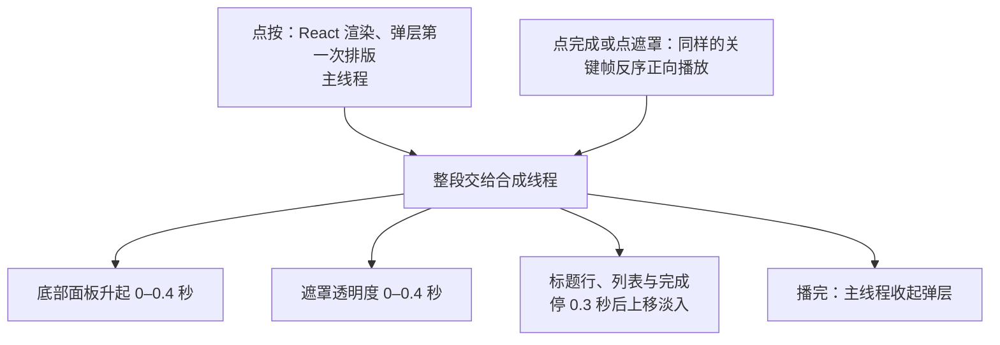

# 活动筛选

## 问答

### 请求：底部弹层卡顿、点击穿透与标签条滚动

> 2026-10-09：“还有一点，bottomsheet弹出弹入动画很卡，然后bottomsheet显示时也有点击穿透问题。
> 然后筛选栏里的标签在触屏上好像能上下滚动，然后标签上下边框似乎也被裁切了一部分。”

### 已查明事实

| # | 事实 | 来源 |
| --- | --- | --- |
| F2 | 锁滚动的做法：工具栏滚到吸顶位置之后，才给 `<html>` 加 `is-filtering`（`overflow: hidden`、`scrollbar-gutter: stable`）并显示面板；面板 `overflow-y: auto`、`overscroll-behavior: contain`，高度到屏幕底边，遮罩是全屏的固定层。重写前（`9878269` 的 `assets/filters.js`、`site.css`）是同一个做法 | `src/components/FilterDock.tsx` 的 `setOpen`、`fitPanel`；`src/styles/app.css` |
| F4 | 触屏上第一次点按会弹出“动作与方向”授权（镜面光随手机晃动要用，`src/lib/glass.ts` 在第一次点按时请求）；模拟器里有一次，第一次点“筛选”只弹出了授权、面板没打开，再点一次才打开 | 模拟器 |
| F7 | 标签条 `ul.filter-tags` 横向可滚（`overflow-x: auto`），按 CSS 规则纵向也跟着成了 `auto`。标签与标签条都是 40px 高，每个标签的反光环（`specular-rim` 的 `::after`，向外 0.7px、环宽 1.4px）比标签多出 0.7px：标签条内容高 41px、框高 40px，纵向能滚 1px（无头 Chrome 量得 `scrollHeight` 41、`clientHeight` 40，`scrollTop` 能设到 1）。反光环上下向外的那一半被标签条的滚动框裁掉，外层的渐隐遮罩 `.filter-tags-edge`（也是 40px 高，遮罩只画到自身边框以内）同样裁掉它；第一个标签左侧的反光环也一样被裁 | `src/components/FilterDock.tsx` 356–358 行；`src/styles/app.css` 的 `specular-rim`、`fade-edges`；无头 Chrome 390×844 实测 |
| F8 | iPhone Air 模拟器的 Safari：按住筛选栏里的标签往下拖，标签跟着手指往下走、被标签条下沿裁掉一截，松手弹回——iOS 对只溢出 1px 的滚动框照样给回弹（F7） | 模拟器拖动中的截图 |
| F9 | 手机宽度（768px 及以下）的场地、风格小类与日期弹层是底部面板：`popover="manual"` 的顶层弹层，暗色遮罩是弹层的 `::backdrop`。浏览器自带样式给打开的弹层的 `::backdrop` 写死了 `pointer-events: none !important`，页面改不了：点在遮罩上的手指落到下面的元素。弹层在“按下的位置不在它里面”时关闭，这一下却照样传给下面——Chrome 里点遮罩上“广州”的位置，弹层关闭、广州被取消（标签 2 个变 1 个）；模拟器 Safari 里点遮罩上“深圳”的位置，弹层关闭、深圳被选上（标签栏出现“深圳”，结果变 18 场）。筛选面板自己不理这一下（有弹层开着时不关面板），所以只有遮罩下面的胶囊与按钮会被点到；在遮罩上拖动也会落到下面的面板上。宽屏的下拉没有遮罩，点外面关闭的同时点到目标，是普通下拉的做法，这次没报告 | `src/components/Pickers.tsx` 的 `PickerPop`（`press`）；`src/components/FilterDock.tsx` 的 `press`；WebKit 自带样式 `Source/WebCore/css/popover.css`；无头 Chrome 与模拟器实测 |
| F10 | 弹层的动画：打开时底部面板从屏幕下沿升起（`transform`），遮罩淡入（自定义属性 `--veil` 驱动 `::backdrop` 的透明度），0.3 秒起标题行、列表与“完成”依次上移 50px 淡入，间隔 0.08 秒；关闭倒放。都用 `EASE`——把 GSAP power3.out 写成 31 个点的 CSS `linear()`；下拉松手后的回弹用 `cubic-bezier` | `src/components/Pickers.tsx` 的 `play`、`release`；`src/lib/motion.ts` |
| F11 | 已发布的 Safari 不把缓动是 `linear()`（带点列）的动画交给合成线程，只在主线程逐帧算：WebKit 源码的 `KeyframeEffect::canBeAccelerated()` 在 Core Animation 这条路上遇到 `linear()` 或 `steps()` 就返回否；WebKit bug 312407（2026-04，iOS 与桌面 Safari 26 上只动 `transform`、`opacity` 也掉帧）记的正是这件事，新的“按时间线程化的动画”开关在 Safari 技术预览版里默认开、修好了它，没有正式版的时间。自定义属性的动画（如 `--veil`）在任何浏览器里都在主线程。带延迟的动画要等延迟结束、主线程跑到那一帧才交给合成线程（`updateAcceleratedActions`） | WebKit 源码 `Source/WebCore/animation/KeyframeEffect.cpp`；https://bugs.webkit.org/show_bug.cgi?id=312407 |
| F12 | 模拟器（iOS 27.0 Safari）对照：点开场地弹层、等两帧后让主线程忙 3 秒。现在的写法，底部面板停在升到三分之一处、遮罩不出现，主线程空出来才一下跳到终点；把缓动换成 `cubic-bezier`，或把同一条曲线写成 31 个关键帧、帧间用普通 `linear`，底部面板在主线程忙的时候照样升到顶；只去掉底部面板的背景模糊或遮罩动画都没有这个效果；遮罩（自定义属性）在各种写法下都停住。关闭（倒放、带延迟）在只等两帧的条件下各种写法都停住，原因（倒放、延迟还是图层还没建好）还没分清 | 模拟器截图 |
| F13 | 模拟器（每秒 60 帧）逐帧计时：场地弹层打开大多满帧，偶有一帧 36–148ms（多在前 0.3 秒）；风格小类、日期弹层与各弹层的关闭很少超过 34ms。分别关掉遮罩动画、底部面板的模糊、遮罩的模糊、地形或内容上移，各 12 次开关里没有一致的差别：模拟器用 Mac 的 CPU 与显卡，主线程很少忙到卡住动画，测不出手机上的手感 | 模拟器测速（场地弹层 6 组各 12 次，全部弹层 6 组各 12 次） |
| F14 | Chrome（手机 390×844、CPU 降速 4 倍）逐帧记录：弹层打开与关闭期间主线程每帧 10–14ms（地形的一帧 4–6ms；遮罩的自定义属性被弹层里每个元素继承，每帧重算样式 3–7ms），弹层停稳后每帧 2–4ms；点按那一下 46–59ms（React 重渲染整页，加上弹层第一次排版约 15ms——这次排版第一帧本来就要做），弹层报告打开后再重渲染一次 13ms。Safari 每秒 60 帧时一帧有 16.7ms，微信 120 帧时只有 8.3ms | Chrome 性能跟踪 |
| F15 | 同一条 `linear()` 缓动（`EASE` 与样式里的 `--ease-card`）还用在：筛选面板的遮罩淡入与卡片上移（面板的高度增长是排版动画，换什么缓动都在主线程）、已选条件标签的出现与让位、活动详情各区的上移与摘要淡入、清单里当天第一条的色条与标题、清单行海报的灰度与位移过渡 | `src/components/FilterDock.tsx`、`EventDetail.tsx`、`EventRow.tsx`；`src/styles/app.css` |
| F16 | 关闭用倒放（`direction: 'reverse'`）写的动画，即使曲线已写成关键帧，Safari 也不交给合成线程：点“完成”后 12 帧让主线程忙 3 秒，标题行、搜索框、列表与“完成”一直完整显示；同一个动作写成正向播放（关键帧按相反顺序排、方向不变）时，它们在主线程忙的时候照样淡出。底部面板自己的退场要等 0.46 秒（等里面的内容先走）才开始，在两种写法下都停着——带延迟的动画要等延迟结束、主线程跑到那一帧才交出去（F11）；把延迟写成关键帧开头停住不动的一段，动画从点按起就是一整段，不必等主线程 | 模拟器截图 |
| F17 | 弹层收起要 0.86 秒（内容先走，底部面板随后），这期间弹层还开着：自己的遮罩若照样接点按，紧接着的点按会被挡住（模拟器里点“完成”后马上点“深圳”没选上）；原来的 `::backdrop` 不接点按，收起途中的点按会落到页面上 | 模拟器；`scripts/check-browser.ts` |

### 问答

| # | 问题 | 答复 | 影响 |
| --- | --- | --- | --- |
| Q4 | 这次改哪些动画的写法（F11、F12、F15）：A 只改底部弹层（报告的问题）；B 筛选这一块全改——底部弹层、筛选面板的遮罩与卡片、已选条件标签（面板的高度增长仍在主线程）；C 在 B 之外再改活动详情与清单行（跨到活动浏览模块，另提一个请求更清楚）。三种都保持曲线、时长与样子不变，只是改成 Safari 能交给合成线程的写法。推荐 B：原因相同、都在筛选里，标签的出现与让位正好发生在改了条件、清单重新渲染、主线程最忙的时候 | “B 筛选这一块”（2026-10-09 提问工具） | 底部弹层、筛选面板的遮罩与卡片、已选条件标签的动画都改成 Safari 能交给合成线程的写法，曲线、时长与样子不变；面板的高度增长照旧；活动详情与清单行不在这次范围 |
| Q5 | 卡顿怎样算修好（F12、F13）：A 我在模拟器里证明动画已交给合成线程（主线程忙时底部面板与遮罩照样动完）、逐帧计时不变差，验收时再请你在看到卡顿的那台手机、那个浏览器里实际看；B 在 A 之外，做一个手机测试页，让你盲比改前改后两种写法（顺序打乱、不标名字）。推荐 A：模拟器测不出手机的手感（F13），但能直接证明卡顿的原因已经去掉（F12），手感由你验收时判断 | “A 模拟器证明加手机上看”（2026-10-09 提问工具） | 验证：模拟器里主线程忙时动画照样走完、逐帧计时不变差；验收时 moss 在看到卡顿的手机与浏览器里看 |
| Q6 | 怎么分层（Q4、Q5 已定）：A 三层——L1 标签条（`src/components/FilterDock.tsx`：标签条纵向不能滚，四周留 1px 给反光环、外边距 -1px 让标签位置不变；`test/browser/layout.js` 加断言：标签条不能纵向滚、反光环在标签条与渐隐遮罩以内；解决 F7、F8）；L2 点击穿透（`src/components/Pickers.tsx`：手机上弹层铺满屏幕，底部面板以外是一层真正的遮罩，取代 `::backdrop`、样子不变，点它只关弹层，在它上面拖不会动到后面的面板，下拉关闭与松手回弹改为调这层遮罩的透明度；`scripts/check-browser.ts` 加检查：点遮罩后弹层关闭、筛选条件不变；解决 F9）；L3 动画交给合成线程（`src/lib/motion.ts`：把 `EASE` 曲线写成关键帧，延迟写成开头停住的一段，关闭写成反序的正向播放；`Pickers.tsx` 的底部面板、遮罩与内容，`FilterDock.tsx` 的面板遮罩、卡片与标签改用它，曲线、时长与样子不变；解决 F10–F12、F16）。B 两层——L1 是 A 的 L1 加 L2（标签条与点击穿透），L2 是 A 的 L3（动画）。C 一层，全部一起做。推荐 B：两处小修都靠 Chrome 与模拟器的点按、拖动核对，一起验收即可；动画要你在手机上看手感（Q5），单独一层，看的时候不夹杂别的改动 | “B 两层”（2026-10-09 提问工具） | 方案按两层写：L1 标签条与点击穿透，L2 动画交给合成线程 |

### 以往：筛选面板打开后触屏滚动穿透（2026-10-09）

> 2026-10-09：“触屏下，筛选点开之后滚动好像穿透了”

- 学习：写入：moss-browser（改了只在安全上下文提供的接口后，用局域网 IP 在无头 Chrome 里打开核对；要 moss 在手机上打开的地址写进提问卡片的问题里）

### 已查明事实

| # | 事实 | 来源 |
| --- | --- | --- |
| F1 | iPhone Air 模拟器的 Safari 里（当前构建，即线上 `c91a864`），筛选面板打开后试了 6 种手势：在卡片上慢慢上拖越过面板的尽头、在卡片上往上快甩、往下快甩、在面板底部空白处上拖、在顶部筛选栏上往下拖（慢、快各一次）。页面的滚动位置全程不变（最大变化 0），页面没有一次滚动事件，可视视口也没有移动；卡片滑到尽头时只在面板里回弹 | 模拟器加调试浮层（每帧记下 `scrollY`、可视视口与面板的滚动） |
| F3 | 点“筛选”后，工具栏不在吸顶位置时先平滑滚过去（最多约 1.5 秒），这期间页面还没锁：手指在这时滑动会滚动页面 | `FilterDock.tsx` 的 `dockBar`、`glideTo` |
| F5 | 与本任务无关（重写 L3 引入的问题）：在不是安全上下文的地址上（如手机经局域网 IP 打开的 http 预览），浏览器没有 `DeviceOrientationEvent`，而 `src/lib/glass.ts` 在判断它存在之前就读了它，抛出 “Can't find variable: DeviceOrientationEvent”，整个页面坏掉（活动行为 0）；线上是 HTTPS、模拟器的 127.0.0.1 也算安全上下文，所以都没出现。诊断页暂由代理补一个空的构造函数绕过，项目代码没改（已由提交 `cac6709` 修好） | moss 的 iPhone 报错；无头 Chrome 经局域网地址打开时活动行为 0 |
| F6 | moss 在 iPhone 的 Safari 里打开诊断页（当前构建加调试浮层，经局域网或 Tailscale 的 http 地址），点“筛选”后在卡片上滑到头再继续滑：这次没复现。诊断页与线上的差别：它是 http，没有第一次点按时的“动作与方向”授权提示（F4），也没有随手机晃动的光效 | moss 的 iPhone（2026-10-09） |

### 问答

| # | 问题 | 答复 | 影响 |
| --- | --- | --- | --- |
| Q1 | 在哪台设备、哪个浏览器上看到的（F1：模拟器的 Safari 里复现不了）：iPhone 的 Safari、iPhone 的微信、安卓手机（写明浏览器），或别的；是线上站点还是预览地址 | “iPhone Safari”（2026-10-09 提问工具） | 在 iPhone 的 Safari 里复现与验证 |
| Q2 | 当时怎么滑、看到什么在动（F1–F3）：A 在卡片上滑，滑到头后下面的活动清单跟着动；B 点开后马上滑，面板还在展开或页面还在滚向吸顶位置时；C 在卡片之间的空隙、底部空白或顶部筛选栏上滑；D 关掉筛选后，页面停在了和打开前不同的位置；或别的情形（写明） | “A 卡片滑到头”（2026-10-09 提问工具） | 要查的是：在卡片上滑到面板尽头之后，后面的清单为什么会动 |
| Q3 | 在线上站点（https://events.cardioravers.com/ ，HTTPS）照 A 那样滑，还能复现吗（F6：http 的诊断页上复现不了）：A 线上还能复现——差别多半在只有 HTTPS 才有的授权提示或晃动光效，下一步做一个 HTTPS 的诊断页（如带调试浮层的 Vercel 预览）在线上条件下量；B 线上也复现不了——按复现不了处理，记下现象，以后再出现时再查 | “线上也复现不了”（2026-10-09 提问工具） | 不改代码，结论写明现象、排查与再出现时的量法 |

## 结论

### 底部弹层、遮罩与标签条

- 标签条：`ul.filter-tags` 只横向滚动、纵向不滚，四周留 1px 让每个标签的反光环完整显示，外层的渐隐遮罩随之包住反光环；标签的位置与工具栏的高度不变。
- 底部弹层（768px 及以下）：弹层铺满屏幕，底部面板贴着屏幕下沿，其余部分是弹层自己的一层遮罩（暗色 55% 加 4px 背景模糊，与原来的 `::backdrop` 一样）。点遮罩只关弹层，手指不会落到下面的筛选项；在遮罩上拖动也动不到后面的面板。收起一开始遮罩就放行点按，紧接着的点按照常落到页面上（F17）。宽屏的下拉不变（没有遮罩，点外面关闭）。
- 动画写法：筛选里的底部弹层（面板、遮罩与里面的内容）、筛选面板的遮罩与卡片、已选条件标签的出现与让位，都用 `src/lib/motion.ts` 里按 Card Nav 曲线写好的关键帧（帧间普通 `linear`）：延迟写成开头停住的一段，关闭写成关键帧反序的正向播放。Safari 能把这样的动画整段交给合成线程，主线程忙的时候也照样走完；曲线、时长与样子与原来一样。面板高度的增长与宽屏下拉的擦开是排版与裁切动画，仍在主线程。

图示说明：点开一个底部弹层时，哪些工作在主线程、哪些整段交给合成线程。

### 触屏滚动穿透（复现不了）

- 现象：moss 在 iPhone 的 Safari 里打开筛选，在卡片上滑到面板尽头后，后面的活动清单跟着动（Q1、Q2）。
- 排查：iPhone Air 模拟器的 Safari 里六种手势都没让页面或后面的清单动（F1）；moss 在 iPhone 上用带调试浮层的诊断页（F6）与线上站点（Q3）都没再复现。锁滚动的做法与重写前相同（F2）。
- 结论：现在复现不了，不改代码。点开后、工具栏还在滚向吸顶位置的那一刻页面还没锁（F3），若以后在这个时机滑动，页面会动，这是已知的行为，不是这次看到的情形。
- 再出现时：经一个本机代理给页面注入每帧记录的浮层（页面滚动位置与滚动事件、后面清单的屏幕位置、窗口与可视视口的高度、面板的滚动），在出问题的设备上复现后读数，分清是页面真的滚了、只是视觉上在动，还是 Safari 地址栏在伸缩；线上才出现时要在 HTTPS 下量（只有 HTTPS 才有动作与方向的授权提示和晃动光效，F4、F6）。
- 另：手机经局域网 http 地址打开时页面会坏掉（F5），已由提交 `cac6709` 修好。

## 记录

### 本任务：底部弹层卡顿、点击穿透与标签条滚动

- 确认：“确认”
- 学习：无合格候选：本任务的规则与约定已在 L1、L2 写入技能，最后一次验收没有新的反馈，代理记忆里没有相关条目

#### 目标与范围

- 目标：标签条在触屏上不能上下滚、反光环不被裁（F7、F8）；点底部弹层的遮罩只关弹层（F9）；底部弹层、筛选面板的遮罩与卡片、已选条件标签的动画在 Safari 里交给合成线程，主线程忙时不卡（F10–F16、Q4）。
- 不做：活动详情与清单行的动画（Q4 没选 C，另提）；面板高度的增长与宽屏下拉的擦开（排版与裁切动画，在主线程）；宽屏下拉点外面时的行为；标签的键盘焦点框（向外 7px）仍会被标签条裁掉，这次报告的是触屏下的反光环。
- 须遵守：Q4、Q5、Q6；曲线、时长与样子都不变，不拿效果换流畅（项目技能 pages-site-visual-choices）；弹层与面板照旧是 Card Nav 节奏（AGENTS.md 第五节）。

#### 层

1. L1 标签条与点击穿透
   - 内容：`src/components/FilterDock.tsx` 的标签条纵向不滚（`overflow-y: hidden`），四周留 1px、外层左右 -1px，标签位置不变；`src/components/Pickers.tsx` 在手机上让弹层铺满屏幕、加一层遮罩取代 `::backdrop`，点遮罩只关弹层，下拉关闭、松手回弹与松手关闭改为调这层遮罩的透明度（淡入淡出的写法到 L2 再改）；`test/browser/layout.js` 加断言：标签条不能纵向滚、反光环在标签条与渐隐遮罩以内；`scripts/check-browser.ts` 加检查：手机宽度点遮罩上胶囊的位置，弹层关闭、筛选条件不变；AGENTS.md 第五节补一句：点遮罩只关闭弹层、不触到下面。
   - 验收：模拟器里按住标签上下拖，标签不动；标签上下的反光环完整；点遮罩任何位置只关弹层、筛选条件不变；遮罩、标签条的样子与开关动画和原来一样。
   - 验证：`bun run build`（含测试）、`bun run check:browser`、`bunx tsc --noEmit`、`git diff --check`；无头 Chrome 量标签条的 `scrollHeight` 与 `clientHeight`、反光环的范围；iPhone Air 模拟器里真实点按遮罩上胶囊的位置、拖动标签；改前改后截图对比遮罩与标签条。
   - 依据：F7–F9、Q6
2. L2 动画交给合成线程
   - 内容：`src/lib/motion.ts` 加把 Card Nav 曲线写成关键帧的函数（延迟写成开头停住，关闭写成反序的正向播放）；`src/components/Pickers.tsx` 的底部面板、遮罩、标题行、列表与“完成”和松手关闭，`src/components/FilterDock.tsx` 的面板遮罩、卡片与标签的出现、让位改用它；宽屏下拉的擦开与面板高度照旧。
   - 验收：模拟器里让主线程忙时，底部弹层的升起与收起（含遮罩与内容）、面板遮罩、标签的出现照样走完；逐帧计时不比改前差；同一时刻暂停对比，样子与改前一样；moss 在看到卡顿的那台手机、那个浏览器里看手感（Q5）。
   - 验证：模拟器“点按后让主线程忙 3 秒”对照（弹层打开、关闭，面板遮罩，标签出现），改前改后截图；模拟器逐帧计时改前改后交替各 3 轮；无头 Chrome 在动画的若干时刻暂停截图，与改前逐像素比；`bun run build`、`bun run check:browser`、`bunx tsc --noEmit`。
   - 依据：F10–F16、Q4、Q5、Q6

#### 交付

- 操作：无（改动留在工作区）

#### 残余风险

- 模拟器测不出手机的手感（F13），手感靠 moss 验收时看。
- 面板高度的增长、宽屏下拉的擦开，以及活动详情与清单行的动画仍在主线程（Q4）。
- Safari 以后正式开启线程化动画后，`linear()` 也能交给合成线程；关键帧写法照样可用。

### L1 标签条与点击穿透（已完成）

- 改动：`src/components/FilterDock.tsx` 的标签条只横向滚动（`overflow-y: hidden`），四周 1px 内边距、最小高 42px，外层左右 -1px，标签位置与工具栏高度不变；`src/components/Pickers.tsx` 在手机上让弹层铺满屏幕、自身不接点按，底部面板贴底，其余部分是弹层自己的遮罩（暗色 55% 加 4px 模糊，取代 `::backdrop`），点遮罩只关弹层，开始收起时遮罩放行点按（F17），下拉关闭、松手回弹与松手关闭改为调遮罩的透明度；`src/styles/app.css` 把 `--veil` 的注册挪到活动详情一节（弹层不再用它）；`test/browser/layout.js` 加断言：标签条不能纵向滚、反光环不被上下裁掉，日期标题的分割线改查第一个显示着的日期组（筛选后第一天可能整组隐藏）；`scripts/check-browser.ts` 在有标签时多跑一次版面检查，加手机宽度点遮罩的检查；AGENTS.md 第五节补一句“点遮罩只关闭弹层、不触到下面的筛选项”。
- 验证：
  - `bun run build`（15 项测试）、`bun run check:browser`（四个宽度、筛选、点遮罩、活动详情、原图预览）、`bunx tsc --noEmit`、`git diff --check` 都通过。
  - 无头 Chrome 改前改后（390×844、3 倍屏）：标签条内容高 41、框高 40、能竖向滚 1px，改后 42 与 42、不能滚；新断言在改前的构建上报错、改后通过；点遮罩上“广州”的位置，改前广州被取消，改后两个标签都在、弹层关闭、筛选面板仍开着。
  - 截图逐像素比（减少动态效果、地形静止）：弹层打开时整屏只有 17 个像素不同、最大差 9/255（在标签条下沿）；标签条那一块有 2% 的像素不同，是上下的反光环现在完整显示（改前被切成平直的细线）。
  - iPhone Air 模拟器的 Safari：点遮罩上“深圳”的位置，弹层关闭、深圳没被选上；在遮罩上往下拖，后面的面板不动、弹层不关；按住标签往下拖，标签不动、反光环完整。收起途中再点一下能点到胶囊，这一项在 Chrome 里核对（模拟器的点按与截图都有延迟）。
- 学习：写入：moss-web-ui（弹层的 `::backdrop` 不接点按，要挡点按就让弹层铺满屏幕、自带遮罩，收起时放行；只横向滚动的条里胶囊外圈让条能竖向滚、被裁；Safari 留在主线程的动画：带点列的 `linear()`、`steps()`、倒放、自定义属性，与写成关键帧的做法）；moss-browser（在模拟器里让主线程空转，看动画是否交给了合成线程）
- 验收：“接受并提交”
- 提交：e2b8762

### L2 动画交给合成线程（已完成）

- 改动：`src/lib/motion.ts` 加 `eased()`：把 Card Nav 曲线（`EASE` 的 31 个点）写成关键帧、帧间普通 `linear`，延迟写成开头停住的一段，关闭写成反序的正向播放；`src/components/Pickers.tsx` 的底部面板、遮罩、标题行、列表与“完成”和松手关闭改用它（宽屏下拉的擦开是裁切动画，仍在主线程）；`src/components/FilterDock.tsx` 的筛选面板（高度、遮罩、卡片）与标签的出现、让位改用它（高度是排版动画，仍在主线程）；`EASE` 字符串不变，活动详情与清单行照旧用它。
- 验证：
  - `bun run build`（15 项测试）、`bun run check:browser`（四个宽度、筛选、点遮罩、活动详情、原图预览）、`bunx tsc --noEmit`、`git diff --check` 都通过。
  - 样子不变：无头 Chrome 里 L1 与 L2 两个构建在同一时刻暂停截图逐像素比（地形藏起来）——弹层打开 9 个时刻、收起 8 个、筛选面板展开 8 个、标签出现 6 个，全部一致（最大差 0–1/255）；只有弹层打开 650ms 那一帧，L1 在淡入中的“完成”按钮上多一道合成接缝（444 个像素），L2 那帧干净。
  - 交给了合成线程：iPhone Air 模拟器里点按后两帧让主线程空转 3 秒——L1 四种情形全停在开头；L2 的弹层打开时面板升到顶、遮罩与内容按时出现，收起时内容淡出、面板落下、遮罩淡去，筛选面板的遮罩淡入、卡片上移（高度停着，排版动画），新标签完整长出。
  - 主线程帧数：模拟器里 L1、L2 交替各 3 轮（每轮场地、风格小类、日期弹层各开关两次）：打开超过 34ms 的帧 19 对 16、超过 50ms 的 6 对 3，收起 12 对 11、2 对 5（L2 那 4 帧集中在一次收起里，L1 也有一次类似的集中），没有系统性变差；两边都没有脚本错误。
  - 没核对：手机上的手感，等 moss 验收时看（Q5）。
- 学习：写入：moss-web-ui（延迟写成关键帧开头停住，动画从一开始就整段交给合成线程）；pages-site-visual-choices（Card Nav 曲线的动画一律用 `eased()` 写，原因与还没改的部分）；moss-browser（改动画写法时在两个构建的同一时刻暂停逐像素对比）
- 验收：“接受并提交”
