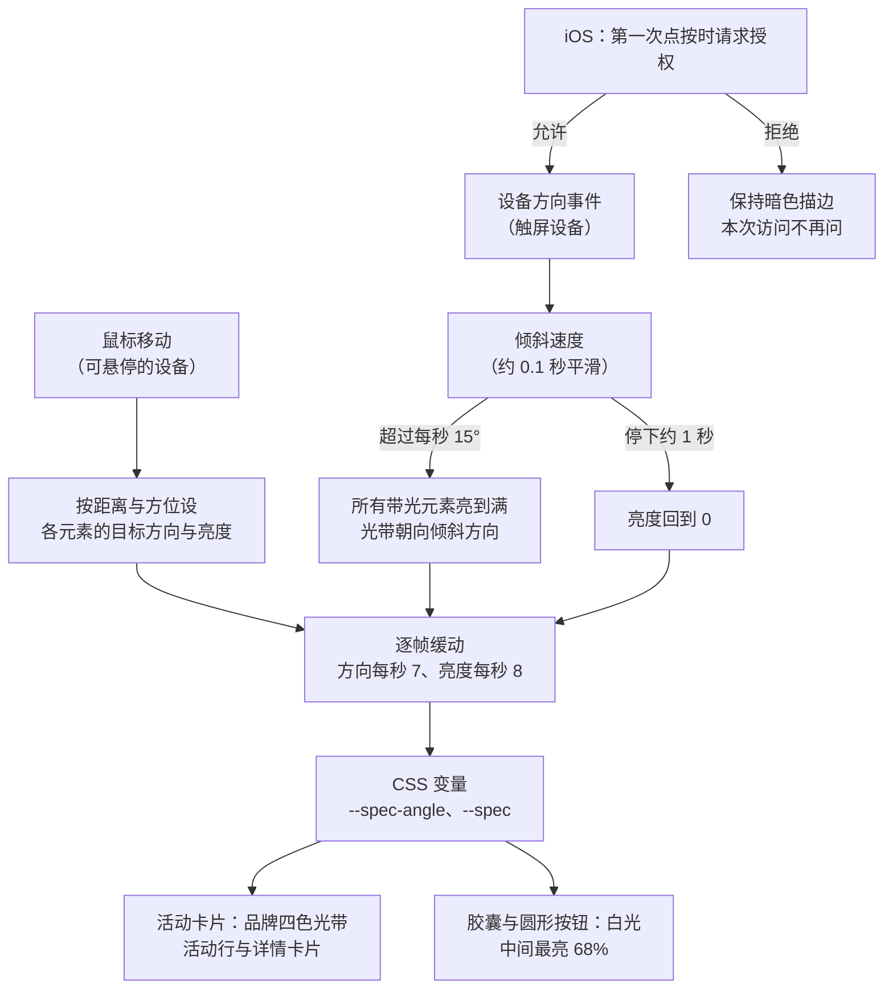

# 光效与材质

## 需求澄清

### 请求：详情排版、卡片光效、去掉倾斜、展开模糊与手机重力光效

> 2026-10-05：“这里出现了排版问题，看看怎么修复 桌面端详情卡片也需要鼠标移动时的边框光效果 然后桌面版那个卡片倾斜的效果，因为卡片不再原地展开，也不太需要了 然后详情展开时，我感觉缺少一些模糊效果 然后我希望在移动端，由于没有鼠标，我希望所有的边框光效果随重力感应来”

### 已查明事实

| # | 事实 | 来源 |
| --- | --- | --- |
| F1 | moss 附的截图：桌面上 Sara Landry: Chapter I 的详情卡片里，票务区的档位名一字一行（“纯入场”“含饮品券”竖排），地点区的场地名断成三行 | moss 2026-10-05 的截图 |
| F2 | 原因：详情卡片最宽 760px（手机全屏 390px），卡片里各区却按屏幕宽度分栏（`.event-details`：屏宽超过 1100px 时 4 栏、有阵容时阵容与其余为 1.5:1；1100px 以下 2 栏、阵容通栏；手机 1 栏）。同样 760px 宽的卡片：1440 宽屏上没有阵容的场次 4 栏各 190px，档位名只剩一字宽；有阵容时阵容 455px、其余 303px；1024 与 768 宽时 2 栏各约 380px、阵容通栏（已由 L1 改变） | 脚本 `pw/g1.mjs`（event-43、event-8、event-2 在 1440、1024、768、390 宽下量各区宽度）；`assets/site.css` |
| F3 | 详情卡片的边框没有光效：`assets/glass.js` 只点亮胶囊、圆形按钮与活动行；活动行的光是 `.event-row::after`（品牌四色、满亮度光带，鼠标在卡片上时一直指着鼠标）。moss 已定光效只分两种：活动卡片一种，其余胶囊与圆形按钮一种（已由 L1 改变） | `assets/glass.js`、`assets/site.css`；项目技能 `pages-site-visual-choices`（2026-10-06） |
| F4 | 收起行的倾斜：`assets/accordion.js` 在屏宽 521px 以上给每天第一条之后的行设 `--tilt: 8deg`，`.event-row` 以 `perspective(1400px) rotateX(var(--tilt))` 倾斜并带 0.6s 过渡；它来自 Accordion Gallery 竖向手风琴的原地展开外观，现在点行都打开详情卡片层、不再原地展开。AGENTS.md 第五节与 README 写着“宽屏收起行 8° 倾斜”（已由 L1 改变） | `assets/accordion.js`、`assets/site.css`、AGENTS.md、README.md |
| F5 | 详情展开时的模糊：遮罩为 `#05050bcc`（约八成深色）加 8px 背景模糊，0.4s 从无到有；卡片本身是不透明的深色（#13131b），飞入的卡片与落定的卡片都不透出后面（已由 L1 改变） | `assets/site.css` 的 `.event-detail::backdrop`、`.event-detail-sheet` |
| F6 | 手机上的光效：`assets/glass.js` 只响应鼠标（`pointerType` 为 mouse），触屏上胶囊、按钮与活动行都只留暗色描边、不亮（AGENTS.md 第五节） | `assets/glass.js`、AGENTS.md |
| F7 | 设备方向：`deviceorientation` 事件自 2023 年 9 月起主流浏览器都支持，只在 HTTPS 下可用；iOS Safari 要先调用 `DeviceOrientationEvent.requestPermission()`，必须由点按等用户操作触发，系统弹窗询问，拒绝时得到 “denied”；安卓 Chrome 不需要授权。本机预览（127.0.0.1 与 Tailscale 的 http 地址）在手机上不是 HTTPS，真机只能在线上域名上试；本机可以用 Chrome 的传感器模拟验证。iOS 微信内置浏览器能否授权未核实 | https://developer.mozilla.org/en-US/docs/Web/API/Window/deviceorientation_event 、https://developer.mozilla.org/en-US/docs/Web/API/DeviceOrientationEvent/requestPermission_static （2026-10-06 读取） |
| F8 | 模糊候选（临时注入样式，未改项目文件）：A 背景更透更糊（遮罩约四成深色、背景模糊 24px）；B 卡片磨砂玻璃（卡片约五成深色、背景模糊 28px，与活动行同一材质）；C 头图糊底（卡片底色为头图放大后重度模糊、压暗的颜色）；D 飞入时动感模糊（飞行中整张卡片约 6px 模糊，落定变清）。手机上卡片全屏，落定后看不到背景，A 只在飞入与收回时看得出；B、C 落定后也看得出 | [桌面截图](glass-effects/blur-candidates-1440.png)、[手机截图](glass-effects/blur-candidates-375.png)（脚本 `pw/g2.mjs`，Chrome `--headless=new`，event-2） |
| F9 | 候选 B 的实际取值：遮罩由 `#05050bcc` 加 8px 模糊改为 `#05050b80`（约五成深色）加 6px 模糊；卡片底色 `rgb(19 19 27/.5)` 加 `blur(28px) saturate(1.5)`。活动行是 `rgb(19 19 27/.4)` 加 `--glass-blur`（18px、saturate 1.5）。关闭时卡片换成非模态层、自绘遮罩（`.event-detail.is-leaving::before`），取值与遮罩相同，要一起改。飞入飞出改的是卡片的上下左右与圆角，磨砂每帧随卡片大小重算；详情打开期间地形背景与海报墙已暂停，卡片背后是静止画面 | 脚本 `pw/g2.mjs`；`assets/site.css`、`assets/event-detail.js` |
| F10 | 光效可复用的部分：`assets/glass.js` 给每个带光元素记方向与亮度，按每秒 7、8 的速率缓动；鼠标只设定目标方向与目标亮度，CSS 把 `--spec-angle`、`--spec` 画成光带。重力可以给屏幕上所有带光元素设同一个目标方向与亮度，沿用这套缓动与光带。详情卡片不在带光列表里，活动行的光环是 `.event-row::after`；屏宽 700px 以下详情卡片全屏，没有边框与圆角 | `assets/glass.js`、`assets/site.css` |
| F11 | 排版的修法：屏宽 700px 以下卡片全屏、各区一栏；701–1100px 卡片宽 653–760px、两栏且阵容通栏，显示正常；1101px 以上卡片仍是 760px，却套用为整行宽度准备的四栏或阵容左右分栏。卡片里在 700px 以上固定用两栏、阵容通栏，阵容左右分栏只留给无脚本时行内的详情，即与 1024、768 宽时的显示一致 | `assets/site.css`；F2 |
| F12 | 真机试重力要 HTTPS（F7）：本机 Tailscale 已开 HTTPS 证书（证书域名 本机的 Tailscale 域名），尾网里有一台在线的 iOS 设备；`tailscale serve` 可以把本机预览临时以 本机 Tailscale 域名的 HTTPS 地址 提供给尾网设备，这要改本机 Tailscale 的服务配置，用完关掉。不用它就只能发布到线上域名后试 | `tailscale status`、`tailscale serve status`（2026-10-06，当前没有服务配置） |
| F13 | 设备方向的接口与事件只在安全上下文里提供：规范把 `ondeviceorientation`、`DeviceOrientationEvent` 都标为 `[SecureContext]`，非安全上下文里不触发事件。`http://127.0.0.1` 算安全上下文，Tailscale IP 的 http 地址不算，手机打开这类地址时重力事件不触发、iOS 也没有授权接口。要在 Tailscale IP 上用 HTTPS，可运行 `tailscale cert` 取本机证书（证书域名 本机的 Tailscale 域名），由本地服务直接监听该 IP，不必改 `tailscale serve` 配置；按 Tailscale 文档，运行过 `tailscale cert` 的机器，其完整域名会记入公开的证书透明日志（开启 HTTPS 证书时管理台要求确认过这一点） | https://w3c.github.io/deviceorientation/ （第 6 节）、https://tailscale.com/kb/1153/enabling-https （2026-10-06 读取） |
| F14 | moss 的手机打不开 Tailscale IP 的 8443 端口（http）。本机防火墙开着（`socketfilterfw --getglobalstate`：State = 1），放行列表里有 mise 的 node 24.15.0 与已不存在的 Homebrew node 26.5.1，没有预览服务所用的 node 24.18.0（mise 当前默认版本）；本机自己请求本机地址不经过防火墙，所以本机核对地址时都是 200，证明不了别的设备能连上。工作文档服务也跑在 24.18.0 上 | `socketfilterfw --getglobalstate`、`--listapps`、`ps`（2026-10-06） |
| F15 | moss 验收 L2 时答“safari没有效果”。核对：Playwright WebKit（Safari 的内核）桌面页面里鼠标靠近活动行时 `--spec` 到 0.98，强制点亮时光环与 Chrome 一样画出品牌四色光带，光环写法 WebKit 认得；手机 Safari 打开局域网或 Tailscale 的 http 预览时不是安全上下文，拿不到设备方向（F13），重力光效不会出现；iPhone 模拟器没有动作传感器，只能核对授权提示；线上网站 events.cardioravers.com 还没有这次的改动 | 脚本 `pw/g9webkit.mjs`、`pw/g10ring.mjs`（2026-10-06）；F13 |

### 问答

| # | 问题 | 答复 | 影响 |
| --- | --- | --- | --- |
| Q1 | 详情展开时加哪种模糊（F5、F8）：A 背景更透更糊——遮罩从约八成深色降到约四成、背景模糊从 8px 加到 24px，随卡片飞入从无到有；手机上卡片全屏，落定后看不出；B 卡片磨砂玻璃——详情卡片改成与活动行同一材质的半透明磨砂，透出后面被糊开的页面颜色，手机上也看得出；C 头图糊底——卡片底色改为头图海报重度模糊、压暗后的颜色，每场带上自己海报的色调；D 飞入时动感模糊——卡片飞行前段整体约 6px 模糊，落定变清晰。推荐 B：站内的活动行、筛选卡片、胶囊都是磨砂玻璃，只有详情卡片是不透明的，改成磨砂后材质一致，手机全屏时也有模糊感；A 在手机上落定后看不出，C 的色调随海报变化、较难控制，D 只在 0.5s 的飞行中出现 | “B 卡片磨砂玻璃 (推荐)”（2026-10-06 提问工具） | 详情卡片改为半透明磨砂，取候选 B 的值（F9）：卡片约五成深色加 28px 模糊，遮罩约五成深色加 6px 模糊，关闭时的自绘遮罩同步；飞入飞出的帧率前后对比（F9） |
| Q2 | 手机上光效随重力的表现（F6、F7）：A 一直亮着、方向随倾斜转——光带取中等亮度常亮，手机倾斜时转向，像信用卡的反光随手机转动；B 只在晃动时闪亮——手机一动光带就亮起并转向，静止约 1 秒后渐暗。两种都覆盖所有带光效的地方（胶囊、圆形按钮、活动卡片），减少动态效果时都不亮。推荐 A：效果始终看得见，转动手机时光带跟着走，最接近桌面上鼠标靠近时的样子；B 在拿着不动时是暗的，不容易发现 | “B 只在晃动时闪亮”（2026-10-06 提问工具） | 手机上光带平时不亮，手机一动就亮起并转向，静止约 1 秒后渐暗；覆盖胶囊、圆形按钮与活动卡片，减少动态效果时不亮；沿用 `assets/glass.js` 的方向与亮度缓动，由重力设定所有带光元素的目标（F10） |
| Q3 | iOS 上的授权（F7）：iOS 要由一次点按触发系统弹窗，用户允许后才有重力数据：A 第一次点按页面时请求——不加任何按钮，这次点按照常生效（如打开详情），同时弹出系统提示；允许后光效随重力，拒绝就保持现在的暗色描边、本次访问不再问；B 加一个“光效”开关——放在页脚，点了才请求；C iOS 不做——只有安卓随重力。安卓不需要授权，打开页面就生效。推荐 A：不加控件（站内约定操作直接作用在内容上、不另设操作行），提示只出现一次 | “A 第一次点按时请求 (推荐)”（2026-10-06 提问工具） | iOS 不加控件，页面上第一次点按时请求授权，这次点按照常生效；拒绝或不支持时保持暗色描边，本次访问不再问；安卓打开页面即生效 |
| Q4 | 手机上的重力光效怎么在真机上验（F7、F12）：A 临时 HTTPS 预览——用 `tailscale serve` 把本机预览以 本机 Tailscale 域名的 HTTPS 地址 提供给尾网设备，moss 用 iPhone 的 Safari 与微信打开试，验收后关掉；要改本机 Tailscale 的服务配置，需 moss 允许；B 发布后在线上试——验收前提交、推送到 main 并发布，在 events.cardioravers.com 试，需另外授权提交与发布；C 不在真机上验——只用 Chrome 的传感器模拟与 iPhone 模拟器核对，真机效果等以后发布时再看。推荐 A：不发布就能在真机上看到晃动光效与 iOS 授权弹窗，也能看磨砂卡片在手机上是否流畅，用完即关 | “直接监听tailscaleip即可”（2026-10-06 提问工具） | 不用 `tailscale serve`，预览服务直接监听 Tailscale IP；但 http 地址在手机上不是安全上下文，重力不触发（F13），按 Q5 处理 |
| Q5 | 直接监听 Tailscale IP 时用 http 还是 https（F13）：A 起 HTTPS——运行一次 `tailscale cert` 取本机证书，临时服务只监听 Tailscale IP 的 8443 端口，地址 本机 Tailscale 域名的 HTTPS 8443 端口，不改 `tailscale serve` 配置；证书由 Let’s Encrypt 签发，若本机以前没取过，本机的 Tailscale 域名 会记入公开的证书透明日志；B 只用 http——在 Tailscale IP 的 8443 端口（http） 上看磨砂、排版与光效外观，重力只用 Chrome 的传感器模拟核对，真机等发布后在线上看。推荐 A：真机上能看到晃动光效与 iOS 授权弹窗，只需取一次证书、不改 Tailscale 的服务配置 | “B 只用 http”（2026-10-06 提问工具） | 给 moss 看的临时预览只监听 Tailscale IP 的 http（8443 端口），不取证书、不改 Tailscale 配置；手机上看磨砂、排版与光效外观，重力在本机 Chrome 的传感器模拟（127.0.0.1 是安全上下文）与 iPhone 模拟器里核对，真机效果等发布后在线上看，列入残余风险 |
| Q6 | 怎么分层（括号里是各层改的文件）：A 两层——L1 详情卡片与清单：详情卡片里 700px 以上固定两栏、阵容通栏，阵容左右分栏只留给无脚本时的行内详情（修 F1、F2 的挤压）；卡片磨砂玻璃按 Q1、F9 的取值，遮罩与关闭时的自绘遮罩同步；卡片边框加活动卡片那种光，700px 以下卡片全屏时不显示；去掉收起行的 8° 倾斜（`assets/site.css`、`assets/glass.js`、`assets/accordion.js`、`scripts/check_layout.js` 加详情分栏的断言，AGENTS.md、README 同步）；L2 手机重力光效：触屏设备按 Q2 晃动时闪亮、静止约 1 秒后渐暗，iOS 按 Q3 第一次点按时请求授权，减少动态效果时不亮（`assets/glass.js`，AGENTS.md、README 同步）。B 三层——L1 排版修正与去掉倾斜（`assets/site.css`、`assets/accordion.js`、`scripts/check_layout.js`、文档）；L2 卡片磨砂与边框光（`assets/site.css`、`assets/glass.js`、文档）；L3 手机重力光效（同 A 的 L2）。C 一层——五项一起做、一次验收。推荐 A：L1 都在桌面与卡片本身，在浏览器里一次看全；L2 只在触屏设备上起作用，要用传感器模拟另验，真机效果要等发布（Q5），分开验收不互相拖住 | “A 两层 (推荐)”（2026-10-06 提问工具） | L1 详情卡片与清单（排版、磨砂、卡片边框光、去掉倾斜），L2 手机重力光效；各自验收 |
| Q7 | “safari没有效果”是在哪儿试的（F15）：A iPhone 的 Safari，打开局域网或 Tailscale 的 http 预览——http 上拿不到设备方向，属于 Q5 选 http 时的限制；B iPhone 的 Safari，打开线上网站——线上还没有这次的改动；C Mac 上的 Safari，用鼠标——WebKit 里光效正常，需要你说明哪里没有效果；D iOS 模拟器——模拟器没有动作传感器。各情况的处理不同，答复后再定 | “A iPhone Safari 的 http 预览”（2026-10-06 提问工具） | 是 F13 所说的限制（http 不是安全上下文，Safari 不提供设备方向），代码不改；L2 的真机效果仍按 Q5 在发布到 HTTPS 线上后看 |

## 实现方案

### 材质

- 磨砂玻璃：令牌 `--glass-*`（`assets/site.css`）。活动行底色约四成深色、背景模糊 18px（`--glass-blur`）；筛选栏、筛选卡片与空状态在 Chromium 上另叠 Glass Surface 折射（`assets/glass.js`）。
- 详情卡片（Q1、F9）：半透明磨砂，底色 `rgb(19 19 27/.5)`、背景 `blur(28px) saturate(1.5)`，透出后面被糊开的页面；四周遮罩约五成深色（`#05050b80`）加 6px 模糊，随卡片飞入从无到有；关闭时卡片换成非模态层后自绘的遮罩取同样的值。手机上卡片全屏，同样是磨砂。

### 镜面光

- 两种（项目技能 `pages-site-visual-choices`）：活动卡片——活动行与详情卡片的 1px 光环（`::after`），品牌四色、满亮度的两道对称光带，没有底环；胶囊与圆形按钮——白光、中间最亮 68%、自带底环。详情卡片的光环只在卡片模式（屏宽 700px 以上）显示，手机上卡片全屏、没有边框，不显示。
- 一套逻辑（`assets/glass.js`）：每个带光元素记方向与亮度，按每秒 7、8 的速率缓动，写成 `--spec-angle`、`--spec`，由 CSS 画成光带；只算屏幕上的元素；减少动态效果时不亮。
- 鼠标（可悬停的设备）：250px 内渐亮，光带朝向鼠标；鼠标在胶囊上时停到对角，在活动卡片上时一直指着鼠标。
- 重力（触屏设备，Q2）：由设备方向事件的前后、左右倾角算倾斜速度（约 0.1 秒平滑），超过每秒 15° 算在动（手稳稳拿着时达不到）——屏幕上所有带光元素一起亮到满，光带朝向倾斜变化的方向；最后一次在动之后约 1 秒渐暗。两次读数之间跳动超过 45°（手机竖直或扣放时角度会翻转）不算晃动；横屏时朝向按竖屏的轴计算。
- 授权（Q3、F13）：只在 HTTPS 下可用。不需要授权的浏览器（安卓）打开页面就生效；iOS 在页面上第一次点按时请求授权，这次点按照常生效；允许后随重力，拒绝时保持暗色描边，本次访问不再问；那次点按没有带来用户激活（如滑动）时等下一次点按。

#### 光效的输入

图：鼠标与重力两种输入怎样驱动同一套光带。

鼠标只在可悬停的设备上起作用，重力只在触屏设备上起作用，两者不会同时驱动；不需要授权的浏览器直接收到设备方向事件。

### 详情卡片的排版

- 屏宽 700px 以下卡片全屏，各区一栏；700px 以上卡片最宽 760px，各区两栏、阵容通栏（F11）。阵容左栏、其余右栏的分法（屏宽 1101px 以上）只用于无脚本时行内展开的详情。

### 清单收起行

- 收起行平放，不再倾斜（F4）；海报的滚动视差与错位照旧。

## 执行记录

### 本任务：详情排版、卡片光效、去掉倾斜、展开模糊与手机重力光效

- 确认：“确认”（2026-10-06 提问工具）
- 学习：写入：moss-browser（给手机看的预览同时监听 Tailscale IP 与局域网地址，两个地址都给 moss；手机 http 预览上看不到需要安全上下文的效果时，在验收问题开头点名写出——moss 曾在 http 预览上试重力光效）；项目技能 `pages-site-visual-choices`（详情卡片属于活动卡片那种光、手机全屏不加光环；触屏光效只在晃动时闪亮与 iOS 首次点按授权；详情卡片与新浮层用磨砂玻璃；收起行平放，原版效果失去作用时提出去掉）；各层的纠正与发现已在 L1、L2 写入 moss-browser 与 moss-web-ui；代理记忆里没有与本任务相关、要迁入技能的条目

#### 目标与范围

- 目标：修好桌面详情卡片里票务、地点等区被挤成一字一行的排版（F1、F2）；详情卡片改为磨砂玻璃（Q1），桌面上卡片边框带随鼠标的活动卡片光效；去掉收起行的 8° 倾斜；触屏设备上所有光效改为随重力——晃动时闪亮、停下约 1 秒后渐暗（Q2），iOS 第一次点按时请求授权（Q3）。
- 不做：不改详情卡片的形态、入口、过场与关闭方式（event-browsing Q20–Q26）；不新增第三种光效，不改两种光效的颜色与亮度；不加光效开关等控件；不改首屏海报墙与筛选的玻璃；不新增依赖。
- 须遵守：Q1–Q6；光效只分两种（活动卡片一种，其余另一种）；减少动态效果时不亮、过场直接显示与隐藏；AGENTS.md 第五、六节；给 moss 看的预览只监听 Tailscale IP 的 http（Q4、Q5），本机验证用 127.0.0.1 与内置浏览器。

#### 层

1. L1 详情卡片与清单
  - 内容：`assets/site.css`：详情卡片里 700px 以上各区两栏、阵容通栏，屏宽 1101px 以上的阵容左右分栏只作用于清单行（无脚本时）；详情卡片的底色与模糊、遮罩及关闭时的自绘遮罩按 F9 的取值；`.event-detail-sheet::after` 与活动行共用光环，700px 以下不显示；`.event-row` 去掉倾斜的 `transform` 及其过渡。`assets/glass.js`：详情卡片加入带光元素，按活动卡片那种一直指着鼠标。`assets/accordion.js`：去掉 `--tilt` 及其屏宽监听，保留错位（`--drift`）。检查：`scripts/check_layout.js` 断言详情卡片 700px 以上两栏、以下一栏，卡片为磨砂、卡片模式下带光环，收起行没有倾斜。文档：AGENTS.md 第五节（收起行倾斜、详情卡片的材质与光、详情分栏）与 README 同步；`docs/event-browsing.md` 实现方案里清单与详情两句（“宽屏倾斜 8°”“四周暗色轻模糊遮罩”）按现状改写。
  - 验收：1440 等宽屏上打开 Sara Landry 等没有阵容的场次，票务档位名与场地名正常成行，有阵容的场次阵容通栏、其余两栏，与 1024、768 宽时一致；详情卡片是半透明磨砂，透出后面糊开的页面，手机全屏时也看得出；桌面上鼠标靠近与移过卡片时边框有品牌四色光带，一直指着鼠标；收起行平放；飞入飞出不比现在卡。观感待你确认（手机可在 Tailscale IP 的 8443 端口（http） 上看）。
  - 验证：`build_page.py --check`、`check_page.py`、`check_filters.js`、`check_preview.js`、`check_detail.js`、`check_hero.mjs`、`git diff --check`；`checkLayout()` 1440、1024、768、375 宽 × 详情开关；Chrome `--headless=new`（GPU）截图核对 event-43、event-8、event-2 在 1440、1024、375 宽的详情；CPU 降速 4 倍对比改前改后飞入飞出的逐帧间隔；内置浏览器里鼠标在卡片边框附近时的光带；临时预览服务（只提供页面与静态资源、no-cache）监听 Tailscale IP 与 127.0.0.1。
  - 依据：Q1、Q6、F1–F5、F9–F11
2. L2 手机重力光效
  - 内容：`assets/glass.js`：触屏设备（`hover: none`）监听设备方向，按实现方案“重力”一条给屏幕上所有带光元素设目标方向与亮度，沿用现有缓动与光带；iOS 第一次点按时请求授权，拒绝后本次访问不再问（`sessionStorage`，读写失败时照常）；减少动态效果时不亮。检查：`scripts/check_layout.js` 加一个异步的重力检查（触屏模拟下派发设备方向事件：倾斜后带光元素变亮并转向，停下约 1 秒后变暗，减少动态效果时不亮）。文档：AGENTS.md 第五节（原“触屏不亮”改为随重力）与 README 同步。
  - 验收：Chrome 手机模拟与传感器模拟下，转动手机时胶囊、按钮与活动卡片的光带一起亮起并随倾斜转向，停下约 1 秒后渐暗；桌面照旧只随鼠标；减少动态效果时不亮；iPhone 模拟器的 Safari 里第一次点按弹出授权提示、这次点按照常生效，拒绝后刷新不再问。真机手感（灵敏度、方向）与微信内置浏览器待发布后在线上确认（Q5）。
  - 验证：Chrome `--headless=new` 手机模拟（127.0.0.1，安全上下文）用 CDP 设备方向覆盖逐帧记录 `--spec` 与 `--spec-angle`；iPhone 模拟器 Safari 打开 127.0.0.1 的预览核对授权提示与点按；`checkLayout()` 与其他脚本检查复跑。
  - 依据：Q2、Q3、Q4、Q5、F6、F7、F10、F13

#### 交付

- 操作：无（改动留在工作区）

#### 残余风险

- 重力光效的真机手感（每秒 15°、0.1 秒平滑、1 秒这几个值）、iOS 授权弹窗与微信内置浏览器只能发布到 HTTPS 线上后核对（Q5），这几个值可能要按真机再调。
- 横屏时光带朝向按竖屏的倾角计算，会转 90°，只影响朝向、不影响闪亮。
- 磨砂卡片在飞入飞出时每帧重算模糊（F9）；本机用 CPU 降速测，真实手机上的流畅度由 moss 在 Tailscale 预览上确认。
- 从首屏海报飞入时卡片圆角由小变大，光环的圆角固定，飞行的半秒里圆角处约有一像素的错位，只在鼠标靠近时看得出。

### L1 详情卡片与清单（已完成）

- 改动：`assets/site.css`：详情卡片里屏宽 701px 以上各区两栏、阵容通栏，屏宽 1101px 以上阵容左栏、其余右栏的四条规则限定在清单行（无脚本时的行内详情）；详情卡片底色 `rgb(19 19 27/.5)` 加 `blur(28px) saturate(1.5)`，遮罩与关闭时的自绘遮罩改为 `#05050b80` 加 6px 模糊；活动行的光环规则同时用于 `.event-detail-sheet::after`，700px 以下卡片全屏时不显示；`.event-row` 去掉 `perspective(1400px) rotateX(--tilt)` 与它的过渡（`--open` 的过渡保留）。`assets/glass.js`：详情卡片加入带光元素与“一直指着鼠标”的一类。`assets/accordion.js`：去掉 `--tilt`、8° 常量与屏宽监听，错位 `--drift` 照旧。`scripts/check_layout.js`：断言收起行没有倾斜；详情打开时 700px 以上两栏、以下一栏，卡片为磨砂，卡片模式有光环、全屏时没有。AGENTS.md 第五节与 README 同步（收起行平放、卡片材质与遮罩、详情分栏、卡片边框光）；`docs/event-browsing.md` 实现方案里清单与详情两句按现状改写
- 验证：`build_page.py --check`、`check_page.py`、`check_filters.js`、`check_preview.js`、`check_detail.js`、`check_hero.mjs`、`git diff --check` 通过；Chrome `--headless=new`（GPU）里 `checkLayout()` 在 1440、1024、768、375 宽 × 两种动态设置下，详情关闭与打开 event-43（Sara Landry，无阵容）、event-2、event-8（有阵容）都通过；1440 宽 Sara Landry 的各区由 190px 变为 379px，票档名与场地名各成一行，有阵容时阵容 758px 通栏、其余各 379px，与 1024 宽一致（768 宽 359px，375 宽一栏）；卡片计算样式为半透明底色与 28px 模糊，鼠标在卡片右侧外 30px 时右边框出现品牌四色光带、中心在鼠标高度；无脚本时清单行的详情照旧（1440 宽阵容左右分栏 805／537px、无阵容四栏，1024 两栏，375 一栏）；CPU 降速 4 倍时飞入飞出平均帧间隔 17.2–17.9ms、最长 33–67ms，改前 18.2–19.9ms、最长 66–100ms，不比改前卡；截图见 [L1 截图](glass-effects/l1-screens.png)；临时预览服务（只提供 `index.html` 与 `assets/`、no-cache）监听 127.0.0.1 与 Tailscale IP 的 8443 端口，内置浏览器已打开 127.0.0.1:8443 并核对新传的脚本与样式；面板隐藏时过场停在第一帧，鼠标光效与过场的实际观感在无头 Chrome 里核对，内置浏览器里待 moss 看
- 学习：写入：moss-browser（给手机看的预览直接监听 Tailscale IP 的 http、不用 `tailscale serve` 与证书，安全上下文才有的接口在 127.0.0.1 模拟验、真机等线上）；moss-web-ui（区块搬进较窄的卡片后仍按屏宽媒体查询分栏会挤坏，卡片里按自身宽度另定栏数并在三档宽度下量各区）
- 修改要求：“我在真机加载不出来，你监听一下局域网地址看看”（2026-10-06 提问工具）
- 修改后改动：页面代码不变；临时预览服务加监听局域网地址的 8443 端口，并改用防火墙已放行的 node 24.15.0 运行（F14：原来用的 24.18.0 不在放行列表，别的设备连进来可能被拦）；仍只提供 `index.html` 与 `assets/`、no-cache
- 修改后验证：本机请求 127.0.0.1、Tailscale IP 与局域网地址的 8443 端口都返回 200；别的设备能否打开本机测不了（本机请求不经过防火墙），待 moss 在手机上确认
- 修改后学习：写入 moss-browser（本机防火墙开着时，没放行的 node 版本收不到别的设备的连接，本机自测不出来；给手机看的预览用 `socketfilterfw --listapps` 里已放行的 node 运行，不改防火墙设置）
- 验收：“接受”（2026-10-06 提问工具）

### L2 手机重力光效（已完成）

- 改动：`assets/glass.js`：没有悬停的设备（`hover: none`）在安全上下文里监听设备方向，由前后、左右倾角算倾斜速度（约 0.1 秒平滑），超过每秒 15° 时屏幕上所有带光元素一起亮到满、光带朝向倾斜变化的方向，最后一次在动之后 1 秒（计时器）亮度回到 0，沿用原有的方向与亮度缓动；两次读数之间跳动超过 45° 不算晃动；元素滚进画面时立即取当前亮度；iOS 在 `touchend`（捕获）里请求授权，结果为拒绝时记在 `sessionStorage`、本次访问不再问，请求被拒（没有用户激活）时等下一次点按；鼠标的光改为只在可悬停的设备上起作用，两种输入互斥；减少动态效果时不亮。实现中把方案里“与缓慢跟随的静止姿态比较、偏离超过 2°”改为按倾斜速度判断：前者在停下后还要约 1 秒才回到 2° 以内，加上 1 秒计时共约 2 秒才暗，不合 Q2“静止约 1 秒后渐暗”；实现方案与残余风险已同步。`scripts/check_layout.js`：新增 `checkMotionLight()`（触屏模拟、安全上下文下派发设备方向读数：拿稳不亮，倾斜后屏幕上的带光元素都亮过一半且光带朝向倾斜方向，停下约 1 秒后暗下，减少动态效果时一直不亮）。AGENTS.md 第五节与 README 同步（原“触屏不亮”改为随手机晃动）
- 验证：`build_page.py --check`、`check_page.py`、`check_filters.js`、`check_preview.js`、`check_detail.js`、`check_hero.mjs`、`git diff --check` 通过；Chrome `--headless=new` 手机模拟（127.0.0.1）`checkMotionLight()` 通过（4 个带光元素，峰值 0.97；减少动态效果时为 0），`checkLayout()` 四种宽度 × 两种动态设置 × 详情开关复跑通过；CDP 设备方向覆盖（真实事件、只在角度变化时触发）：倾斜后亮度 0.98、朝向 85°（向右），停下 0.95 秒时仍为 1，2.2 秒时 0.002；桌面：派发方向读数不亮，鼠标移入后 0.996；iPhone 17 Pro Max 模拟器 Safari（127.0.0.1:8443）：第一次点按首屏海报，详情照常打开并弹出“想要访问动作与方向”的系统提示，点取消后刷新再点按，不再弹出、详情照常打开；截图见 [L2 截图](glass-effects/l2-motion.png)（手机模拟，左为拿稳、右为晃动时所有活动卡片与“筛选”按钮亮起）；真机手感与微信内置浏览器待发布后在线上核对（Q5）
- 学习：写入：moss-web-ui（设备方向只在安全上下文、只给没有悬停的设备；iOS 在 `touchend` 里请求授权、被拒时等下一次点按、拒绝记在 `sessionStorage`；方向事件可能只在变化时才来，停下后的判断用计时器；按平滑后的倾斜速度判断在动，跳动几十度是角度翻转）；moss-browser（iOS 才有的网页行为用 iPhone 模拟器 Safari 打开 127.0.0.1 核对，点按后截图要等一会儿，坐标按设备点数；Chrome 的方向覆盖只能测逻辑）
- 修改要求：“safari没有效果”（2026-10-06 提问工具）
- 修改后改动：无（Q7：在 iPhone Safari 的 http 预览上试的，属于 F13 的限制）
- 修改后验证：同上方验证；http 预览上手机既没有设备方向、也没有鼠标，光效不亮，与改动前的触屏表现相同
- 验收：“接受”（2026-10-06 提问工具）
