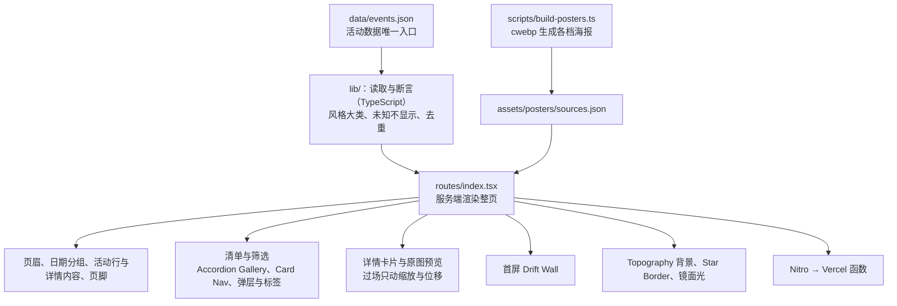

# 用框架重写全站

## 需求澄清

### 请求：用框架重写，动画改用 CSS

> 2026-10-09：“然后我认为有几个优化方向 1. 使用react或其他高性能前端框架重写 2. 动画尽可能用css实现，少用js 3. 图片加载需要优化”

### 已查明事实

| # | 事实 | 来源 |
| --- | --- | --- |
| F1 | 这条请求在 `docs/motion-performance.md` 里拆分：图片加载（第 3 条）已在那里做完；用框架重写（Q30 选了“用框架重写”）与动画改用 CSS（Q31 选了清单视差与日期标题漂移改为 CSS 滚动驱动动画、详情飞出与缩回只动缩放与位移）按 Q33 放到本文档，作为单独的任务 | `docs/motion-performance.md` Q30–Q33 |
| F2 | 现在的架构：`scripts/build_page.py` 用 Python 读 `data/events.json` 与 `templates/index.html` 生成静态 `index.html`；样式是 `assets/site.css`（约 54KB）与构建时内联的 `assets/hero.css`；交互是 10 个原生脚本（`hero.js`、`topography.js` 由 bun 从 `scripts/hero.mjs`、`scripts/topography.mjs` 打包，后者用 ogl 画 WebGL）；海报由 `scripts/build_posters.py` 生成各档；检查脚本 `build_page.py --check`、`check_page.py`、`check_filters.js`、`check_preview.js`、`check_detail.js`、`check_hero.mjs` 与浏览器里的 `check_layout.js` 都针对生成的 `index.html`；Vercel 的构建只是把 `index.html` 与 `assets/` 复制进发布目录 | `package.json`、`vercel.json`、`scripts/`、`assets/` |
| F3 | 要重写的交互（规格见 AGENTS.md 第四、五节，以及 `docs/event-browsing.md`、`docs/glass-effects.md`、`docs/motion-performance.md` 里几十轮问答定下的细节）：首屏 Drift Wall 海报墙；全页 Topography 等高线背景与文字背后的模糊带；按日期分组的手风琴清单与视差；吸顶筛选工具栏（Card Nav 展开、已选条件标签、城市与时段胶囊、风格分体胶囊与小类弹层、场地与日期弹层）；App Store 式详情卡片（从清单行或墙上海报飞出、下拉关闭、`#event-id` 地址、返回键）；原图预览（缩放、拖动、惯性、捏合与下拉关闭）；镜面光（随鼠标、随手机晃动）；分割线星光；复制与系统分享 | AGENTS.md；`assets/*.js` |
| F4 | 必须保留的约束：无脚本时清单照常显示并在行内展开全部详情；减少动态效果时没有过渡、视差与动画；语义化 HTML、键盘与读屏可用；未知信息不显示也不参加筛选；`data/events.json` 是活动数据唯一的编辑入口。AGENTS.md 现在写着“复用静态 HTML/CSS 与现有脚本，不为资讯维护引入框架或采集平台”，重写要改这一条 | AGENTS.md 第一、五节 |
| F5 | 前几轮实测的负担与写法无关：手机上每帧重算磨砂玻璃（120 帧的微信尤甚）、详情过场每帧重新排版、大图解码（`docs/motion-performance.md` F5、F27、F30、F36、F38）；换框架本身不减少这几样，Q31 的两项动画改法与图片优化才直接对应 | `docs/motion-performance.md` |
| F6 | React Bits 的组件原本是 React 写的（部分依赖 GSAP、ogl 或 three）；站内是照原版移植成原生脚本，并按 moss 的选择改了参数与行为（如 Drift Wall 的列宽、斜转与卡内平移）。用 React 时可以直接引入原版组件，再按这些已定的改动调整 | `scripts/hero.mjs`；`.claude/skills/pages-site-visual-choices` |
| F7 | 发布：Vercel 的 `events` 项目从 `main` 部署到 events.cardioravers.com；推送别的分支只生成预览部署，且项目的 Vercel 登录保护已关闭，预览地址公开可开。AGENTS.md 第六节要求直接在 `main` 上提交 | GitHub 部署记录；`docs/unbranded-preview.md` 的记录；AGENTS.md |
| F8 | TanStack Start：`@tanstack/react-start` 1.168.60（2026-09-30 更新，1.x 正式版），配 React 19.3；基于 Vite，`vite.config.ts` 里 `tanstackStart` 插件的 `prerender` 选项（`enabled`、`crawlLinks`、`filter` 等）可在构建时把页面预渲染成静态 HTML，用于不支持服务端渲染的平台；部署到 Vercel 的官方写法是加 Nitro 的 `nitro/vite` 插件，默认以服务端渲染运行（Vercel 函数）。文档没有写预渲染的页面在无脚本时能否交互（静态内容本身照常显示） | [TanStack Start：Static Prerendering](https://tanstack.com/start/latest/docs/framework/react/guide/static-prerendering)、[Hosting](https://tanstack.com/start/latest/docs/framework/react/guide/hosting)；`npm view`（2026-10-09） |

### 问答

| # | 问题 | 答复 | 影响 |
| --- | --- | --- | --- |
| Q1 | 用哪个框架、怎样输出（F2、F4、F6）：A Astro——页面在构建时生成静态 HTML，只有交互部分用 React 组件按需加载，React Bits 原版组件可以直接用，无脚本时清单照常；B React + Vite——构建时预渲染成静态 HTML，再由 React 接管整页；C Svelte（SvelteKit）或 Solid——运行时更小，但 React Bits 原版要手动移植，与现在的做法相同。推荐 A：页面主体是静态清单，Astro 默认不发脚本、只给交互部分发，最接近现在的轻量，又能直接用 React Bits | “tanstack start”（2026-10-09 提问工具） | 用 TanStack Start（React 19、Vite）重写；输出方式见 Q5（F8） |
| Q2 | 重写后的样子与交互按什么标准（F3、F6）：A 与现在完全一致——每个宽度、每个状态与现在逐项截图对比，只有 Q31 的两项动画换做法、不换样子；B 改用 React Bits 原版组件的样子与参数，与现在不同的地方逐项问你。推荐 A：现在的样子是几十轮问答调出来的 | “B 改用 React Bits 原版”（2026-10-09 提问工具） | 各部件改用 React Bits 原版组件的样子与参数；每做一个部件，先列出与现在不同的地方逐项问 moss（含此前选定的改动，如 Drift Wall 的斜转与卡内平移） |
| Q3 | 开发与上线方式（F7）：A 在单独的分支上重写，推送后用 Vercel 预览地址给你看，全部验收后再合进 `main` 上线（这件事不按“直接在 main 上提交”）；B 直接在 `main` 上分步替换，每层上线一部分。推荐 A：重写期间正式站不受影响 | “B 在 main 上分步替换”（2026-10-09 提问工具） | 直接在 `main` 上分层替换，每层验收后上线一部分；所以第一层就要让 TanStack Start 产出可上线的完整页面（已被 Q8 改变） |
| Q4 | 活动数据与检查（F2、F4）：A 活动数据仍以 `data/events.json` 为唯一入口，现有的数据断言（Python）保留，页面结构与交互检查改写成新框架下的测试；B 数据断言也改写进框架的构建（TypeScript），不再用 Python。推荐 A：数据规则多（风格分类、未知不显示、去重等），保留现成的断言最稳 | “B 全部改写进框架”（2026-10-09 提问工具） | 活动数据的断言、页面检查与海报生成都改用 TypeScript 写进新的构建，不再用 Python；`data/events.json` 仍是活动数据的唯一入口 |
| Q5 | 输出与托管（F4、F8）：A 构建时把页面预渲染成静态 HTML（`prerender`），Vercel 只托管静态文件，无脚本时清单照常显示，与现在的托管方式一样；B 用 Nitro 部署成服务端渲染，每次访问由 Vercel 函数生成页面。推荐 A：内容只在更新数据时变，静态最快最稳，也不产生函数调用 | “B 服务端渲染”（2026-10-09 提问工具） | 用 Nitro 部署到 Vercel，以服务端渲染运行（Vercel 函数）；页面仍先输出完整 HTML，无脚本时清单照常 |
| Q6 | 样式怎么写（F2、F6）：A 沿用现在的 CSS（`site.css` 按组件拆开），React Bits 用“TypeScript + CSS”版本的组件；B 改用 Tailwind，React Bits 用“TypeScript + Tailwind”版本。推荐 A：现有的设计令牌（品牌色、玻璃、控件尺寸）都在 CSS 变量里，原样沿用最省 | “B 改用 Tailwind”（2026-10-09 提问工具） | 样式改用 Tailwind，现有设计令牌（品牌色、玻璃、控件尺寸、圆角）移进 Tailwind 主题；React Bits 用“TypeScript + Tailwind”版本 |
| Q7 | 怎么分层（在单独的分支上重写，全部验收后再合进 `main`，Q8）：A 五层——L1 骨架与数据：分支里搭 TanStack Start、Tailwind 与 Nitro，`data/events.json` 的断言与海报生成改写成 TypeScript，用 React 输出页面结构（页眉、清单、详情内容、页脚）与无脚本时的样子；L2 清单与筛选：手风琴清单、筛选工具栏、弹层与标签（React Bits 原版，差异逐项问）；L3 详情与原图预览：过场只动缩放与位移（Q31）；L4 首屏与背景：Drift Wall、Topography、Star Border、镜面光，清单视差与日期标题漂移改为 CSS 滚动驱动动画（Q31）；L5 收尾：检查改写完、删掉旧脚本与 Python、AGENTS.md 与 README 重写、Vercel 改用新构建，合进 `main` 上线。B 三层——L1 同上；L2 清单、筛选、详情与预览；L3 首屏、背景与收尾上线。每层都推送分支，用 Vercel 预览地址验收。推荐 A：每层集中在一类部件，React Bits 的差异问答与验收都更清楚 | “B 三层”（2026-10-09 提问工具） | 分三层：L1 骨架与数据；L2 清单、筛选、详情与预览；L3 首屏、背景与收尾上线；每层推送 `tanstack-start` 分支，用 Vercel 预览地址验收 |
| Q8 | 修改要求 | “还是改一下之前的方案先提交现在没提交的修改 然后切个分支来做”（2026-10-09 提问工具） | 先在 `main` 上提交现在未提交的改动（另作一件事处理，已提交为 9878269、未推送，并切出 `tanstack-start` 分支）；重写改在单独的分支上做，全部验收后再合进 `main`，Q3 的“在 main 上分步替换”不再适用；Q7 按此重问 |

## 实现方案

### 结构

这张图说明重写后各部分的关系：活动数据经 TypeScript 读取与断言后，由一个服务端渲染的路由输出整页，各交互部件是 React 组件（样子与参数取 React Bits 原版，与现在不同处逐项问过），经 Nitro 部署到 Vercel。

- 技术：TanStack Start（React 19、Vite、TypeScript）、Tailwind（现有设计令牌移进主题）、Nitro 部署到 Vercel，以服务端渲染运行（Q1、Q5、Q6）；包管理沿用 bun。
- 数据：`data/events.json` 仍是活动数据唯一的编辑入口；`scripts/build_page.py` 与 `scripts/check_page.py` 里的数据规则改写成 TypeScript，在构建与测试时执行（Q4）。
- 海报：`scripts/build_posters.py` 改写成 TypeScript（仍调用 cwebp），各档海报与 `sources.json` 的字段不变。
- 部件：每个部件用 React Bits 的“TypeScript + Tailwind”原版组件；动手前列出它与现在不同的地方逐项问（Q2）。清单视差与日期标题漂移用 CSS 滚动驱动动画，详情过场只动缩放与位移（Q31）。
- 无脚本时：服务端输出的 HTML 里有全部活动与详情，清单照常显示（F4）。
- 检查：数据与页面结构的断言写成测试；筛选、详情、预览与布局的检查改写成浏览器测试。

## 执行记录

### 本任务：用框架重写，动画改用 CSS

- 确认：“确认”（2026-10-09 提问工具）

#### 目标与范围

- 目标：在 `tanstack-start` 分支上用 TanStack Start 重写全站，部件改用 React Bits 原版，两项动画改为合成线程上的做法，数据断言与构建脚本改用 TypeScript，全部验收后合进 `main` 上线（Q1–Q8）。
- 不做：不改活动数据内容；不改海报的各档规格（`docs/motion-performance.md` Q34、Q36）；重写期间正式站与 `main` 不动。
- 须遵守：Q1–Q8；`docs/motion-performance.md` 的 Q27（不拿效果换流畅）与 Q31；AGENTS.md 里与框架无关的内容规则（数据核对、未知不显示、无障碍、减少动态效果）；只用 iPhone Air 模拟器。

#### 层

1. L1 骨架与数据
  - 内容：在分支里搭好 TanStack Start、Tailwind 与 Nitro（`package.json`、`vite.config.ts`、`tsconfig.json`、`src/`），`vercel.json` 改用新构建；把 `build_page.py` 与 `check_page.py` 的数据规则改写成 TypeScript；`build_posters.py` 改写成 TypeScript；用 React 组件服务端渲染页眉、日期分组、全部活动行（含详情内容）与页脚，无脚本时的样子与现在一致；这一层没有交互。
  - 验收：服务端输出的页面含全部 57 场活动，各字段与现在的 `index.html` 一致；无脚本时桌面与手机截图与现在一致；原有的数据断言逐条都有对应且通过；海报脚本重跑生成的文件与现在相同；分支的 Vercel 预览地址能打开。
  - 验证：对比新旧页面里每场活动的字段；关掉脚本在桌面与手机截图对比；数据测试；海报脚本重跑后 `git status` 干净；推送分支后打开预览地址。
  - 依据：Q1、Q4、Q5、Q6、Q7、F2、F4、F8
2. L2 清单、筛选、详情与预览
  - 内容：手风琴清单（Accordion Gallery）、吸顶筛选工具栏（Card Nav）与已选标签、风格与场地弹层、日期日历、详情卡片层（过场只动缩放与位移）、原图预览，换成 React Bits 原版组件；每个部件动手前列出与现在不同的地方逐项问；对应的检查改写成浏览器测试。
  - 验收：各部件按问答定下的样子与行为工作；筛选结果与现在一致；详情的地址、返回键、焦点与下拉关闭照常；减少动态效果与无脚本时照常；桌面、手机与 iPhone Air 模拟器里核对。
  - 验证：浏览器测试（筛选、详情、预览、布局）；桌面与手机截图；iPhone Air 模拟器；推送分支看预览。
  - 依据：Q2、Q7、Q31、F3
3. L3 首屏、背景与收尾上线
  - 内容：首屏 Drift Wall、Topography 背景与文字模糊带、Star Border 分割线、镜面光与晃动光效换成 React Bits 原版（差异逐项问）；清单视差与日期标题漂移改为 CSS 滚动驱动动画；删除旧的原生脚本、模板与 Python 脚本；AGENTS.md（含去掉“不引入框架”）与 README 重写；合进 `main` 前跑全部检查。
  - 验收：首屏与背景按问答定下的样子；视差与标题漂移与现在一致且在合成线程上运行；仓库里不再有旧脚本与 Python；文档与新结构一致。
  - 验证：全部测试；桌面、手机与 iPhone Air 模拟器；在有界面的 Chrome 与模拟器里对比滚动与过场的帧数；推送分支看预览。
  - 依据：Q2、Q7、Q31、F3、F5

#### 交付

- 操作：每层推送 `tanstack-start` 分支，生成 Vercel 预览供验收；三层都验收后，把分支合进 `main` 并推送，等 Vercel 部署完成后回读线上页面

#### 残余风险

- 部署到 Vercel 依赖 Nitro 的 Vite 插件，官方说它仍在活跃开发（F8）；服务端渲染会产生 Vercel 函数调用与冷启动。
- React Bits 原版与现在的样子不同之处多，每个部件都要问答，工期以天计。
- CSS 滚动驱动动画需要 Safari 26、Chrome 115 起，更旧的浏览器上没有清单视差与标题漂移。

### L1 骨架与数据（进行中）
