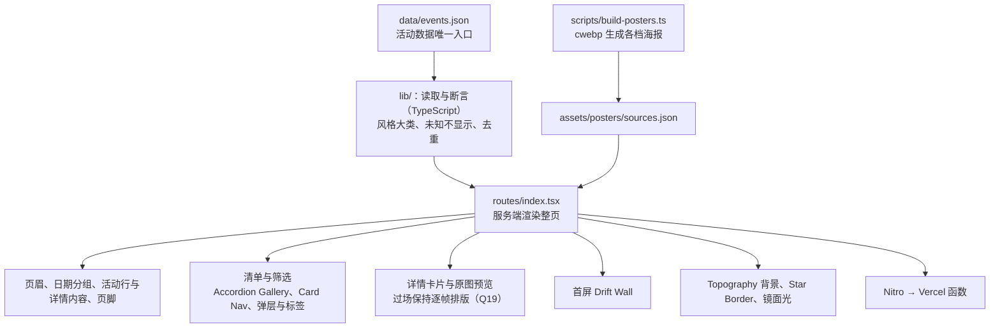

# 用框架重写全站

## 需求澄清

### 请求：用框架重写，动画改用 CSS

> 2026-10-09：“然后我认为有几个优化方向 1. 使用react或其他高性能前端框架重写 2. 动画尽可能用css实现，少用js 3. 图片加载需要优化”

### 已查明事实

| # | 事实 | 来源 |
| --- | --- | --- |
| F1 | 这条请求在 `docs/motion-performance.md` 里拆分：图片加载（第 3 条）已在那里做完；用框架重写（Q30 选了“用框架重写”）与动画改用 CSS（Q31 选了清单视差与日期标题漂移改为 CSS 滚动驱动动画、详情飞出与缩回只动缩放与位移）按 Q33 放到本文档，作为单独的任务 | `docs/motion-performance.md` Q30–Q33 |
| F2 | 现在的架构：`scripts/build_page.py` 用 Python 读 `data/events.json` 与 `templates/index.html` 生成静态 `index.html`；样式是 `assets/site.css`（约 54KB）与构建时内联的 `assets/hero.css`；交互是 10 个原生脚本（`hero.js`、`topography.js` 由 bun 从 `scripts/hero.mjs`、`scripts/topography.mjs` 打包，后者用 ogl 画 WebGL）；海报由 `scripts/build_posters.py` 生成各档；检查脚本 `build_page.py --check`、`check_page.py`、`check_filters.js`、`check_preview.js`、`check_detail.js`、`check_hero.mjs` 与浏览器里的 `check_layout.js` 都针对生成的 `index.html`；Vercel 的构建只是把 `index.html` 与 `assets/` 复制进发布目录 | `package.json`、`vercel.json`、`scripts/`、`assets/` |
| F3 | 要重写的交互（规格见 AGENTS.md 第四、五节，以及 `docs/event-browsing.md`、`docs/glass-effects.md`、`docs/motion-performance.md` 里几十轮问答定下的细节）：首屏 Drift Wall 海报墙；全页 Topography 等高线背景与文字背后的模糊带；按日期分组的手风琴清单与视差；吸顶筛选工具栏（Card Nav 展开、已选条件标签、城市与时段胶囊、风格分体胶囊与小类弹层、场地与日期弹层）；App Store 式详情卡片（从清单行或墙上海报飞出、下拉关闭、`#event-id` 地址、返回键）；原图预览（缩放、拖动、惯性、捏合与下拉关闭）；镜面光（随鼠标、随手机晃动）；分割线星光；复制与系统分享 | AGENTS.md；`assets/*.js` |
| F4 | 必须保留的约束：无脚本时清单照常显示并在行内展开全部详情；减少动态效果时没有过渡、视差与动画；语义化 HTML、键盘与读屏可用；未知信息不显示也不参加筛选；`data/events.json` 是活动数据唯一的编辑入口。AGENTS.md 现在写着“复用静态 HTML/CSS 与现有脚本，不为资讯维护引入框架或采集平台”，重写要改这一条 | AGENTS.md 第一、五节 |
| F5 | 前几轮实测的负担与写法无关：手机上每帧重算磨砂玻璃（120 帧的微信尤甚）、详情过场每帧重新排版、大图解码（`docs/motion-performance.md` F5、F27、F30、F36、F38）；换框架本身不减少这几样，Q31 的两项动画改法与图片优化才直接对应 | `docs/motion-performance.md` |
| F6 | React Bits 的组件原本是 React 写的（部分依赖 GSAP、ogl 或 three）；站内是照原版移植成原生脚本，并按 moss 的选择改了参数与行为（如 Drift Wall 的列宽、斜转与卡内平移）。用 React 时可以直接引入原版组件，再按这些已定的改动调整 | `scripts/hero.mjs`；`.claude/skills/pages-site-visual-choices` |
| F7 | 发布：Vercel 的 `events` 项目从 `main` 部署到 events.cardioravers.com；推送别的分支只生成预览部署，且项目的 Vercel 登录保护已关闭，预览地址公开可开。AGENTS.md 第六节要求直接在 `main` 上提交 | GitHub 部署记录；`docs/unbranded-preview.md` 的记录；AGENTS.md |
| F8 | TanStack Start：`@tanstack/react-start` 1.168.60（2026-09-30 更新，1.x 正式版），配 React 19.3；基于 Vite，`vite.config.ts` 里 `tanstackStart` 插件的 `prerender` 选项（`enabled`、`crawlLinks`、`filter` 等）可在构建时把页面预渲染成静态 HTML，用于不支持服务端渲染的平台；部署到 Vercel 的官方写法是加 Nitro 的 `nitro/vite` 插件，默认以服务端渲染运行（Vercel 函数）。文档没有写预渲染的页面在无脚本时能否交互（静态内容本身照常显示） | [TanStack Start：Static Prerendering](https://tanstack.com/start/latest/docs/framework/react/guide/static-prerendering)、[Hosting](https://tanstack.com/start/latest/docs/framework/react/guide/hosting)；`npm view`（2026-10-09） |
| F9 | TanStack Start 不水合时也会往页面里写两样东西：`<HeadContent />` 输出客户端包的 `modulepreload`（约 450KB），路由 `loader` 返回的数据序列化成 `$_TSR` 脚本（本页约 110KB）；两者都不用、在组件里直接取数据时，页面 264KB，与原来的 261KB 相当。L2 开始水合时，数据要以某种方式到客户端（序列化进页面或打进脚本） | L1 构建与本机服务实测 |
| F10 | React 的服务端输出在相邻的文字之间插 `<!-- -->`，文字拆成几个文本节点后字形会挪开零点几像素；相邻文字写成一个字符串后，无脚本截图与原页面逐像素一致 | L1 截图比对 |
| F11 | React Bits Card Nav 原版（`src/ts-tailwind/Components/CardNav/CardNav.tsx`，2026-09-27）：一个 60px 高、12px 圆角、白底带投影、宽 90%（最大 800px）的框随页面滚走，里面是汉堡图标（30px 线，0.3s 线性变 ×）、居中 Logo 与“Get Started”按钮；打开时同一个框增高到 260px（桌面固定，手机按内容），最多 3 张纯色深底卡片（#1B1722、#2F293A，9.6px 圆角，标题 22px 常规字重，下面是链接）等宽等高、内容靠下，0.4s power3.out，卡片上移 50px 淡入、间隔 0.08s；没有吸顶、遮罩、锁滚动、Esc 与减少动态效果；依赖 GSAP 与 react-icons。现在的工具栏与它不同的地方中，已有题号定过的：栏里放“筛选”按钮、已选标签、清空与结果数（第 189、199–200、215–216 题）；56px 玻璃胶囊、28px 圆角、无投影、14px 汉堡图标（第 138、215–217 题）；吸顶并变成贴顶通栏（第 140、170、218 题）；卡片是工具栏下方单独的浮层，带遮罩、锁滚动、Esc，未吸顶时先滚到吸顶位置（第 164、180 题）；卡片品牌色调玻璃、24px 圆角、16px 内距（AGENTS.md 第五节，第 212、219 题）。没定过的：卡片标题 Syne 20px 粗体（原版 22px 常规），四张卡按 1:2:1.2:1 定宽、各自高度、内容靠上（原版等宽等高、内容靠下）。原版的卡片只能放链接、只取前 3 张、桌面固定 260px 高，放不下 4 张表单卡片 | react-bits `main`（2026-10-08）；`public/assets/site.css`、`filters.js`；研究代理 |
| F12 | 全站写作“power3.out”的 Card Nav 节奏实际是 `cubic-bezier(.215,.61,.355,1)`（三次方缓出，即 GSAP 的 power2.out）；GSAP 的 power3.out 是四次方缓出（起步更快、收尾更长）。用在筛选面板与卡片、已选标签、各弹层、详情卡片落定后的上移淡入与清单手风琴（0.6s）；没有问答定过这条曲线 | GSAP `gsap-core.js`；`filters.js`、`pickers.js`、`event-detail.js`、`site.css` |
| F13 | React Bits Shiny Text 在 2026-10-08 整个重写：新版光带更窄、边缘柔和（shineWidth 40、softness 0.8），平滑缓动，从右往左扫，只扫文字本身（inline-block），离开屏幕时暂停，减少动态效果时为纯色；每帧用脚本重算渐变，不依赖第三方库。现在的空状态标题照的是重写前的默认（CSS 动画，宽光带硬边、线性、从左往右，扫过整张卡的宽度） | react-bits commit `8f6effa`；`site.css` |
| F14 | React Bits Accordion Gallery 原版（`src/ts-tailwind/Components/AccordionGallery/AccordionGallery.tsx`，2026-09-27）默认：整组固定 736px 高、各行按比例分（展开约 362px、收起约 84px），鼠标悬停、聚焦或点击切换展开行（默认第 3 行），方向键循环；收起行 8° 倾斜、全灰度加 35% 暗化，每行底部深色渐变；实色底 #0a0713、16px 圆角；按离展开行的远近错开 13–20px；只有展开行显示标签（3×26px 光条带 12px 光晕，文字从左滑入）；GSAP 0.6s power3.out，首次显示不播动画。现在与它不同的地方中，已定过的：每天第一条固定展开、点任何行打开详情（event-browsing Q25、Q26）；按内容定高，舞台 560/520px、收起行列出全部艺人与风格（AGENTS.md 第五节，event-browsing Q20–Q25）；收起行平放（glass-effects Q6）、保留 70% 色彩、不压暗、渐隐露出玻璃（第 134、135 题）；磨砂玻璃、24px 圆角与镜面光环（AGENTS.md 第四、五节，第 193–195 题）；页面就绪时播放收起（motion-performance Q28）；Syne 字体（AGENTS.md 第五节）。没定过的：错开幅度用行高算（约 5–7px，原版 13–20px）；展开行的品牌粉竖条 3px×0.9em、没有滑入；海报取景偏上（`center 25%`，原版居中）。原版的方向键切换与 520px 断点只对“可切换展开行”有意义，现在不适用 | react-bits `main`；`accordion.js`、`scroll-motion.js`、`site.css`；研究代理 |
| F15 | 其余 L2 部件在 React Bits 里没有对应组件：日期日历、可移除的已选标签、详情卡片层、原图预览都没有；小类与场地弹层只有部分相近的 Glide Select（`Micro/GlideSelect`：菜单从角上弹出、悬停高亮在行间滑动），但只能单选，没有搜索，也没有手机底部面板 | react-bits `main` 的组件目录（2026-10-09） |
| F16 | TanStack Start 的服务端组件（只让交互部分水合，其余部分不需要把数据送到浏览器）官方仍标为实验性，API 可能还会改；对应的包 `@tanstack/react-start-rsc` 为 0.1.59。数据序列化进页面约多 14KB（gzip，整页约 33KB）；React 与路由的客户端包约 113KB（gzip） | [Server Components](https://tanstack.com/start/v0/docs/framework/react/guide/server-components)、[Composite Components](https://tanstack.com/blog/composite-components)；L1 构建实测 |
| F17 | TanStack Router 默认接管浏览器历史：它改写 `history.pushState`、监听返回键，把详情与原图预览自己压入的 `#event-id` 条目都当作导航——重新跑路由、渲染完再滚动页面（有锚点就滚到那一行，没有就滚到页首）。在 iPhone Air 模拟器里，关闭收起行的详情时页面在飞行途中滚动，帧数由旧版的 56–57 掉到 35–38；路由在浏览器里改用它自己的内存历史后回到 55–58，开关详情时页面不再滚动，返回与前进照常 | iPhone Air 模拟器测速（关闭期间的 DOM 变动由 700 多次降到 10 次）；`@tanstack/history`、`router-core` 的 `scroll-restoration.js`（2026-10-09） |
| F18 | 水合的开销（iPhone Air 模拟器，各 3 轮）：起初水合后整页 57 行连同详情重新渲染一遍，且清单收起要等水合完才开始，首屏 6 秒里长帧（>34ms）10–12 次（旧版 3–6 次）；活动行改为只在自身数据变化时重新渲染、`accordion-ready` 改在解析完成时加上（与旧版同一时机）、每行包进 `Suspense` 分块水合后，长帧 5–6 次，清单收起 237–263ms（旧版 258–355ms），能响应点击的时间 486–514ms（旧版 258–355ms，晚约 0.2 秒，是整页水合本身的开销）；筛选面板开关 58–59 帧、打开详情 54–59 帧、关闭详情 53–58 帧，与旧版（55–60、53–59、54–57）相当 | iPhone Air 模拟器测速（本机测速页，旧版为 `main` 的导出，2026-10-09） |
| F19 | Q31b 的“只动缩放与位移”做出来了（卡片按落定的尺寸排好版，飞行中只做位移、旋转与缩放，内容反向缩放保持原尺寸，海报等比放大盖满框，圆角按比例补算，`src/lib/flight.ts`），在 iPhone Air 模拟器里各测 3 轮与现在的逐帧排版对比：打开详情两者都是 54–59 帧、开头各有一帧长帧（展开行 81–120ms 对 96–103ms）；关闭两者 53–57 帧，新做法最长一帧 80–115ms、现在的 62–78ms。两者开头那一帧都慢，是打开与关上那一刻的工作，与飞行中排不排版无关。样子：飞行的前三成，新做法的海报按落定的取景放大、淡出跟着放大的海报走，与现在按当时的舞台取景、在舞台七成处淡完不同（桌面与手机放慢 10 倍的截图对比）；后半程两者看不出差别 | iPhone Air 模拟器测速；无头 Chrome 放慢截图（2026-10-09） |
| F20 | Tailwind 改写的代价：活动行与详情的每个元素都带一串工具类，服务端输出的页面由 390KB 涨到 992KB（gzip 62KB → 85KB），页面脚本多 24KB（gzip 7KB），样式表多 10KB（gzip 3KB）。iPhone Air 模拟器里与改写前的构建交替各测 4 轮：解析完成晚约 10ms（中位 228 对 218ms）、load 晚约 17ms；能响应点击的时间（中位 486 对 499ms）与筛选、详情的帧数没有差别。按慢速 4G（1.44Mbps）估算多下载约 0.13 秒（未实测） | iPhone Air 模拟器测速；本机构建（2026-10-09） |

### 问答

| # | 问题 | 答复 | 影响 |
| --- | --- | --- | --- |
| Q1 | 用哪个框架、怎样输出（F2、F4、F6）：A Astro——页面在构建时生成静态 HTML，只有交互部分用 React 组件按需加载，React Bits 原版组件可以直接用，无脚本时清单照常；B React + Vite——构建时预渲染成静态 HTML，再由 React 接管整页；C Svelte（SvelteKit）或 Solid——运行时更小，但 React Bits 原版要手动移植，与现在的做法相同。推荐 A：页面主体是静态清单，Astro 默认不发脚本、只给交互部分发，最接近现在的轻量，又能直接用 React Bits | “tanstack start”（2026-10-09 提问工具） | 用 TanStack Start（React 19、Vite）重写；输出方式见 Q5（F8） |
| Q2 | 重写后的样子与交互按什么标准（F3、F6）：A 与现在完全一致——每个宽度、每个状态与现在逐项截图对比，只有 Q31 的两项动画换做法、不换样子；B 改用 React Bits 原版组件的样子与参数，与现在不同的地方逐项问你。推荐 A：现在的样子是几十轮问答调出来的 | “B 改用 React Bits 原版”（2026-10-09 提问工具） | 各部件改用 React Bits 原版组件的样子与参数；每做一个部件，先列出与现在不同的地方逐项问 moss（含此前选定的改动，如 Drift Wall 的斜转与卡内平移） |
| Q3 | 开发与上线方式（F7）：A 在单独的分支上重写，推送后用 Vercel 预览地址给你看，全部验收后再合进 `main` 上线（这件事不按“直接在 main 上提交”）；B 直接在 `main` 上分步替换，每层上线一部分。推荐 A：重写期间正式站不受影响 | “B 在 main 上分步替换”（2026-10-09 提问工具） | 直接在 `main` 上分层替换，每层验收后上线一部分；所以第一层就要让 TanStack Start 产出可上线的完整页面（已被 Q8 改变） |
| Q4 | 活动数据与检查（F2、F4）：A 活动数据仍以 `data/events.json` 为唯一入口，现有的数据断言（Python）保留，页面结构与交互检查改写成新框架下的测试；B 数据断言也改写进框架的构建（TypeScript），不再用 Python。推荐 A：数据规则多（风格分类、未知不显示、去重等），保留现成的断言最稳 | “B 全部改写进框架”（2026-10-09 提问工具） | 活动数据的断言、页面检查与海报生成都改用 TypeScript 写进新的构建，不再用 Python；`data/events.json` 仍是活动数据的唯一入口 |
| Q5 | 输出与托管（F4、F8）：A 构建时把页面预渲染成静态 HTML（`prerender`），Vercel 只托管静态文件，无脚本时清单照常显示，与现在的托管方式一样；B 用 Nitro 部署成服务端渲染，每次访问由 Vercel 函数生成页面。推荐 A：内容只在更新数据时变，静态最快最稳，也不产生函数调用 | “B 服务端渲染”（2026-10-09 提问工具） | 用 Nitro 部署到 Vercel，以服务端渲染运行（Vercel 函数）；页面仍先输出完整 HTML，无脚本时清单照常 |
| Q6 | 样式怎么写（F2、F6）：A 沿用现在的 CSS（`site.css` 按组件拆开），React Bits 用“TypeScript + CSS”版本的组件；B 改用 Tailwind，React Bits 用“TypeScript + Tailwind”版本。推荐 A：现有的设计令牌（品牌色、玻璃、控件尺寸）都在 CSS 变量里，原样沿用最省 | “B 改用 Tailwind”（2026-10-09 提问工具） | 样式改用 Tailwind，现有设计令牌（品牌色、玻璃、控件尺寸、圆角）移进 Tailwind 主题；React Bits 用“TypeScript + Tailwind”版本 |
| Q7 | 怎么分层（在单独的分支上重写，全部验收后再合进 `main`，Q8）：A 五层——L1 骨架与数据：分支里搭 TanStack Start、Tailwind 与 Nitro，`data/events.json` 的断言与海报生成改写成 TypeScript，用 React 输出页面结构（页眉、清单、详情内容、页脚）与无脚本时的样子；L2 清单与筛选：手风琴清单、筛选工具栏、弹层与标签（React Bits 原版，差异逐项问）；L3 详情与原图预览：过场只动缩放与位移（Q31）；L4 首屏与背景：Drift Wall、Topography、Star Border、镜面光，清单视差与日期标题漂移改为 CSS 滚动驱动动画（Q31）；L5 收尾：检查改写完、删掉旧脚本与 Python、AGENTS.md 与 README 重写、Vercel 改用新构建，合进 `main` 上线。B 三层——L1 同上；L2 清单、筛选、详情与预览；L3 首屏、背景与收尾上线。每层都推送分支，用 Vercel 预览地址验收。推荐 A：每层集中在一类部件，React Bits 的差异问答与验收都更清楚 | “B 三层”（2026-10-09 提问工具） | 分三层：L1 骨架与数据；L2 清单、筛选、详情与预览；L3 首屏、背景与收尾上线；每层推送 `tanstack-start` 分支，用 Vercel 预览地址验收 |
| Q8 | 修改要求 | “还是改一下之前的方案先提交现在没提交的修改 然后切个分支来做”（2026-10-09 提问工具） | 先在 `main` 上提交现在未提交的改动（另作一件事处理，已提交为 9878269、未推送，并切出 `tanstack-start` 分支）；重写改在单独的分支上做，全部验收后再合进 `main`，Q3 的“在 main 上分步替换”不再适用；Q7 按此重问 |
| Q9 | 已定过的差异怎么处理（F11、F14）：Card Nav 与 Accordion Gallery 和原版不同的地方，多数以前问答定过（工具栏内容、玻璃胶囊外观、吸顶、浮层面板与遮罩、品牌色调卡片；每天第一条固定展开、点行打开详情、按内容定高、收起行平放保留色彩、磨砂玻璃、就绪时播收起、Syne 字体）。A 这些一律保留现在的样子，只逐项问没定过的；B 每一项都逐项问。推荐 A：这些是几十轮问答调出来的，原版的对应做法（白底工具栏、固定高度、灰度压暗）与全站的深色玻璃风格冲突 | “A 一律保留 (推荐)”（2026-10-09 提问工具） | F11、F14 里已有题号定过的差异全部保留现在的样子；只按原版改没定过的项（Q10–Q17） |
| Q10 | Card Nav 节奏的缓动（F12）：A 改成原版的 power3.out（四次方缓出），全站用这套节奏的地方一起改，汉堡图标也按原版 0.3s 线性；B 保持现在的三次方缓出。推荐 A：Q2 选了原版参数，现在的曲线是移植时的偏差，没有问答定过 | “A 原版 power3.out (推荐)”（2026-10-09 提问工具） | Card Nav 节奏改用真正的 power3.out（四次方缓出），筛选面板与卡片、已选标签、各弹层、详情卡片的上移淡入与清单手风琴一起改；汉堡图标变 × 按原版 0.3s 线性 |
| Q11 | 筛选卡片的标题（F11）：A 原版 22px 常规字重；B 现在的 Syne 20px 粗体。推荐 A：Q2 选了原版参数，标题字号字重没有问答定过 | “B 保持现在”（2026-10-09 提问工具） | 筛选卡片标题保留 Syne 20px 粗体 |
| Q12 | 筛选卡片的排列（F11）：A 原版等宽等高、内容靠下；B 现在按内容 1:2:1.2:1 定宽、各自高度、内容靠上。推荐 B：风格卡有 7 个分体胶囊，等宽时它要折成好几行，面板更早超出屏幕 | “B 按内容定宽 (推荐)”（2026-10-09 提问工具） | 筛选卡片保留 1:2:1.2:1、各自高度、内容靠上 |
| Q13 | 空状态标题 Shiny Text（F13）：A 照 10-08 重写后的原版（窄而柔和的光带、平滑缓动、从右往左、只扫文字、离屏暂停），用 CSS 做出同样的样子；B 保持重写前的默认。推荐 A：Q2 选了原版，新版只扫文字，也修掉了现在光带扫过整张卡宽的问题 | “A 新版原版 (推荐)”（2026-10-09 提问工具） | 空状态标题按 10-08 重写后的 Shiny Text 默认参数，用 CSS 实现：只扫文字、平滑缓动、从右往左、离屏暂停，减少动态效果时为纯色 |
| Q14 | 清单收起行的错开幅度（F14）：A 原版 13–20px；B 现在约 5–7px。推荐 A：现在是按行高算的移植偏差，没有问答定过 | “A 原版 13–20px (推荐)”（2026-10-09 提问工具） | 收起行的错开按原版以海报尺寸为基准计算 |
| Q15 | 展开行名称前的竖条（F14）：A 原版 3×26px 光条带 12px 光晕、文字滑入，强调色用品牌粉（原版的 accentColor 参数）；B 保持现在的品牌粉 3px×0.9em 竖条、不滑入。推荐 A：Q2 选了原版参数，竖条的样子没有问答定过 | “A 原版光条 (推荐)”（2026-10-09 提问工具） | 展开行名称前改为原版 3×26px 光条带 12px 光晕、文字滑入，强调色品牌粉 |
| Q16 | 展开行的海报取景（F14）：A 原版居中；B 现在偏上（`center 25%`）。推荐 B：活动名多印在海报上半部，偏上能在舞台里露出名字（推测，没有记录） | “B 偏上 (推荐)”（2026-10-09 提问工具） | 展开行海报保留 `center 25%` 取景 |
| Q17 | 小类与场地弹层（F15）：A 保持现在的自绘多选弹层；B 借用 Glide Select 的弹出方式与悬停高亮滑动。推荐 A：Glide Select 只能单选，没有搜索与手机底部面板 | “A 保持自绘 (推荐)”（2026-10-09 提问工具） | 小类与场地弹层保留现在的自绘多选弹层，改写成组件 |
| Q18 | 开始水合后活动数据怎样到浏览器（F9、F16）：A 整页水合，数据随页面序列化（多约 14KB gzip）；B 整页水合，数据打进脚本（大小相同，可被缓存，但每次更新数据都会变）；C 用服务端组件，只有交互部分水合，数据不必全送。推荐 A：TanStack Start 的标准做法，最稳；C 省得最多，但官方仍标实验性 | “A 随页面序列化 (推荐)”（2026-10-09 提问工具） | 整页水合，活动数据经路由加载器随页面序列化送到浏览器 |
| Q19 | 详情过场用哪种（F19，Q31b 的前提在模拟器里不成立）：A 保持现在的逐帧排版——样子与现在完全一样，模拟器里帧数相同；B 改成只动缩放与位移——模拟器里没有更快，关闭时最长一帧略长，飞行前三成海报的取景与淡出和现在不同。推荐 A：Q31b 是为了让过场更顺才定的，实测没有收益，还改了样子；开头那一帧的卡顿另查 | “A 保持现在 (推荐)”（2026-10-09 提问工具） | 详情飞出与缩回保持逐帧排版的做法，样子不变；Q31 的 b 项（详情过场只动缩放与位移）不做，试做的代码已删去；打开与关上那一刻的长帧另查 |

## 实现方案

### 结构

这张图说明重写后各部分的关系：活动数据经 TypeScript 读取与断言后，由一个服务端渲染的路由输出整页，各交互部件是 React 组件（样子与参数取 React Bits 原版，与现在不同处逐项问过），经 Nitro 部署到 Vercel。

- 技术：TanStack Start（React 19、Vite、TypeScript）、Tailwind（现有设计令牌移进主题）、Nitro 部署到 Vercel，以服务端渲染运行（Q1、Q5、Q6）；包管理沿用 bun。
- 数据：`data/events.json` 仍是活动数据唯一的编辑入口；`scripts/build_page.py` 与 `scripts/check_page.py` 里的数据规则改写成 TypeScript，在构建与测试时执行（Q4）。
- 海报：`scripts/build_posters.py` 改写成 TypeScript（仍调用 cwebp），各档海报与 `sources.json` 的字段不变。
- 部件：每个部件用 React Bits 的“TypeScript + Tailwind”原版组件；动手前列出它与现在不同的地方逐项问（Q2）。清单视差与日期标题漂移用 CSS 滚动驱动动画（Q31）；详情过场保持现在逐帧排版的做法（Q19：只动缩放与位移在模拟器里没有更快，F19）。
- 无脚本时：服务端输出的 HTML 里有全部活动与详情，清单照常显示（F4）。
- 检查：数据与页面结构的断言写成测试；筛选、详情、预览与布局的检查改写成浏览器测试。
- 过渡：L1 只做服务端渲染、不水合，页面的行为仍由原有的原生脚本（`public/assets/*.js`）负责；L2 换成组件并开始整页水合（F9、Q18），原生脚本只剩首屏墙、地形、视差与光效，L3 换掉。样式：原来的 `site.css` 移进构建成为 `src/styles/legacy.css`，放在 Tailwind 工具类之下的层（Tailwind 不带 preflight、只扫 `src/`）；部件改写成工具类时删去对应的旧规则，L2 的部件已改完，剩下页眉、页脚、首屏、字体与令牌、光效与分割线、打印规则，L3 改完后删去这个文件。

## 执行记录

### 本任务：用框架重写，动画改用 CSS

- 确认：“确认”（2026-10-09 提问工具）

#### 目标与范围

- 目标：在 `tanstack-start` 分支上用 TanStack Start 重写全站，部件改用 React Bits 原版，清单视差与日期标题漂移改为合成线程上的做法（详情过场按 Q19 不改），数据断言与构建脚本改用 TypeScript，全部验收后合进 `main` 上线（Q1–Q8）。
- 不做：不改活动数据内容；不改海报的各档规格（`docs/motion-performance.md` Q34、Q36）；重写期间正式站与 `main` 不动。
- 须遵守：Q1–Q8；`docs/motion-performance.md` 的 Q27（不拿效果换流畅）与 Q31；AGENTS.md 里与框架无关的内容规则（数据核对、未知不显示、无障碍、减少动态效果）；只用 iPhone Air 模拟器。

#### 层

1. L1 骨架与数据
  - 内容：在分支里搭好 TanStack Start、Tailwind 与 Nitro（`package.json`、`vite.config.ts`、`tsconfig.json`、`src/`），`vercel.json` 改用新构建；把 `build_page.py` 与 `check_page.py` 的数据规则改写成 TypeScript；`build_posters.py` 改写成 TypeScript；用 React 组件服务端渲染页眉、日期分组、全部活动行（含详情内容）与页脚，无脚本时的样子与现在一致；这一层没有交互。
  - 验收：服务端输出的页面含全部 57 场活动，各字段与现在的 `index.html` 一致；无脚本时桌面与手机截图与现在一致；原有的数据断言逐条都有对应且通过；海报脚本重跑生成的文件与现在相同；分支的 Vercel 预览地址能打开。
  - 验证：对比新旧页面里每场活动的字段；关掉脚本在桌面与手机截图对比；数据测试；海报脚本重跑后 `git status` 干净；推送分支后打开预览地址。
  - 依据：Q1、Q4、Q5、Q6、Q7、F2、F4、F8
2. L2 清单、筛选、详情与预览
  - 内容：手风琴清单（Accordion Gallery）、吸顶筛选工具栏（Card Nav）与已选标签、风格与场地弹层、日期日历、详情卡片层（过场保持现在的做法，Q19）、原图预览，换成 React Bits 原版组件；每个部件动手前列出与现在不同的地方逐项问；对应的检查改写成浏览器测试。
  - 验收：各部件按问答定下的样子与行为工作；筛选结果与现在一致；详情的地址、返回键、焦点与下拉关闭照常；减少动态效果与无脚本时照常；桌面、手机与 iPhone Air 模拟器里核对。
  - 验证：浏览器测试（筛选、详情、预览、布局）；桌面与手机截图；iPhone Air 模拟器；推送分支看预览。
  - 依据：Q2、Q7、Q31、F3
3. L3 首屏、背景与收尾上线
  - 内容：首屏 Drift Wall、Topography 背景与文字模糊带、Star Border 分割线、镜面光与晃动光效换成 React Bits 原版（差异逐项问）；清单视差与日期标题漂移改为 CSS 滚动驱动动画；删除旧的原生脚本、模板与 Python 脚本；AGENTS.md（含去掉“不引入框架”）与 README 重写；合进 `main` 前跑全部检查。
  - 验收：首屏与背景按问答定下的样子；视差与标题漂移与现在一致且在合成线程上运行；仓库里不再有旧脚本与 Python；文档与新结构一致。
  - 验证：全部测试；桌面、手机与 iPhone Air 模拟器；在有界面的 Chrome 与模拟器里对比滚动与过场的帧数；推送分支看预览。
  - 依据：Q2、Q7、Q31、F3、F5

#### 交付

- 操作：每层推送 `tanstack-start` 分支，生成 Vercel 预览供验收；三层都验收后，把分支合进 `main` 并推送，等 Vercel 部署完成后回读线上页面

#### 残余风险

- 部署到 Vercel 依赖 Nitro 的 Vite 插件，官方说它仍在活跃开发（F8）；服务端渲染会产生 Vercel 函数调用与冷启动。
- React Bits 原版与现在的样子不同之处多，每个部件都要问答，工期以天计。
- CSS 滚动驱动动画需要 Safari 26、Chrome 115 起，更旧的浏览器上没有清单视差与标题漂移。

### L1 骨架与数据（已完成）

- 改动：`vite.config.ts`、`tsconfig.json`、`src/`（`router.tsx`、`routes/__root.tsx` 与 `routes/index.tsx`、`components/Page.tsx` 与 `components/EventRow.tsx`、`lib/guide.ts`、`styles/app.css`）、`scripts/build-posters.ts`、`test/`（`data.test.ts`、`page.test.tsx`、`setup.ts`）、`bunfig.toml`、`package.json`（`build` 先跑测试）、`vercel.json`（`bun run build`，Nitro 在 Vercel 上以函数运行）；`assets/` 移到 `public/assets/`，内联的 `hero.css` 移到 `src/styles/`。超出方案的：`build_page.py`、`check_page.py`、`build_posters.py`、`templates/index.html` 与生成的 `index.html` 原定 L3 删，提前在本层删去——旧检查依赖模板与生成页面，已由 TypeScript 的数据规则与测试完整取代；旧的 `check_filters`、`check_detail`、`check_preview` 因 `package.json` 改成 ES 模块而改名 `.cjs` 并改指 `public/assets/`，`check_preview` 与 `check_hero` 里读模板或页面的几条移进 `test/page.test.tsx`；`.gitignore` 原来忽略 `public/`（旧构建的输出目录），改为忽略 `.output/` 等新构建目录
- 验证：比对新旧页面（旧的是 `main` 的 `index.html`）在无头 Chrome 里的 DOM（去掉注释、合并空白、属性排序）：57/57 场活动行完全一致，整个 `<body>` 一致，`<head>` 只多出 Tailwind 的样式表；关掉脚本按视口逐段截图（整页截图超过 16384px 会重复第一段），桌面 1440 宽 58 段、手机 390 宽 76 段逐字节相同；`bun test` 7 项、4063 条断言通过（数据规则另用 4 个改坏的副本确认会报错；故意改坏 B2B 写法时页面测试失败）；`tsc` 无错误；海报脚本在草稿目录删掉全部 133 个生成文件后重跑，与仓库里的文件和 `sources.json` 逐字节相同，在仓库里重跑没有改动；旧的 4 个 JS 检查通过；本机服务与预览部署里开着脚本时首屏墙、地形、筛选（香港 18 场、清空回 57 场）、详情打开（`#event-18`）与 Esc 关闭正常，控制台无错误；分支推送为 `dbdd31e`，预览部署成功，返回的页面与本机一致（只多出 Vercel 预览自带的反馈脚本），资源全部 200
- 学习：写入：moss-browser（无头整页截图超过 16384px 重复第一段，长页面按视口分段截图比对，截图前把懒加载图片改成立即加载并解码）；新建 moss-tanstack-start（不水合时去掉 `<HeadContent />` 与 `<Scripts />`、加载器数据会序列化进页面、React 服务端输出拆开相邻文字、旧根目录 `index.html` 会被 Nitro 当成模板、本机与 Vercel 的构建运行）；新建 moss-tailwind（在已有样式表的页面上不带 preflight 分层导入、`source(none)` 限定扫描、`@theme inline` 引用现有令牌）；新建 moss-bun（`bun test` 里处理 Vite 的 `?raw`、`?url` 导入、happy-dom 的类型）
- 验收：“接受”（2026-10-09 提问工具）

### L2 清单、筛选、详情与预览（待验收）

- 修改要求：“chrome里是电脑级性能，你起码要在ios模拟器测性能”
- 改动：
  - 结构：数据拆成 `src/lib/guide.ts`（类型与工具）与 `guide.server.ts`（读取与校验），经加载器随页面序列化（Q18）；开启整页水合，路由在浏览器里用自己的内存历史（F17）；`site.css` 移进构建（`src/styles/legacy.css`，工具类之下的层，`vite.config.ts` 关掉 CSS 优化与压缩以保持逐像素一致）。
  - 部件：筛选工具栏与已选标签（`FilterDock.tsx`）、风格与场地弹层和日期日历（`Pickers.tsx`）、手风琴清单与活动行（`Page.tsx`、`EventRow.tsx`，含复制与分享）、详情卡片（`EventDetail.tsx`）、原图预览（`PosterPreview.tsx`）、闪光字（`ShinyText.tsx`）改写成组件，筛选逻辑在 `src/lib/filters.ts`，缓动与动效工具在 `src/lib/motion.ts`；活动行只在自身数据变化时重新渲染、每行分块水合、`accordion-ready` 在解析完成时加上（F18）；Q10 缓动、Q13 闪光字、Q14 错开、Q15 光条按答复改。
  - 样式：以上部件全部改写成 Tailwind 工具类（组件里的类常量；遮罩、细线、关闭叉、筛选栏玻璃等配方写成 `src/styles/app.css` 的 `@utility`，屏幕断点、手风琴与视差状态、鼠标设备写成自定义变体），`legacy.css` 删去对应的约 350 条规则。原图预览复制详情海报时去掉复制品的类名，免得带上舞台的裁切。
  - 检查：浏览器测试 `scripts/check-browser.ts`（`bun run check:browser`：四个宽度下静止、筛选面板、详情、预览时的布局，筛选流程，详情的开关、地址、返回与前进、焦点与分享地址，含减少动态效果，原图预览的缩放、Esc 与返回键）；`check_layout.js` 移为 `test/browser/layout.js`；筛选测试 `test/filters.test.ts`；页面测试改为只比语义类名；删去旧的 `check_filters`、`check_detail`、`check_preview` 与 6 个原生脚本（`accordion`、`copy-share`、`event-detail`、`filters`、`pickers`、`poster-preview`）。
- 验证：
  - `bun test` 11 项通过，`tsc` 无错误，`git diff --check` 干净；`bun run check:browser` 通过（布局 390／768／1024／1440、筛选、详情两种动效设置、预览）。
  - 逐元素比对计算样式（与改写成工具类之前的构建并排）：10 个状态（无脚本、静止、筛选面板、场地弹层、日期、空结果、详情、预览、打印、无脚本打印）× 4 个宽度全部相同；比出的 3 处差异已改掉——打印时筛选与弹层套上了手机样式（原规则只对屏幕生效）、时段列的等宽数字被字体简写重置、原图预览的复制品带上了海报舞台的样式。
  - 无脚本时与 `main` 的旧页面逐段截图：桌面 58 段、手机 76 段；整轮里个别段哈希不同，单独重截后与旧页面逐像素相同（图片解码时机的噪点，改写前的构建也一样）。
  - iPhone Air 模拟器，与旧页面交替各 3 轮：筛选面板开 57、关 59 帧（旧 56、59），详情开 57、关 55 帧（旧 55、54），没有脚本错误；与改写前的构建交替各 4 轮见 F20。模拟器里点开详情目视核对：磨砂卡片、关闭按钮、舞台淡出、票价与链接的细线和箭头正常。
- 学习：写入：moss-tailwind（逐部件改写：旧样式表放进工具类之下的层并关掉 Lightning CSS 优化；按路径逐元素比对计算样式，含打印；`max-[…]` 不带 screen，按原写法定义自定义变体并从宽到窄注册；`hover:` 自带悬停媒体查询；同层工具类按属性顺序输出、简写会重置单项；按元素算清层叠，用自定义变体（含块写法）表达状态；伪元素配方用 `@utility` 配 `after:`；`cloneNode` 会带走工具类；模板字符串里紧挨 `${` 的类扫不到；长列表的页面体积要量）；moss-tanstack-start（路由接管浏览器历史，页面自己压入的 `#` 条目也触发导航与滚动，改用内存历史；长列表整页水合：服务端算好状态、`memo`、每行 `Suspense` 分块、用内联模块脚本加布局类）；moss-browser（手机页面的性能至少在 iPhone Air 模拟器里测，moss 的纠正；模拟器里自动交替对比测速；逐段截图的偶然哈希差异要单独重截确认）
